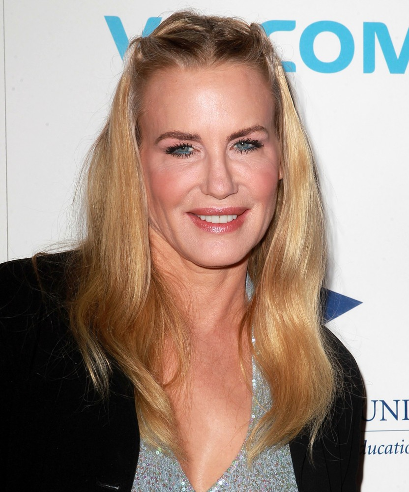
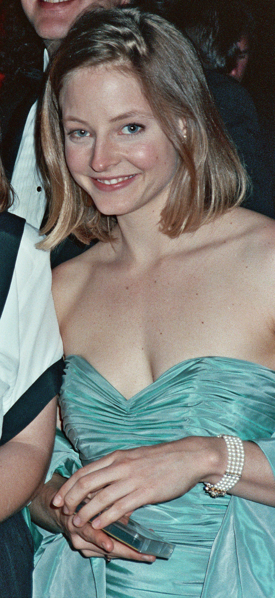
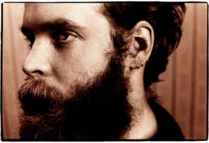
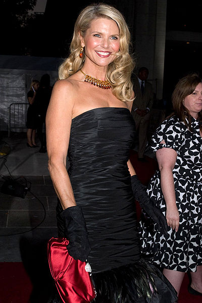

```{r setup, include=FALSE}
knitr::opts_chunk$set(echo = FALSE)
```

## Pessoa 1 - 52 anos

```{r, echo=FALSE}
# http://www.aceshowbiz.com/events/Daryl%20Hannah/daryl-hannah-stars-2012-benefit-gala-01.html

# foto de 2012

idade=52
```


<center></center>


## Pessoa 1 - Ramo e Folhas
```{r, echo = FALSE, message=FALSE, warning=FALSE}
pessoa <- read.csv2("Pessoa1a.csv")
pessoa1 <- pessoa[pessoa$Pessoa==1,]
idade <- pessoa1$Idade

stem(idade, scale = 0.5)
```


**Estatística Sumárias**
```{r, echo = FALSE, message=FALSE, warning=FALSE}
options(digits = 2)
c(summary(idade), SD = round(sd(idade), 2))
```


## Pessoa 1 - Histograma
```{r, echo = FALSE, message=FALSE, warning=FALSE}
library(ggplot2)
ggplot(pessoa1, aes(x = Idade)) +
    geom_histogram(breaks = seq(30, 75, by=5), closed = "left", fill = "#1B9E77", col = "dimgrey") +
    labs(y = "Frequência", x = "Chutes da Idade")
```


## Pessoa 1 - Boxplot
```{r, echo = FALSE, message=FALSE, warning=FALSE}
ggplot(pessoa1, aes(y = Idade, x = "")) +
    geom_boxplot(fill = "#1B9E77", col = "dimgrey") +
    labs(x = "", y = "Chutes da Idade") + coord_flip()
```


## Pessoa 2 - 27 anos

```{r, echo=FALSE}
# https://pt.wikipedia.org/wiki/Jodie_Foster
# foto de 1989

idade=27
```
<center></center>


## Pessoa 2 - Ramo e Folhas
```{r, echo = FALSE, message=FALSE, warning=FALSE}
pessoa <- read.csv2("Pessoa2a.csv")
pessoa2 <- pessoa[pessoa$Pessoa==2,]
idade <- pessoa2$Idade

stem(idade, scale = 0.5)
```


**Estatística Sumárias**
```{r, echo = FALSE, message=FALSE, warning=FALSE}
options(digits = 2)
c(summary(idade), SD = round(sd(idade), 2))
```


## Pessoa 2 - Histograma
```{r, echo = FALSE, message=FALSE, warning=FALSE}
library(ggplot2)
ggplot(pessoa2, aes(x = Idade)) +
    geom_histogram(breaks = seq(10, 60, by=5), closed = "left", fill = "#1B9E77", col = "dimgrey") +
    labs(y = "Frequência", x = "Chutes da Idade")
```


## Pessoa 2 - Boxplot
```{r, echo = FALSE, message=FALSE, warning=FALSE}
ggplot(pessoa2, aes(y = Idade, x = "")) +
    geom_boxplot(fill = "#1B9E77", col = "dimgrey") +
    labs(x = "", y = "Chutes da Idade") + coord_flip()
```


## Pessoa 3 - 29 anos

```{r,echo=FALSE}
# http://static1.purepeople.com/articles/1/17/35/21/@/2092987-johnny-depp-a-cannes-en-1992-950x0-2.jpg
# foto de 1992

idade=29
```
<center></center>


## Pessoa 3 - Ramo e Folhas
```{r, echo = FALSE, message=FALSE, warning=FALSE}
pessoa <- read.csv2("Pessoa3a.csv")
pessoa3 <- pessoa[pessoa$Pessoa==3,]
idade <- pessoa3$Idade

stem(idade, scale = 0.5)
```


**Estatística Sumárias**
```{r, echo = FALSE, message=FALSE, warning=FALSE}
options(digits = 2)
c(summary(idade), SD = round(sd(idade), 2))
```


## Pessoa 3 - Histograma
```{r, echo = FALSE, message=FALSE, warning=FALSE}
library(ggplot2)
ggplot(pessoa3, aes(x = Idade)) +
    geom_histogram(breaks = seq(10, 60, by=5), closed = "left", fill = "#1B9E77", col = "dimgrey") +
    labs(y = "Frequência", x = "Chutes da Idade")
```


## Pessoa 3 - Boxplot
```{r, echo = FALSE, message=FALSE, warning=FALSE}
ggplot(pessoa3, aes(y = Idade, x = "")) +
    geom_boxplot(fill = "#1B9E77", col = "dimgrey") +
    labs(x = "", y = "Chutes da Idade") + coord_flip()
```


## Pessoa 4 - 45 anos


```{r,echo=FALSE}
# http://www.gettyimages.com/event/liam-gallagher-self-assignment-june-19-2017-700070321?esource=SEO_GIS_CDN_Redirect#singer-and-musician-liam-gallagher-is-photographed-on-june-19-2017-in-picture-id800194674
# foto de 2017

idade=45
```
<center></center>


## Pessoa 4 - Ramo e Folhas
```{r, echo = FALSE, message=FALSE, warning=FALSE}
pessoa <- read.csv2("Pessoa4a.csv")
pessoa4 <- pessoa[pessoa$Pessoa==4,]
idade <- pessoa4$Idade

stem(idade, scale = 0.5)
```


**Estatística Sumárias**
```{r, echo = FALSE, message=FALSE, warning=FALSE}
options(digits = 2)
c(summary(idade), SD = round(sd(idade), 2))
```


## Pessoa 4 - Histograma
```{r, echo = FALSE, message=FALSE, warning=FALSE}
library(ggplot2)
ggplot(pessoa4, aes(x = Idade)) +
    geom_histogram(breaks = seq(20, 55, by=5), closed = "left", fill = "#1B9E77", col = "dimgrey") +
    labs(y = "Frequência", x = "Chutes da Idade")
```


## Pessoa 4 - Boxplot
```{r, echo = FALSE, message=FALSE, warning=FALSE}
ggplot(pessoa4, aes(y = Idade, x = "")) +
    geom_boxplot(fill = "#1B9E77", col = "dimgrey") +
    labs(x = "", y = "Chutes da Idade") + coord_flip()
```


## Pessoa 5 - 21 anos

<center></center>

```{r,echo=FALSE}
# Elton John
# foto de 1968
idade=21
```


## Pessoa 5 - Ramo e Folhas
```{r, echo = FALSE, message=FALSE, warning=FALSE}
pessoa <- read.csv2("Pessoa5a.csv")
pessoa5 <- pessoa[pessoa$Pessoa==5,]
idade <- pessoa5$Idade

stem(idade, scale = 0.5)
```


**Estatística Sumárias**
```{r, echo = FALSE, message=FALSE, warning=FALSE}
options(digits = 2)
c(summary(idade), SD = round(sd(idade), 2))
```


## Pessoa 5 - Histograma
```{r, echo = FALSE, message=FALSE, warning=FALSE}
library(ggplot2)
ggplot(pessoa5, aes(x = Idade)) +
    geom_histogram(breaks = seq(18, 45, by=4), closed = "left", fill = "#1B9E77", col = "dimgrey") +
    labs(y = "Frequência", x = "Chutes da Idade")
```


## Pessoa 5 - Boxplot
```{r, echo = FALSE, message=FALSE, warning=FALSE}
ggplot(pessoa4, aes(y = Idade, x = "")) +
    geom_boxplot(fill = "#1B9E77", col = "dimgrey") +
    labs(x = "", y = "Chutes da Idade") + coord_flip()
```


## Pessoa 6 - 33 anos


<center></center>

```{r,echo=FALSE}
# Bonnie Prince Billy
idade=33
```

## Pessoa 7 - 54 anos


<center></center>

```{r,echo=FALSE}
idade=54
```

## Pessoa 8 - 47 anos


<center></center>

```{r,echo=FALSE}
idade=47
```

## Pessoa 9 - 35 anos

<center></center>

```{r,echo=FALSE}
idade=35
```

## Pessoa 10 - 48 anos

<center></center>

```{r,echo=FALSE}
idade=48
```


## Respostas Corretas e Estimativas {.smaller}

<!-- * Pessoa 1 - idade 52 -->
<!-- * Pessoa 2 - idade 27 -->
<!-- * Pessoa 3 - idade 29 -->
<!-- * Pessoa 4 - idade 45 -->
<!-- * Pessoa 5 - idade 21 -->
<!-- * Pessoa 6 - idade 33 -->
<!-- * Pessoa 7 - idade 54 -->
<!-- * Pessoa 8 - idade 47 -->
<!-- * Pessoa 9 - idade 35 -->
<!-- * Pessoa 10 - idade 48 -->


| Pessoa 	| Idade Correta 	| n   	| Média 	| Desvio Padrão 	|
|--------	|---------------	|-----	|-------	|---------------	|
| 1      	| 52            	| 102 	| 48,89   | 8,6      	    	|
| 2      	| 27            	| 100 	| 31,86 	| 7,28           	|
| 3      	| 29              | 101 	| 28,56 	| 5,08          	|
| 4      	| 45              | 100 	| 38,8    | 6,17           	|
| 5     	| 21            	| 101 	| 29,95   | 7,77          	|
| 6      	| 33            	| 100 	| 32,48   | 5,41          	|
| 7      	| 54              | 101  	| 43,22   | 7,91          	|
| 8      	| 47              | 101  	| 48,30   | 5,49          	|
| 9      	| 35            	| 101 	| 37,64   | 4,92          	|
| 10      | 48            	| 101 	| 57,37   | 5,94      	  	|
