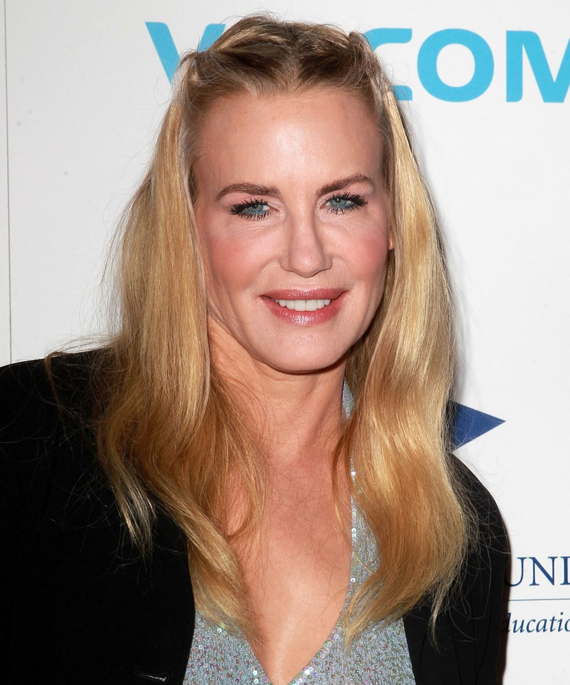

# Qual a idade?

## Coleta de dados

Nessa atividade iremos apresentar a foto de dez (10) pessoas e cada aluno deverá tentar adivinhar a idade de cada uma dessas pessoas.

Para isso, os alunos devem fazer o seguinte:

1) Cada aluno deverá pegar uma folha de papel e recortá-la em 10 tiras. 

2) Cada tira deverá ser identificada com Pessoa 1, Pessoa 2, ..., Pessoa 10, que representará a pessoa apresentada na foto.

3) Ao lado da identificação da Pessoa, colocar um "chute" para a idade da pessoa.

**IMPORTANTE**: Não consulte seus colegas, coloque o seu "chute" sobre a idade.


## Pessoa 1

```{r, echo=FALSE}
# http://www.aceshowbiz.com/events/Daryl%20Hannah/daryl-hannah-stars-2012-benefit-gala-01.html

# foto de 2012

idade=52
```
<center></center>


## Pessoa 2

```{r, echo=FALSE}
# https://pt.wikipedia.org/wiki/Jodie_Foster
# foto de 1989

idade=27
```
<center></center>


## Pessoa 3

```{r,echo=FALSE}
# http://static1.purepeople.com/articles/1/17/35/21/@/2092987-johnny-depp-a-cannes-en-1992-950x0-2.jpg
# foto de 1992

idade=29
```
<center></center>


## Pessoa 4


```{r,echo=FALSE}
# http://www.gettyimages.com/event/liam-gallagher-self-assignment-june-19-2017-700070321?esource=SEO_GIS_CDN_Redirect#singer-and-musician-liam-gallagher-is-photographed-on-june-19-2017-in-picture-id800194674
# foto de 2017

idade=45
```
<center></center>


## Pessoa 5

<center></center>

```{r,echo=FALSE}
# Elton John
# foto de 1968
idade=21
```

## Pessoa 6


<center></center>

```{r,echo=FALSE}
# Bonnie Prince Billy
idade=33
```

## Pessoa 7


<center></center>

```{r,echo=FALSE}
idade=54
```

## Pessoa 8


<center></center>

```{r,echo=FALSE}
idade=47
```

## Pessoa 9

<center></center>

```{r,echo=FALSE}
idade=35
```

## Pessoa 10

<center></center>

```{r,echo=FALSE}
idade=48
```


## Grupos {.smaller}

Formam-se 10 grupos (número de membros em cada grupo depende do número de alunos na sala).

Grupo X fica responsável por coletar os dados da Pessoa X, ou seja, as tiras de papel com os chutes da idade referentes à Pessoa X. 

Cada grupo deve entregar uma folha com:

* Título: Pessoa X
* RA e nome de cada membro do grupo X

Depois de organizar os dados no papel, apresentar o seguinte:

1. estatísticas sumárias (mínimo, Q1, mediana, Q3, máximo, média, desvio padrão)
2. gráfico de ramo-e-folhas 
3. histograma 
4. boxplot

Baseando-se na análise descritiva realizada, apresente uma **estimativa para a idade da Pessoa X**.

A presença será contabilizada pela entrega dessa atividade ao final da aula.


##

Slides produzidos por:

* Samara Kiihl
