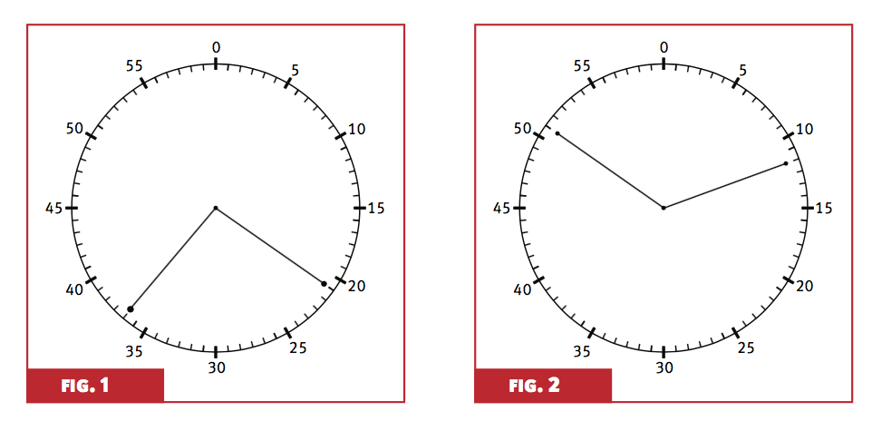

## Apresentação do jogo


### Regras

* Dois times: A e B

* O time A ganha se o 0 estiver na maior região delimitada pelos dois ponteiros.

* O time B ganha se o 0 estiver na menor região delimitada pelos dois ponteiros.

* Se as duas regiões tiverem a mesma área, consideramos empate e um novo sorteio deve ser feito. Também será empate se a marca de 0min estiver na fronteira das regiões.

Figura 1: Time A ganha 1 ponto

Figura 2: Time B ganha 1 ponto

```{r pressure, echo=FALSE, out.width = '80%'}

```

### Material

* Relógio com dois ponteiros.

    * Você usará a figura do relógio e irá marcar os ponteiros à lápis.

* Fichas/bolas enumeradas de 0 a 59 (representando os minutos no relógio). 
    
    * Recorte papéis de tamanhos iguais e enumere. 
    * Coloque em um saquinho para sortear.


## Os times possuem mesma chance de vencer?


### Coleta de dados

Divida o grupo (no máximo 4 alunos) em dois times: A e B

Em cada jogada:

* O time A retira uma ficha ao acaso e coloca o ponteiro no número indicado na ficha. Não devolve a ficha para a sacola.

* O time B retira uma ficha ao acaso e coloca o ponteiro no número indicado na ficha.

* As fichas são então devolvidas para a próxima jogada.


Cada grupo deverá coletar os dados em uma tabela com as seguintes colunas:

* Número da jogada

* Ficha retirada pelo time A

* Ficha retirada pelo time B

* Time vencedor na jogada


```{r fig.width=12, fig.height=12,echo=FALSE}
library(png)
library(grid)
img <- readPNG("figuras/relogio.png")
 grid.raster(img)
```

\pagebreak


###  Resultados

* RAs, nomes e assinaturas dos membros do grupo
* Tabela (descrita anteriormente)
* Análise descritiva dos dados e cálculos necessários para embasar a conclusão
* Conclusão


