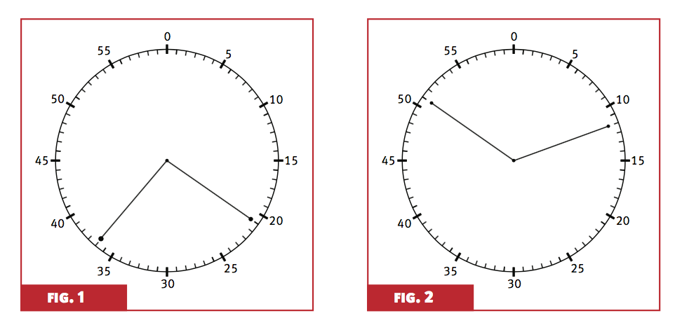

# Jogo do relógio

## Apresentação do jogo

Material:

* relógio com dois ponteiros

* fichas/bolas enumeradas de 0 a 59 (representando os minutos no relógio). Recorte papéis de tamanhos iguais e enumere. Coloque em um saquinho para sortear.

## Apresentação do jogo

* Dois times: A e B

* O time A ganha se o 0 estiver na maior região delimitada pelos dois ponteiros.

* O time B ganha se o 0 estiver na menor região delimitada pelos dois ponteiros.

* Se as duas regiões tiverem a mesma área, consideramos empate e um novo sorteio deve ser feito. Também será empate se a marca de 0min estiver na fronteira das regiões.


## Apresentação do jogo

Figura 1: Time A ganha

Figura 2: Time B ganha

<center></center>


## Apresentação do jogo

Divida o grupo (no máximo 4 alunos) em dois times: A e B

Em cada jogada:

* O time A retira uma ficha ao acaso e coloca o ponteiro no número indicado na ficha. Não devolve a ficha para a sacola.

* O time B retira uma ficha ao acaso e coloca o ponteiro no número indicado na ficha.

* As fichas são então devolvidas para a próxima jogada.

## Apresentação do jogo

Façam uma tabela com as seguintes colunas:

* Número da jogada

* Ficha retirada pelo time A

* Ficha retirada pelo time B

* Time vencedor na jogada


## Quem tem mais chance de vencer?

As chances são as mesmas para os dois times?

Como avaliar usando os dados?

Que tipo de estatísticas sumárias/gráficos podem ser feitos?

## Entregar

* RAs, nomes e assinatura dos membros do grupo

* Tabela com as jogadas do grupo

* Estatísticas, gráficos e cálculos relevantes para embasar a resposta obtida


```{r,echo=FALSE,eval=FALSE}
png(file = "grafico.png",width = 1480, height = 1480)
plot(1, type="n", xlab="", ylab="", xlim=c(0, 60), ylim=c(0, 60),cex.axis=2)
grid(64,col=1)
dev.off()


# [Jogo do relógio - Profa. Laura Rifo](http://m3.ime.unicamp.br/recursos/1365)


```


##

Slides produzidos por:

* Samara Kiihl

