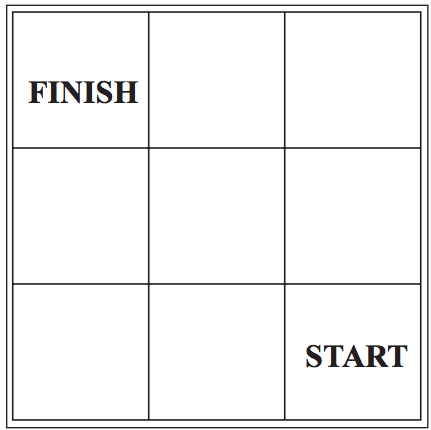

# Jogo de tabuleiro

## Material

* 1 dado

* 1 peça para marcar o tabuleiro

* tabuleiro:





## Regras

* Coloque a peça na casa **START**
* Jogue o dado
* Se sair um número **PAR**, vá uma casa para **CIMA**
* Se sair um número **ÍMPAR**, vá um casa para a **ESQUERDA**
* Caso o resultado coloque sua peça fora do tabuleiro, você perde o jogo.
* Se conseguir chegar na casa **FINISH** você ganhou o jogo.

### Experimento Aleatório e Espaço Amostral

Considere uma partida deste jogo como um experimento aleatório, ou seja, a sequência de jogadas da partida (ex: "PPP") é um fenômeno aleatório, pois não conhecemos _a priori_ a sequência de jogadas. Construa uma tabela com duas colunas: o ponto do espaço amostral do experimento e a probabilidade dele ocorrer.


## Apresentação do jogo

Devida o grupo (no máximo 4 alunos) em dois times: A e B

Em cada jogada:

* O time A retira uma ficha ao acaso e coloca o ponteiro no número indicado na ficha.

* O time B retira uma ficha ao acaso e coloca o ponteiro no número indicado na ficha.

* as fichas são devolvidas para a próxima jogada.

## Apresentação do jogo

Façam uma tabela com as seguintes colunas:

* Número da jogada

* Ficha retirada pelo time A

* Ficha retirada pelo time B

* Time vencedor na jogada


## Quem tem mais chance de vencer?

As chances são as mesmas para os dois times?

Como avaliar usando os dados?

Que tipo de estatísticas sumárias/gráficos podem ser feitos?


```{r,echo=FALSE,eval=FALSE}
png(file = "grafico.png",width = 1480, height = 1480)
plot(1, type="n", xlab="", ylab="", xlim=c(0, 60), ylim=c(0, 60),cex.axis=2)
grid(64,col=1)
dev.off()


# [Jogo do relógio - Profa. Laura Rifo](http://m3.ime.unicamp.br/recursos/1365)


```


##

Slides produzidos por:

* Samara Kiihl

