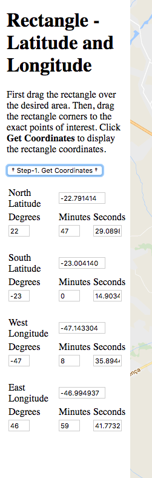

# Cadê o ponto de ônibus?

## Introdução

Imagine que eu queira estimar a proporção da área de Campinas que tenha pelo menos um ponto de ônibus a menos de XXXXX km de distância.

Como fazer? Qual estratégia você consegue pensar para descobrir isso? É factível?

## "Censo"

Podemos pensar em dividir todo o território de Campinas em quadrados de 1 $m^2$, por exemplo, e denotar contar, quantos desses quadrados têm pelo um ponto de ônibus a menos de XXXXX km de distância. A proporção então é 

$$p=\frac{\# \mbox{ quadrados de 1 }m^2\mbox{ com pelo menos 1 ponto de ônibus a menos de XXXX de distância}}{\# \mbox{ quadrados de 1 }m^2}$$

Levaria um certo tempo/esforço para conseguir esta informação.

## Usando inferência estatística


Seja $X_i$ uma variável aleatória indicando se o ponto $i$ na cidade de Campinas tem pelo menos 1 ponto de ônibus a menos de XXXX km de distância. $X_i=1$ se tem e 0 se não tem.

Se a verdadeira proporção de locais com pelo menos 1 ponto de ônibus a menos de xxxx km de distância é $p$, então temos que $P(X_i=1)=p$ e $P(X_i=0)=1-p$.

$$X_i\sim b(p)\,\quad \forall i$$ 

$$E(X_i)=p\,\quad \forall i$$

$$Var(X_i)=p(1-p)\,\quad \forall i$$


## Usando inferência estatística

Se definirmos $X=\sum_{i=1}^nX_i$, sabemos que $X\sim Binomial(n,p)$, portanto $E(X)=np$ e $Var(X)=np(1-p)$.

Queremos um estimador para $p$: $\hat{p}=\frac{1}{n}\sum_{i=1}^n X_i=\frac{X}{n}$. 

Queremos um estimador com "boas propriedades".

Primeiro, note que 

$$E(\hat{p})=E\left( \frac{X}{n}  \right) = \frac{1}{n}E(X)=\frac{np}{n}=p$$

Ou seja, para cada amostra aleatória de $X_i$'s, calculamos $\hat{p}$ e este será diferente para cada amostra. No entanto, o valor esperado é exatamente igual ao parâmetro que queremos estimar.

## Usando inferência estatística


Além disso, note que: 

$$Var(\hat{p})=Var\left( \frac{X}{n}  \right) = \frac{1}{n^2}Var(X)=\frac{np(1-p)}{n^2}=\frac{p(1-p)}{n}$$
Ou seja, para cada amostra aleatória de $X_i$'s, calculamos $\hat{p}$ e este será diferente para cada amostra, mas a variabilidade desses valores em cada amostra ao redor do verdadeiro parâmetro, diminui, se aumentarmos o tamanho da amostra.


## Usando inferência estatística

Uma boa propriedade, por exemplo:

$$P(\mid\hat{p}-p\mid < 0.05) = 0.95$$

Podemos usar o Teorema Central do Limite, que nos diz:

$$\hat{p} \sim N(p, p(1-p)/n)$$
De forma que:

$$P(\mid\hat{p}-p\mid < 0.05) = 0.95$$

$$P(-0.05 < \hat{p}-p < 0.05) = 0.95$$

## Usando inferência estatística

$$P\left(-\frac{0.05}{\sqrt{p(1-p)/n}} < \frac{\hat{p}-p}{\sqrt{p(1-p)/n}} < \frac{0.05}{\sqrt{p(1-p)/n}}\right) \approx 0.95$$
$$P\left(-\frac{0.05}{\sqrt{p(1-p)/n}} < Z < \frac{0.05}{\sqrt{p(1-p)/n}}\right) \approx 0.95$$
em que $Z\sim N(0,1)$.

Queremos saber o tamanho amostral para ter a boa propriedade.


## Usando inferência estatística


Mas $p$ é desconhecido de maneira que $Var(\hat{p})$ não pode ser utilizada. Consideramos o "pior caso": $Var(\hat{p})=\frac{1}{4n}$.

$$P\left(-\frac{0.05}{\sqrt{1/4n}} < Z < \frac{0.05}{\sqrt{1/4n}}\right) \approx 0.95$$

A solução:

$$\frac{0.05}{\sqrt{1/4n}}=1.96$$

$$ n = \frac{1.96^2}{4\times 0.05^2} \approx 385$$
Um número alto, mas lembre que consideramos o pior caso, em que $p=1/2$. Esta suposição é plausível em Campinas?

## Usando inferência estatística

Iremos utilizar uma amostra de tamanho $n$ de alguns locais de Campinas.

Não iremos fisicamente nos locais, usaremos o GoogleMaps.

Como obter uma amostra aleatória de locais?

## Amostra aleatória

Usando o RStudio, temos o pacote `mosaic` com a função `rgeo`, que permite sortear ao acaso latitude e longitude de uma área específica.

```{r,eval=FALSE}
library(mosaic)
samples = rgeo(n=total_amostras, latlim = c(?? , ??), lonlim=c(??, ??))
```

Problema: precisamos informar dois intervalos: para latitude e para longitude.


## Definindo a área de Campinas

Utilizando o site https://www3.epa.gov/storet/RECTANGLETool_Passback.html defini um retângulo ao redor do centro de Campinas.

<center></center>

## Definindo a área de Campinas

E o site me informa os quatro pontos do retângulo em latitude e longitude:

<center></center>


## Amostra aleatória

Agora podemos preencher a função `rgeo` com as informações de Campinas para realizar o sorteio dos locais.

```{r,eval=FALSE}
library(mosaic)
set.seed(XYZ)  # substitua XYZ pelos 3 ultimos digitos do RA
total_amostras = 25
amostras = rgeo(n=total_amostras, latlim = c(-23.00414,-22.791414), 
                lonlim=c(-47.143304,-46.994937))
```


## Amostra aleatória

Usaremos a seguinte função para chamar o GoogleMaps centralizado na localização da amostra e com um círculo ao redor.

```{r,eval=FALSE}
getLocation = function(counter) {
  googleMap(amostras[counter,"lat"], amostras[counter,"lon"], 
            mark=TRUE, maptype="terrain", radius=.1, browse=TRUE)
}

```


## Coleta dos dados


Você deverá então produzir uma tabela, em arquivo .csv com as seguintes colunas: "lat", "lon", "ponto" (sim ou não).

Para salvar a tabela das latitudes e longitudes em arquivo .csv:

```{r,eval=FALSE}
write.csv(amostras, file="dados_XXXXXXX.csv") # substitua XXXXX pelo seu RA
```

E aí você vai preenchendo este arquivo com a terceira coluna, segundo informações obtidas pelo comando `getLocation(1)`, `getLocation(2)`, etc....


## Obtendo intervalos de confiança

Como visto na aula anterior, os intervalos de $100 (1-\alpha)\%$ de confiança para $p$ podem então ser de duas formas: 

1) Método Conservador
$$IC_1(p, 1-\alpha)=\left[\hat{p}-z_{\alpha/2}\sqrt{\frac{1}{4n}};\hat{p}+z_{\alpha/2}\sqrt{\frac{1}{4n}}\right]$$ 

2) Usando $\hat p$ para estimar o erro-padrão
$$IC_2(p, 1-\alpha)=\left[\hat{p}-z_{\alpha/2}\sqrt{\frac{\hat{p}(1-\hat{p})}{n}};\hat{p}+z_{\alpha/2}\sqrt{\frac{\hat{p}(1-\hat{p})}{n}}\right]$$


## Resumo dos comandos

```{r,echo=TRUE,eval=FALSE}
library(mosaic)
set.seed(XXXXXXX)  # substitua XXXXXXX pelo RA de alguém do grupo
total_amostras1 = 10
amostras1 = rgeo(n=total_amostras1, latlim = c(-23.00414,-22.791414), 
                lonlim=c(-47.143304,-46.994937))
write.csv(amostras1, file="dados_10_XXXXXXX.csv") # substitua XXXXXXX pelo RA usado no comando set.seed

getLocation = function(counter) {
  googleMap(amostras1[counter,"lat"], amostras1[counter,"lon"], 
            mark=TRUE, maptype="terrain", radius=.1, browse=TRUE)
}

# para coletar os dados:
getLocation(1)
getLocation(2)
# etc...
getLocation(10)
```

## Resumo dos comandos (cont.)


```{r,eval=FALSE}
set.seed(XXXXXXX)  # substitua XXXXXXX pelo RA de alguém do grupo
total_amostras2 = 30
amostras2 = rgeo(n=total_amostras2, latlim = c(-23.00414,-22.791414), 
                lonlim=c(-47.143304,-46.994937))
write.csv(amostras2, file="dados_30_XXXXXXX.csv") # substitua XXXXXXX pelo RA usado no comando set.seed

getLocation = function(counter) {
  googleMap(amostras2[counter,"lat"], amostras2[counter,"lon"], 
            mark=TRUE, maptype="terrain", radius=.1, browse=TRUE)
}

getLocation(1)
getLocation(2)
# etc...
getLocation(30)
```

## Entregar via Moodle

* O arquivo `dados_10_XXXXXXX.csv`, substituindo XXXXX pelo RA utilizado no comando `set.seed`. O arquivo deve ter a terceira coluna preenchida com a informação: 1 caso o local tenha ponto de ônibus dentro do raio e 0, caso contrário.

* O arquivo `dados_30_XXXXXXX.csv`, substituindo XXXXX pelo RA utilizado no comando `set.seed`. O arquivo deve ter a terceira coluna preenchida com a informação: 1 caso o local tenha ponto de ônibus dentro do raio e 0, caso contrário.


(continua)

## Entregar via Moodle (cont.)

* Um arquivo .pdf com o intervalo de confiança (conservador e não conservador) de 95% para a verdadeira proporção de locais com pontos de ônibus dentro do raio especificado na área de Campinas. Mostre os cálculos intermediários até o resultado. Interprete o intervalo de confiança para este problema. Fale sobre as suposições para que o intervalo seja válido. Sua amostra satisfaz essas suposições? Discuta em detalhes. São 4 IC a serem feitos: conservador e não conservador para $n=10$ e $n=30$.

* Na interpretação tome cuidado ao mencionar o parâmetro da população para a qual estamos fazendo a inferência. A população de interesse era a cidade de Campinas, mas por logística, ficou sendo apenas aquela região retangular da figura apresentada.


```{r,echo=FALSE}
arquivos <- list.files("./dadosalunos_10")
p_10 <- c()
p_a_10 <-c()
for (i in 1:length(arquivos))
{
  tmp <- read.csv(paste0("./dadosalunos_10/",arquivos[i]),header=TRUE)
  p_10[i] <- mean(tmp[,1])
  p_a_10 <- c(p_a_10,tmp[,1])
}

```

```{r, echo=FALSE, fig.height=3.5,message=FALSE,warning=FALSE,fig.align='center',eval=FALSE}
library(ggplot2)

library(RColorBrewer)
mycol <- brewer.pal(8, "Dark2")


eixos <- theme(plot.title = element_text(size=16, face="bold"),
               axis.text = element_text(size=14), 
               axis.title = element_text(size=14),
               legend.title = element_text(size=14, face="bold"), 
               legend.text=element_text(size=14))

prop <- data.frame(six = p_10)

ggplot(prop, aes(x=six)) + 
    geom_histogram(bins=11, fill=mycol[1], col="black", alpha=0.8) + 
    geom_vline(xintercept = mean(prop$six), col="red", linetype="dashed") + 
    xlab("Proporção de locais com pontos de ônibus dentro do raio") + 
    ylab("Frequência") + eixos

```


```{r,echo=FALSE}
arquivos <- list.files("./dadosalunos_30")
p_30 <- c()
p_a_30 <-c()
for (i in 1:length(arquivos))
{
  tmp <- read.csv(paste0("./dadosalunos_30/",arquivos[i]),header=TRUE)
  p_30[i] <- mean(tmp[,1])
  p_a_30 <- c(p_a_30,tmp[,1])
}

```


```{r, echo=FALSE, fig.height=3.5,message=FALSE,warning=FALSE,fig.align='center',eval=FALSE}

prop <- data.frame(six = p_30)

ggplot(prop, aes(x=six)) + 
    geom_histogram(bins=11, fill=mycol[1], col="black", alpha=0.8) + 
    geom_vline(xintercept = mean(prop$six), col="red", linetype="dashed") + 
    xlab("Proporção de locais com pontos de ônibus dentro do raio") + 
    ylab("Frequência") + eixos

```


## Resultados para $n=10$ e $n=30$


```{r,echo=FALSE,meassage=FALSE,warning=FALSE,fig.align='center'}
dados <- data.frame(cidade=rep(c("10", "30"), each=44), salario=c(p_10, p_30))
```


```{r, echo=FALSE, fig.height=3.5, fig.width=8,fig.align='center'}

library(ggplot2)

library(RColorBrewer)
mycol <- brewer.pal(8, "Dark2")


eixos <- theme(plot.title = element_text(size=16, face="bold"),
               axis.text = element_text(size=14), 
               axis.title = element_text(size=14),
               legend.title = element_text(size=14, face="bold"), 
               legend.text=element_text(size=14))


ggplot(data=dados, aes(salario)) + 
    geom_histogram(bins=11, colour="black", fill=mycol[1],alpha=0.8) +
    labs(x="Proporção de locais com pontos de ônibus dentro do raio", y="Frequência") + 
    facet_grid(~ cidade) + 
    theme(axis.title = element_text(face="bold", size=12, color="black"),
          axis.text = element_text(face="bold", size=12, color="black"))
```

Para $n=10$: $\hat{p}=`r round(mean(p_a_10),2)`$.


Para $n=30$: $\hat{p}=`r round(mean(p_a_30),2)`$.


## Resultados 

Usando todas as amostras de tamanho 30 da classe como se fosse uma amostra só com $n=`r length(p_a_30)`$, temos como estimativa $\hat{p}=\frac{`r sum(p_a_30)`}{`r length(p_a_30)`}=`r round(mean(p_a_30),2)`$.

IC 95% para a verdadeira proporção ($p$) de locais na região delimitada com pelo menos um ponto de ônibus a XX de distância:

$$IC_2(p, 1-\alpha)=\left[\hat{p}-z_{\alpha/2}\sqrt{\frac{\hat{p}(1-\hat{p})}{n}};\hat{p}+z_{\alpha/2}\sqrt{\frac{\hat{p}(1-\hat{p})}{n}}\right]$$

$$IC_2(p, 0.95)=\left[`r round(mean(p_a_30),2)`-1.96\sqrt{\frac{`r round(mean(p_a_30),2)`(1-`r round(mean(p_a_30),2)`)}{`r length(p_a_30)`}};`r round(mean(p_a_30),2)`+1.96\sqrt{\frac{`r round(mean(p_a_30),2)`(1-`r round(mean(p_a_30),2)`)}{`r length(p_a_30)`}}\right]$$

$$IC_2(p, 0.95)=[`r round(round(mean(p_a_30),2)-1.96*sqrt( round(mean(p_a_30),2)*(1-round(mean(p_a_30),2))/length(p_a_30)),2)`;`r round(round(mean(p_a_30),2)+1.96*sqrt( round(mean(p_a_30),2)*(1-round(mean(p_a_30),2))/length(p_a_30)),2)`]$$


##

Slides produzidos por:

* Samara Kiihl

