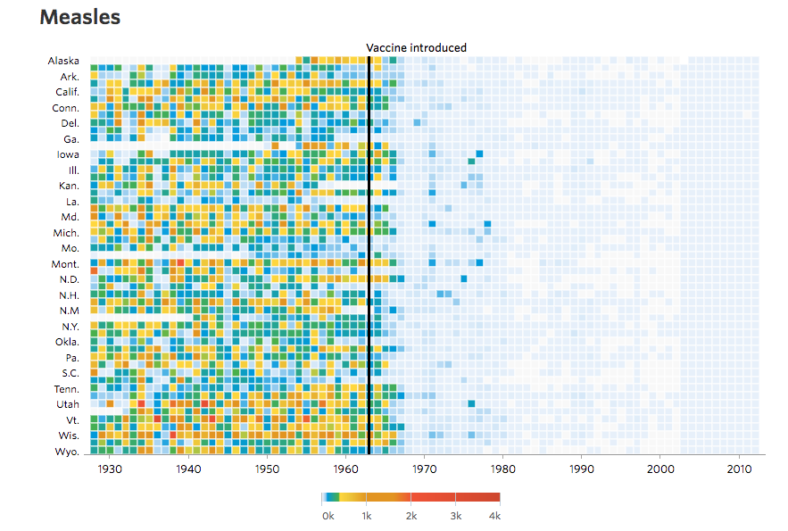

```{r setup, include=FALSE}
knitr::opts_chunk$set(echo = FALSE, warning = FALSE, message = FALSE)
```


# Introdução

## Por que aprender Estatística?

Jornais, revistas, noticiários da TV estão repletos de informações obtidas através de pesquisas de opinião, pesquisas médicas, estudos econômicos, estudos ambientais, estatísticas sobre uma pandemia.


Números e conclusões tiradas a partir deles são cada vez mais comuns no dia-a-dia.

No meio de tantos dados e informações, o que levar em conta e o que descartar?

Estamos na era da informação e a Estatística trabalha no uso da informação para tomada de decisão.


## Alguns exemplos 


> * Como predizer o número de casos/óbitos por COVID-19?

> * Como analisar se um tratamento é realmente eficaz para uma certa doença? Ex: uso da cloroquina/hidroxicloroquina no combate a COVID-19?

> * Qual sua chance de ganhar na megasena?

> * Há preconceito contra as mulheres para cargos de chefia?

> * Como o Netflix sabe que tipo de filmes/séries você gosta?


## Big Data


Na era da internet e do "Big Data", entender Estatística é essencial.


## Pensamento Estatístico 


No livro [Mankind in the Making](http://www.goodreads.com/book/show/1940169.Mankind_in_the_Making), de 1903, [H.G. Wells](http://pt.wikipedia.org/wiki/H._G._Wells) [escreveu](http://www.statschat.org.nz/2012/08/13/what-wells-actually-said-in-context/):   
<br />

*"... e não estamos muito longe do tempo em que se entenderá que, para exercermos a cidadania de maneira eficiente, será tão necessário saber calcular e pensar em médias, máximos e mínimos, quanto é agora necessário saber ler e escrever."*


<!-- ## Estatística Moderna  -->

<!--  -->

<!-- [Ronald Fisher](http://en.wikipedia.org/wiki/Ronald_Fisher) (1890 - 1962): estatístico, biólogo, eugenista e professor britânico. -->

<!-- Em 1920, estudando dados de produtividade de cultivo, Ronald Fisher formou a base da estatística moderna. -->

<!-- Fisher se interessava pela aplicação e popularização de métodos estatísticos (Conniffe, 1991). -->

<!-- Em 1925, Fisher escreveu o livro [Statistical Methods for Research Workers](http://en.wikipedia.org/wiki/Statistical_Methods_for_Research_Workers) para biólogos com problemas estatísticos similares aos que ele encontrou trabalhando com experimentos agrícolas em [Rothamsted](http://www.rothamsted.ac.uk). -->

<!-- **Tópicos do livro:** teste-t, correlação, teste qui-quadrado, análise de variância e regressão. Ainda hoje, estes são os principais tópicos de cursos de metodologia estatística.  -->


## Estatística 


A **Estatística** é um conjunto de técnicas que permite, de forma sistemática, organizar, descrever, analisar e interpretar dados oriundos de estudos ou experimentos, realizados em qualquer área do conhecimento.
            
**Estatística** é a arte de aprender através de dados. 


Três aspectos principais da estatística: 

* **Planejamento**: planejar como obter os dados para responder às perguntas de interesse. <br />
* **Descrição**: resumir os dados obtidos. <br />
* **Inferência**: tomar decisões e fazer predições baseando-se nos dados.


## Por que usar métodos estatísticos? 
   


Os tópicos de estudo de um certo pesquisador são tão diversos quanto as perguntas de interesse.

Muitas vezes esses estudos podem ser realizados com técnicas simples de amostragem, análise de dados e conceitos fundamentais de inferência estatística.

Com isso, a Estatística pode trabalhar em parceria com qualquer área do conhecimento, planejando experimentos, auxiliando na coleta de amostras representativas, resumindo e analisando seus dados, tirando conclusões a partir de experimentos.


## Estatística aplicada nas mais diversas áreas


* Meio Ambiente
* Pesquisa de Mercado
* Big Data
* Informática/Telecomunicação
* Agronegócio
* Hospitais e Pesquisa Médica
* Mercado Financeiro
* Indústria
* Biomedicina/Indústria Farmacêutica
* Instituições de Ensino e Pesquisa


## Estudo de Caso: stents e prevenção de infarto 


<!-- <figcaption>Figura: Stents no tratamento de infarto </figcaption> -->

Problema comum em medicina: como avaliar a eficácia de um procedimento médico?

[Estudo](http://www.nejm.org/doi/full/10.1056/NEJMoa1105335): [stents](http://www.nhlbi.nih.gov/health/health-topics/topics/stents) são eficazes no tratamento de pacientes com risco de infarto?

Stents são usados para a recuperação de pacientes que já sofreram infarto.

<br />
Os pesquisadores do estudo investigaram se havia benefícios também para pacientes com risco de infarto.

**Pergunta de interesse:** O uso de stent reduz o risco de infarto?


## Estudo de Caso: stents e prevenção de infarto 


**Estudo**: Os pesquisadores coletaram dados de 451 pacientes com risco de infarto que se voluntariaram para o estudo.

<br />
Cada paciente foi alocado aleatoriamente em um dos grupos:

* **Grupo de Tratamento**: paciente recebe stent e medicação. <br />
* **Grupo Controle**: paciente recebe a mesma medicação do grupo tratamento, mas não recebe stent.


## Estudo de Caso: stents e prevenção de infarto 


Cada paciente foi avaliado em duas ocasiões: primeiros 30 dias e após 1 ano.


</br>

Avaliar cada paciente individualmente desta planilha de dados é eficaz?

Como poderíamos resumir?


## Estudo de Caso: stents e prevenção de infarto 


Veja a tabela ao lado com os resultados.

Dentre os 224 pacientes do grupo tratamento:

* 33 pacientes tiveram infarto durante os primeiros 30 dias. <br />
* 45 pacientes tiveram infarto durante o primeiro ano.


Qual a proporção de pacientes do grupo tratamento que sofreram infarto durante o primeiro ano?

$$\frac{45}{224} = `r round(45/224,2)` = `r round(45/224,2)*100`\%$$

Podemos calcular **estatísticas sumárias** a partir da tabela.

```{r, echo=FALSE, message=FALSE, eval=FALSE}

trinta <- data.frame(Grupo = c("Tratamento", "Controle", "Tratamento", "Controle"), 
                     Infarto = c("Sim", "Sim", "Não", "Não"), 
                     Freq=c(33, 13, 191, 214))
trintaLong <- data.frame(Grupo = rep(c("Tratamento", "Tratamento", "Controle", "Controle"),
                                     times = c(33, 191, 13, 214)), 
                         Infarto = rep(c("Sim", "Não", "Sim", "Não"), 
                                       times = c(33, 191, 13, 214)))

library(ggplot2)

g <- ggplot(trintaLong, aes(x = Grupo, fill=Infarto)) + 
    geom_bar(position=position_dodge(), aes(y = ..count..)) + 
    ylab("Número de Pacientes") +
    scale_x_discrete("Grupo") +
    scale_fill_discrete(name ="Infarto?") + 
    theme(axis.text.x = element_text(face="bold", size=12, color="black"),
          axis.text.y = element_text(face="bold", size=12, color="black"))
print(g)

g <- ggplot(trintaLong, aes(x = Grupo, fill=Infarto)) + 
    geom_bar(position="fill") + 
    ylab("Proporção de Pacientes") +
    scale_x_discrete("Grupo") +
    scale_fill_discrete(name ="Infarto?") + 
    theme(axis.text.x = element_text(face="bold", size=12, color="black"),
          axis.text.y = element_text(face="bold", size=12, color="black"))
print(g)
```


## Estudo de Caso: stents e prevenção de infarto 


**Estatística Sumária**: número obtido a partir de informações dos dados coletados para resumí-los.

<br /><br />
Proporção de pacientes do grupo tratamento que sofreram infarto: 
$\displaystyle \frac{45}{224} = `r round(45/224, 2)` = `r round(45/224, 2)*100`\%$

Proporção de pacientes do grupo controle que sofreram infarto: 
$\displaystyle \frac{28}{227} = `r round(28/227, 2)` = `r round(28/227, 2)*100`\%$

No grupo tratamento, temos 8% a mais de pacientes que sofreram infarto.


## Estudo de Caso: stents e prevenção de infarto 

Relembrando a pergunta de interesse. <br />
**Pergunta de interesse:** O uso de stent reduz o risco de infarto?

O resultado observado está de acordo com a expectativa dos pesquisadores? 

8% é uma diferença **considerável**? 

Uma diferença de 8% poderia acontecer ao acaso, mesmo que os dois tratamentos na verdade oferecessem o mesmo risco de infarto?

Utilizando metodologia estatística, os pesquisadores chegaram à conclusão de que stents não servem para previnir novos infartos.

**Razão médica:** o stent só resolve o fluxo sanguíneo naquela artéria específica lesionada, mas o paciente continua sendo de alto risco para infarto pois a doença está disseminada.  


## Estudo de Caso: stents e prevenção de infarto 


<br /><br />
<div class="red2">**CUIDADO!**</div>

<br />

Não podemos generalizar os resultados do estudo para todo tipo de paciente e todo tipo de stent.


# Análise Descritiva

## Análise Descritiva 
**Análise descritiva** se refere a métodos para resumir e descrever os dados.


É o primeiro passo antes de qualquer análise estatística!

Dados aqui refere-se à informação contida na amostra, ou seja, a que foi coletada de um experimento, uma pesquisa, um registro histórico, etc.

Resumo dos dados pode ser feito por meio de: 

* **métricas quantitativas**: estatísticas sumárias como média, mediana, desvio padrão, proporções. <br />
* **ferramentas visuais**: gráficos.

A técnica adequada depende do tipo de variável.


## Exemplo: Dados do Censo

É mais simples olharmos gráficos ou 35.723.254 questionários?


<font size=4>
Fonte: [http://www.censo2010.ibge.gov.br](http://www.censo2010.ibge.gov.br)
</font>


## Exemplo: spam


Suponha que extraímos informações de 50 emails recebidos e armazemos esses dados numa tabela. Esse é um **conjunto de dados**.

Primeiras linhas do conjunto de dados:

```{r, echo=FALSE, message=FALSE, warning=FALSE}
library(readr)
library(dplyr)
dados = read_tsv("email50.txt")

dados = dados %>% 
  select(spam, num_char, line_breaks, format, number) %>% 
  mutate(spam = factor(spam, labels = c("No", "Yes")),
         num_char = num_char*1000)
colnames(dados) = c("spam", "characters", "lineBreaks", "format", "number")

library(knitr)
kable(head(dados, 4))
```


## Exemplo: spam


Cada linha representa um email recebido.

Colunas:

* `r colnames(dados)[1]`: `Yes` se spam e `No` caso contrário.

* `r colnames(dados)[2]`: número de caracteres no email.

* `r colnames(dados)[3]`: número de quebras de linha no email.

* `r colnames(dados)[4]`: 1 se formato é HTML, 0 caso contrário.

* `r colnames(dados)[5]`: indica se o email não continha nenhum número (none), um número pequeno (small) ou um número grande (big).


## Estrutura básica dos dados 


Para que possamos resumir os dados, é importante primeiramente entender como eles são organizados e também os diversos tipos de cada variável.

**Variável** é uma condição ou característica de um elemento de estudo. Pode assumir valores diferentes em diferentes elementos.

**Tipos de Variáveis**


**Exemplos**: peso, altura, curso. 

Veja que para cada pessoa, os valores não necessariamente são os mesmos.


## Tipos de Variável 

Suponha que nós aplicamos um questionário entre os alunos de ME414 e coletamos várias informações sobre vocês. 

Cada pergunta se refere a uma variável, que pode ter valores diferentes para cada um de vocês. 

Dentre outras coisas, perguntamos sobre as seguintes variáveis:


* Número de irmãos
* Altura
* Se já fez algum curso de estatística anteriormente

\
Qual o tipo de cada variável?


## Análise Descritiva Univariada

A análise descritiva univariada consiste basicamente em, para cada uma das variáveis individualmente:

* classificar a variável quanto a seu tipo: qualitativa (nominal ou ordinal) ou quantitativa (discreta ou contínua)


* obter tabela, gráfico e/ou medidas resumo apropriados

A partir destes resultados pode-se montar um resumo geral dos dados.

Na aula de hoje, falaremos sobre tabelas e gráficos apropriados para cada tipo de variável.


##  Exemplo: `SleepStudy`


Para ilustrar as diferentes técnicas usadas em análise descritiva, vamos utilizar o conjunto de dados `SleepStudy` disponível no pacote `Lock5Data` do `R`.

Esses dados referem-se a um estudo de padrões de sono para estudantes universitários.

Os dados foram obtidos de uma amostra de 253 alunos universitários que fizeram testes de habilidades para medir função cognitiva. 

Todos os participantes completaram uma pesquisa, na qual responderam questões sobre atitudes e hábitos. Eles também mantiveram um diário para registrar o tempo e a qualidade do sono durante um período de duas semanas. 

Nesse conjunto de dados encontramos todos os tipos de variáveis.

```{r, echo=FALSE}
library(Lock5Data)  ## carregando o pacote
data(SleepStudy) ## carregando o banco de dados
names(SleepStudy) ## nomes das variáveis/colunas
```


## Exemplo: `SleepStudy`


Iremos selecionar algumas variáveis de cada tipo:

- Gênero (`Gender`): categórica nominal 
        
- Autodeclaração de uso de álcool (`AlcoholUse`) e nível de ansiedade (`AnxietyStatus`): categórica ordinal  

- Número de aulas na semana antes das 9am (`NumEarlyClass`) e número de bebidas alcoólicas por semana (`Drinks`): quantitativa discreta 
      
- Média de horas de sono em todos os dias (`AverageSleep`) e *score* de cognição (`CognitionZscore`): quantitativa contínua


# Resumindo Dados Qualitativos 

## Variável Categórica Nominal 

A variável gênero (`Gender`) é do tipo categórica (qualitativa) nominal. 

Para resumir esse tipo de variável começamos por uma **tabela de frequências** e também podemos representar as frequências num **gráfico de barras ou de pizza (setores)**.

**Tabela de frequência**: listas todos os valores possíveis e contar quantas vezes cada um aparece.


```{r, echo=FALSE}
dados = SleepStudy
dados$Gender = factor(dados$Gender, labels = c("female", "male"))

tab.gender = table(dados$Gender)
tmp = data.frame(tab.gender, round(prop.table(tab.gender), 3))
tmp = tmp[, -3]
colnames(tmp) = c("Gênero", "Frequência", "Freq. Relativa")

library(knitr)
library(kableExtra)
kable(tmp) %>% kable_styling(position = "left", font_size = 20)
```


```{r, echo=FALSE, eval=FALSE}
png("graficoBarrasGenero.png")
par(mar = c(3, 5.1, 3, 3))
barplot(tab.gender, las = 1, main = "Gráfico de Barras - Gênero", 
        col = c("tomato", "dodgerblue"), ylim = c(0, 170), ylab = "Frequency", 
        cex.axis = 1.5, cex.names = 2, cex.main = 2, cex.lab = 1.8)
dev.off()

pct = round(prop.table(tab.gender), 2)*100
lbs = paste0(levels(dados$Gender), " ", pct, "%")

png("graficosGenero.png", width = 600, height = 300)
par(mfrow=c(1, 2), mar = c(3, 5.1, 3, 3))
barplot(tab.gender, las = 1, main = "Gráfico de Barras", 
        col = c("tomato", "dodgerblue"), ylim = c(0, 170), ylab = "Frequency", 
        cex.axis = 1.5, cex.names = 2, cex.main = 2, cex.lab = 1.8)
pie(table(dados$Gender), labels = lbs, radius = 1, cex = 2, cex.main = 2, 
    col = c("tomato", "dodgerblue"), main = "Gráfico de Pizza")
dev.off()
```


## Exemplo: Doctor Who

Qual ator atuou no maior número de episódios da série [Doctor Who](https://pt.wikipedia.org/wiki/Doctor_Who)?

**Tabela de frequências e frequências relativas**


```{r, echo=FALSE}
# http://4dpiecharts.com/2013/08/03/the-tenure-of-doctor-who-incarnations/
# http://www.imdb.com/title/tt0436992/fullcredits?ref_=tt_cl_sm#cast

whos <- data.frame(
  doctor = c(
    "William Hartnell",
    "Patrick Troughton",
    "Jon Pertwee",
    "Tom Baker",
    "Peter Davison",
    "Colin Baker",
    "Sylvester McCoy",
    "Christopher Ecclestone",
    "David Tennant",
    "Matt Smith",
    "Peter Capaldi"
  ),
  n_episodes = c(
    136,
    127,
    129,
    173,
    70,
    35,
    42,
    20,
    52,
    51,
    29
  ),
  stringsAsFactors = FALSE
)
whos$doctor <- factor(whos$doctor, levels = whos$doctor)
whos$prop <- round(whos$n_episodes/sum(whos$n_episodes), 3)

colnames(whos) <- c("Ator", "Frequência", "Freq. Relativa")

kable(whos) %>% kable_styling(position = "left", font_size = 22)
```

<br />
<font size=4>
Fonte: Informações do site IMDB ([1963-1989](http://www.imdb.com/title/tt0056751/fullcredits?ref_=tt_cl_sm#cast), [2005-2015](http://www.imdb.com/title/tt0436992/fullcredits?ref_=tt_cl_sm#cast))
</font>


## Gráfico de Barras


**Gráfico de barras**

* técnica visual para resumir dados categóricos. 

* É uma representação gráfica da tabela de frequências absolutas ou frequências relativas.


## Exemplo: Doctor Who

Veja o gráfico de barras representando a tabela de frequências absolutas.

```{r, echo=FALSE}
library(ggplot2)
colnames(whos) <- c("doctor", "n_episodes", "prop")

ggplot(whos, aes(x = reorder(doctor, n_episodes), y = n_episodes)) +
  geom_bar(stat = "identity", fill = "turquoise3") +
  coord_flip() + 
  ylab("Número de episódios (Frequência)") +
  xlab("Atores") +
  ggtitle("Gráfico de Barras - Frequências Absolutas") +
  theme_bw() + 
    theme(axis.title = element_text(face="bold", size=13),
          axis.text = element_text(face="bold", size=12),
          plot.title = element_text(face="bold", size=16))
```


## Exemplo: Doctor Who

Veja o gráfico de barras representando a tabela de frequências relativas.

```{r, echo=FALSE}
ggplot(whos, aes(x = reorder(doctor, prop), y = prop)) +
    geom_bar(stat = "identity", fill = "turquoise3") +
    coord_flip() + ylab("Proporção de episódios (Frequência Relativa)") + xlab("Atores") +
    ggtitle("Gráfico de Barras - Frequências Relativas") +
  theme_bw() + 
    theme(axis.title = element_text(face="bold", size=13),
          axis.text = element_text(face="bold", size=11),
          plot.title = element_text(face="bold", size=16)) 
```


## Variável Categórica Ordinal

A variável `AnxietyStatus` é uma variável categórica (qualitativa) ordinal, ou seja, são categorias cuja ordem é relevante.

Assim como na variável categórica nominal, podemos utilizar as frequências absolutas e relativas para resumir os dados. Visualmente, representamos essa variável com um gráfico de barras.


```{r, echo=FALSE}
# Transformando AnxietyStatus em fator ordenado
SleepStudy$AnxietyStatus = ordered(SleepStudy$AnxietyStatus, 
                                   levels = c("normal", "moderate", "severe"))

tab.anxiety = table(SleepStudy$AnxietyStatus)
tmp2 = data.frame(tab.anxiety, round(prop.table(tab.anxiety), 3))
tmp2 = tmp2[, -3]
colnames(tmp2) = c("Anxiety Status", "Frequência", "Freq. Relativa")

library(knitr)
library(kableExtra)
kable(tmp2) %>% kable_styling(position = "left", font_size = 20)
```
 

```{r, echo=FALSE, eval=FALSE}
library(RColorBrewer)
mycol = brewer.pal(10, "Spectral")
png("figuras/graficoAnxiety.png", width = 600, height = 400)
par(mar = c(3, 5.1, 3, 3))
barplot(tab.anxiety, las = 1, main = "Anxiety Status",  
        col = mycol[c(7, 4, 1)], ylab = "Frequency", ylim = c(0, 190), 
        angle = 45, 
        cex.axis = 1.5, cex.names = 2, cex.main = 2, cex.lab = 1.8)
dev.off()
```


# Resumindo Dados Quantitativos

## Variável Quantitativa Discreta

**Quantitativa Discreta:** conjunto enumerável e finito de valores possíveis.

**Exemplo:** Nos dados `SleepStudy`, a variável `NumEarlyClass` representa o número de aulas por semana antes das 9am, sendo então quantitativa discreta.

Nesse caso, assim como nas variáveis categóricas, podemos apresentar uma tabela de frequências absolutas e/ou relativas.


```{r, echo=FALSE}
tab.early = table(SleepStudy$NumEarlyClass)
tmp3 = data.frame(tab.early, round(prop.table(tab.early), 3))[, -3]
colnames(tmp3) = c("Número de Aulas", "Frequência", "Freq. Relativa")

library(knitr)
library(kableExtra)
kable(tmp3, align = c("c", "c", "c")) %>% kable_styling(position = "left", font_size = 20)
```


## Variável Quantitativa Discreta

As frequências absolutas ou relativas podem ser apresentadas num gráfico de barras.

```{r, echo=FALSE, fig.width=6, fig.height=3.5}
SleepStudy %>% ggplot(aes(x = factor(NumEarlyClass),
                          y=..count../sum(..count..))) +
  geom_bar(fill="turquoise3") + 
  labs(title = "Aulas por semana antes das 9am", x = "Número de aulas antes das 9am", y = "Frequência Relativa") +
  theme_bw() + 
  theme(axis.title = element_text(face="bold", size=13),
          axis.text = element_text(face="bold", size=11),
          plot.title = element_text(face="bold", size=16)) 
```

É comum esses universitários terem aulas antes das 9h da manhã?


## Variável Quantitativa Discreta

**Exemplo**: Nos dados `SleepStudy`, outra variável quantitativa discreta é `Drinks` (número de bebidas alcoólicas por semana). 

Poderíamos também aqui apresentar uma tabela de frequências absolutas e/ou relativas.


```{r}
table(SleepStudy$Drinks)
```

Porém, nesse caso, veja que são muitos valores possíveis e apresentá-los numa tabela não é a melhor alternativa.


## Variável Quantitativa Discreta

```{r, echo=FALSE}
SleepStudy %>% ggplot(aes(x = Drinks)) +
  geom_bar(fill="turquoise3") + 
  labs(title = "Frequência de Drinks por Semana", x = "Drinks por Semana", y = "Frequência") +
  theme_bw() + 
  theme(axis.title = element_text(face="bold", size=13),
          axis.text = element_text(face="bold", size=11),
          plot.title = element_text(face="bold", size=16)) 
```

Esse gráfico pode ser feito também usando frequências relativas.


## Variáveis Quantitativas Contínuas

**Quantitativa Contínua**: os valores possíveis estão dentro de um intervalo dos números reais.

Faz sentido estudar a distribuição de frequências de uma variável contínua?

No exemplo do `SleepStudy`, a variável `AverageSleep` representa a média de horas de sono para todos os dias, sendo então quantitativa contínua. 

Podemos listar todos os valores possíveis e contar quantas vezes cada valor ocorre? Isso seria eficiente?

Existem diferentes tipos de gráficos para esse tipo de variável, mas aqui vamos estudar dois muito usados:

* Histograma
* Boxplot (próxima aula)


## Histograma

Histograma é uma representação gráfica de uma variável contínua.

Pode-se dizer que é semelhante a um gráfico de frequências para variáveis discretas. Porém, aqui os dados contínuos são agrupados em classes disjuntas e o histograma representa a frequência de dados em cada classe. 

**Exemplo**: Suponha que a variável seja a idade de um grupo de 100 pessoas.


```{r, echo=FALSE, eval=FALSE}
set.seed(1111)
idade = rnorm(100, 60, 10)
png("figuras/histogramIdade.png", width = 500, height = 350)
par(mar=c(5, 5, 3, 1))
hist(idade, nclass=20, las=1, main = "Histograma de Idade", 
     xlab = "idade", ylab = "Frequência", col = "turquoise3",
     cex.lab = 1.5, cex.main = 1.5, cex.axis = 1.5)
dev.off()
```

Em vez de calcular as frequências de cada idade individualmente, calculamos as frequências por faixas etárias: (30, 35], (35, 40], ..., (80, 85], (85, 90].


## Construção de um Histograma 


Assista ao vídeo da Khan Academy sobre como criar um histogram:

https://youtu.be/gSEYtAjuZ-Y

<br />

**Passo-a-passo:**

1) Ordene os dados do menor para o maior.
2) Escolha intervalos disjuntos, ou seja, de maneira que cada observação possa ser incluída em exatamente um deles.
3) Neste curso os intervalos são abertos à esquerda e fechados à direita (a,b].
4) Construa uma tabela de frequências
5) Desenhe o gráfico: a altura corresponde à frequência do intervalo.


## Exemplo: QI

Os dados a seguir representam o QI de 32 crianças de 12 anos de idade:

114, 122, 103, 118, 99, 105, 134, 125, 117, 106, 109, 104, 111, 127, 133, 111, <br />
117, 103, 120, 98, 100, 130, 141, 119, 128, 106, 109, 115, 113, 121, 100, 130

```{r}
QI = c(114, 122, 103, 118, 99, 105, 134, 125, 117, 106, 109, 104, 111, 127, 133, 111, 117, 103, 120, 98, 100, 130, 141, 119, 128, 106, 109, 115, 113, 121, 100, 130)

## QI
```

Dados ordenados:

98, 99, 100, 100, 103, 103, 104, 105, 106, 106, 109, 109, 111, 111, 113, 114, <br />
115, 117, 117, 118, 119, 120, 121, 122, 125, 127, 128, 130, 130, 133, 134, 141

```{r, eval=FALSE}
sort(QI)
```


**Intervalos:** <br />
(95, 100]: `r sum(QI>95 & QI<=100)` $\qquad$ (120, 125]: `r sum(QI>120 & QI<=125)`  <br />
(100, 105]: `r sum(QI>100 & QI<=105)` $\qquad$ (125, 130]: `r sum(QI>125 & QI<=130)`  <br />
(105, 110]: `r sum(QI>105 & QI<=110)` $\qquad$ (130, 135]: `r sum(QI>130 & QI<=135)`  <br />
(110, 115]: `r sum(QI>110 & QI<=115)` $\qquad$ (135, 140]: `r sum(QI>135 & QI<=140)` <br />
(115, 120]: `r sum(QI>115 & QI<=120)` $\qquad$ (140, 145]: `r sum(QI>140 & QI<=145)`


## Exemplo: QI


<font size=5>
**Intervalos:** <br />
(95, 100]: `r sum(QI>95 & QI<=100)` $\quad$ (120, 125]: `r sum(QI>120 & QI<=125)`  <br />
(100, 105]: `r sum(QI>100 & QI<=105)` $\quad$ (125, 130]: `r sum(QI>125 & QI<=130)`  <br />
(105, 110]: `r sum(QI>105 & QI<=110)` $\quad$ (130, 135]: `r sum(QI>130 & QI<=135)`  <br />
(110, 115]: `r sum(QI>110 & QI<=115)` $\quad$ (135, 140]: `r sum(QI>135 & QI<=140)` <br />
(115, 120]: `r sum(QI>115 & QI<=120)` $\quad$ (140, 145]: `r sum(QI>140 & QI<=145)`
</font>


```{r, echo=FALSE, eval=FALSE}
dadosQI <- data.frame(QI = QI)
## hist(QI, col="lightblue", xlab="QI", ylab="Frequência", main=" ", cex.lab=1.5, cex.axis=1.5)

ggplot(dadosQI, aes(QI)) + 
  geom_histogram(binwidth = 5, center = 97.5, col = "black", 
                 fill="turquoise3") +
  labs(x="QI", y="Frequência", title="Histograma de QI") + 
  theme_bw() + 
  theme(axis.title = element_text(face="bold", size=12),
        axis.text = element_text(face="bold", size=12),
        plot.title = element_text(size=16))

ggsave("figuras/histogramQI.png", width = 6, height = 4)
```

<br /><br /><br /><br /><br /><br />
Se apenas esse histograma dos QI's fosse apresentado a você, que conclusões você tira?


## Histograma

Histograma são usados para estudar a distribuição de uma variável e até mesmo encontrar erros. Veja alguns exemplos de formatos de distribuição:

```{r, echo=FALSE, fig.width=8, fig.height=3.8}
# Build dataset with different distributions
data <- data.frame(
  type = c( rep("edge peak", 1000), rep("comb", 1000), rep("normal", 1000), rep("uniform", 1000), rep("bimodal", 1000), rep("skewed", 1000) ),
  value = c( rnorm(900), rep(3, 100), rnorm(360, sd=0.5), rep(c(-1,-0.75,-0.5,-0.25,0,0.25,0.5,0.75), 80), rnorm(1000), runif(1000), rnorm(500, mean=-2), rnorm(500, mean=2), abs(log(rnorm(1000))) )
)

# Represent it
data %>%
  ggplot( aes(x=value)) +
    geom_histogram(fill="#69b3a2", color="#e9ecef", alpha=0.9) +
    facet_wrap(~type, scale="free_x") +
    theme_bw() +
    theme(
      panel.spacing = unit(0.1, "lines"),
      axis.title.x=element_blank(),
      axis.text.x=element_blank(),
      axis.ticks.x=element_blank()
    )
```

<font size=4>
**Fonte:** https://www.data-to-viz.com/graph/histogram.html
</font>


## Histograma

Vamos fazer o histograma da variável `AverageSleep` do `SleepStudy`.

```{r, echo=FALSE, fig.height=4, fig.width=6}
par(mar=c(5, 5, 3, 1))
hist(SleepStudy$AverageSleep, las=1, 
     main = "Histograma do Tempo Médio de Sono", ylim=c(0, 60),
     xlab = "Tempo médio de sono (em horas)", ylab = "Frequência", 
     col = "turquoise3", cex.lab = 1.3, cex.main = 1.3, cex.axis = 1.3)
```

Como você analisa esse gráfico?


## Ramo-e-folhas 

**Ramo-e-folhas:** representa graficamente os dados sem perder nenhuma informação.

O gráfico de ramo-e-folhas (*stem-and-leaf plot* em inglês) é, basicamente, uma tabela num formato especial usada para representar dados quantitativos.

Veja um exemplo:


Cada observação (valor) é separado em duas partes: o ramo (colocado à esquerda) e as folhas (colocadas à direita).


## Exemplo: Notas dos Alunos

Um professor apresenta à classe as notas do exame usando um gráfico de ramo-e-folhas.

```{r}
notas = c(65,68,68,70,71,71,73,76,77,77,79,81,82,82,83,83,83,84,
           86,87,87,87,88,89,90,91,91,92,93,94,94,95,98)
## stem(notas, scale=0.5)
```


Analisando esse gráfico, responda:

* Qual o total de alunos?

* Qual a menor nota?

* Qual a maior nota?

* Você conseguiria listar todas as notas?


```{r, eval=FALSE, fig.width=5}
## hist(notas, col="lightblue",xlab="Notas",ylab="Frequência",main=" ",nclass=4,cex.axis=1.5,cex.lab=1.5)

ggplot(data=data.frame(notas=notas), aes(notas)) + 
    geom_histogram(binwidth = 5, closed="right", center=65, colour="black", fill="blue") +
    labs(x="Notas", y="Frequência") +
    ggtitle("Histograma das Notas") + 
    theme(axis.title = element_text(face="bold", size=12, color="black"),
          axis.text = element_text(face="bold", size=12, color="black"),
          plot.title = element_text(size=18))
```


## Ramo-e-Folhas x Histograma

Vamos voltar nos dados de QI (ordenados): <br />
98, 99, 100, 100, 103, 103, 104, 105, 106, 106, 109, 109, 111, 111, 113, 114, <br />
115, 117, 117, 118, 119, 120, 121, 122, 125, 127, 128, 130, 130, 133, 134, 141

Gráfico ramo-e-folhas (à esquerda) e histograma (à direita):


<br />
Qual o tipo de informação você obtém através de um gráfico de ramo-e-folhas mas não não através de um histograma?


## Dados sobre vacinas nos EUA

No link [http://graphics.wsj.com/infectious-diseases-and-vaccines/](http://graphics.wsj.com/infectious-diseases-and-vaccines/) temos vários gráficos mostrando muito bem o efeito de vacinas ao longo dos anos para cada estado americano, para várias doenças.

<center></center>


## Leitura

[OpenIntro](https://www.openintro.org/stat/textbook.php): seções 1.1, 1.2, 1.6, 1.7

[Ross](http://www.sciencedirect.com/science/book/9780123743886): seções 1.1, 1.2, 1.3, 1.4, 2.1, 2.2, 2.3, 2.4

[Khan Academy - Creating a Histogram](https://youtu.be/gSEYtAjuZ-Y)

[Khan Academy - Stem-and-Leaf Plots](https://youtu.be/LEFE1km5ROY)

<br />

Slides produzidos pelos professores:

* Samara Kiihl
* Tatiana Benaglia
* Larissa Matos
* Benilton Carvalho