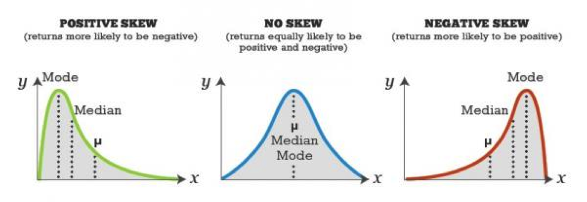

```{r setup, include=FALSE}
knitr::opts_chunk$set(echo = FALSE, warning = FALSE, message = FALSE)

## options(knitr.table.format = "html") 
options("kableExtra.html.bsTable" = T)
```

```{r}
change_margin = function(x, margin = "2cm"){
  ## função para adicionar uma margem à direita da tabela quando colocamos como float.
   gsub("margin-right: 10px;", paste("margin-right:", margin), x)
}
```


# Análise Descritiva

## Análise Descritiva Univariada

Na aula passada trabalhamos na análise descritiva univariada para variáveis categóricas (nominal e ordinal) e quantitativas (discreta e contínua).

Relembrando, a análise descritiva univariada consiste em:


* classificar a variável quanto ao seu tipo

* obter tabela, gráfico e/ou medidas resumo apropriados

Na aula de hoje, falaremos sobre **estatísticas sumárias** ou **medidas resumo**, tanto de posição quanto de dispersão.


## Medidas Resumo

Vimos na aula anterior como usar gráficos e tabelas de frequência para resumir os dados.

Podemos também usar **estatísticas sumárias** (ou **medidas resumo**): quantidades numéricas calculadas a partir dos dados.

Por exemplo, podemos estar interessados em encontrar qual seria um valor "típico" do conjunto de dados.


Podemos então usar uma estatística que descreva o centro da distribuição dos dados. 

**Objetivo**: resumir os dados, através de valores que representem o conjunto de dados em relação à alguma característica (posição, dispersão).


# Medidas de Posição Central

## Média Aritmética 

Se $x_1, x_2, \ldots, x_n$ são as $n$ observações, a média aritmética é:

$$\bar{x}=\frac{1}{n}\sum_{i=1}^nx_i$$

A média pode ser interpretada como o ponto de equilíbrio de uma distribuição.

<center></center>


## Exemplo: Cereais matinais

Temos cereias matinais de várias marcas e observamos a quantidade de calorias e carboidratos em porções de 30g.


```{r}
library(dplyr)
library(knitr)
library(kableExtra)
cereais = data.frame(Cereal = 
                      c("Sucrilhos", "All Bran", "Nesfit", "Nescau", 
                        "Snow", "Crunch", "Moça", "Fibra Mais", "Froot Loops"),
                    Calorias=c(109, 81, 102, 115, 113, 119, 113, 84, 113),
                    Carboidratos=c(26, 13.5, 21, 23, 25, 23, 25, 15, 25))

cereais %>% 
  kable(caption = "Calorias e Carboidratos (Porções de 30g)") %>% 
  kable_styling(bootstrap_options = c("striped", "condensed"),
                full_width = FALSE, font_size = 18, position = "left")


media = mean(cereais$Calorias)
```


## Exemplo: Cereais matinais 

Calorias dos 9 cereais: 109, 81, 102, 115, 113, 119, 113, 84, 113 <br /> 
$x_i$: calorias do cereal $i$.

$$\bar{x} = \frac{1}{n}\sum_{i=1}^nx_i = \frac{1}{9}\sum_{i=1}^9x_i = `r round(media, 2)`$$
No gráfico de pontos abaixo, os pontos azuis representam as observações e a linha vermelha representa a média.

<center>
```{r, fig.height=2, fig.width=6.5}
par(mar=c(2, 2, 1, 1))
stripchart(cereais$Calorias, xlab="Calorias (porção 30g)", 
           method="stack", col="blue", 
           lwd=2, pch=19)
abline(v=media, col="red", lwd=2)
```
</center>


## Mediana

**Mediana**: valor que separa os dados em dois grupos de tamanhos iguais, ou seja, 50% das observações em cada, de acordo com seus valores ordenados.

Para determinar a mediana (também conhecida como $Q_2$), ordene as $n$ observações: $x_{(1)}, x_{(2)}, \ldots, x_{(k)}, \ldots, x_{(n)}$ 

* Se $n$ é **ímpar**: a mediana é o valor do meio, na sequência ordenada. <br />
* Se $n$ é **par**: a mediana, por convenção, é a média aritmética das duas observações  que caem no meio da sequência ordenada.

A fórmula da mediana pode ser escrita como:
$$
Q_2= \begin{cases}
   x_{\left(\frac{n+1}{2}\right)} \,,& \mbox{se  $n$ é ímpar} \\ 
    \frac{x_{\left(\frac{n}{2}\right)}+x_{\left(\frac{n}{2}+1\right)}}{2}\,, & \mbox{se  $n$ é par}
  \end{cases}
$$


## Exemplo: Cereais matinais 


Calorias dos 9 cereais: <br />
109, 81, 102, 115, 113, 119, 113, 84, 113
```{r, eval=FALSE}
cereais$Calorias
```

Calorias em ordem crescente: <br />
81, 84, 102, 109, 113, 113, 113, 115, 119
```{r, eval=FALSE}
sort(cereais$Calorias)
```

<br />
A mediana é 5ª observação, ou seja, **`r median(cereais$Calorias)`**.

<br />
Se descartássemos o maior valor, 119, teríamos oito observações e aí a mediana seria:
$$\mbox{mediana} = \frac{109 + 113}{2} = 111.$$

## Moda 

A moda é o valor com maior número de ocorrências nos dados. 


Calorias dos 9 cereais: <br />
109,  81, 102, 115, 113, 119, 113,  84, 113
```{r, eval=FALSE}
cereais$Calorias
```

Tabela de frequências:
```{r}
t(table(cereais$Calorias)) %>% 
  kable() %>% 
  kable_styling(bootstrap_options = c("bordered", "striped"), 
                position = "left", font_size = 22, full_width = FALSE) %>% 
  column_spec(1:7, width = "1.5cm")
```

Portanto, a moda de calorias dos cereias é 113.


## Exemplo: Emissão de $CO_2$ 

Veja a tabela com dados da emissão de $CO_2$ per capita (em toneladas) para 8 países, em 2009.

<!--  -->

```{r}
country = c("China", "Índia", "EUA", "Indonésia", "Brasil", "Rússia", "Paquistão", "Bangladesh")
co2 = c(5.8, 1.7, 17.3, 1.9, 1.9, 11.1, 0.9, 0.3)

dados = tibble("País" = country, "Emissão CO2" = co2)
```


```{r tabelaCO2}
dados %>% kable() %>% 
  kable_styling(c("bordered", "striped", "condensed"),
              position = "float_left", full_width = FALSE, 
              font_size = 22) %>% 
  column_spec(1, bold = T) %>%
  footnote(general = c("http://data.worldbank.org"), 
           general_title = "Fonte:" ,
           fixed_small_size=TRUE) %>% 
  change_margin()
```

<!-- País | Emissão $CO_2$ | País | Emissão $CO_2$    -->
<!-- ---- | -------------- | ---- | -------------- -->
<!-- China | 5.8 | Brazil | 1.9 -->
<!-- Índia | 1.7 | Rússia | 11.1  -->
<!-- EUA   | 17.3 | Paquistão | 0.9 -->
<!-- Indonésia | 1.9 | Bangaladesh | 0.3 -->

<center>
```{r, fig.height=2, fig.width=5}
par(mar = c(5.1, 4.1, 1.1, 2.1))
stripchart(co2, xlab="Emissão de CO2 per capita (em toneladas)", col="blue", pch=19)
```
</center>

**Média**: $\displaystyle \quad \bar{x}=\frac{`r sum(co2)`}{8} \approx `r round(mean(co2), 2)`$

```{r, eval=FALSE}
sort(co2)
```

**Dados Ordenados:** <font size=5> 0.3,  0.9,  1.7,  1.9,  1.9,  5.8, 11.1, 17.3 </font><br />
**Mediana** = `r median(co2)`

A mediana é bem menor do que a média.


## Exemplo: Emissão de $CO_2$

Veja a tabela com dados da emissão de $CO_2$ per capita (em toneladas) para 8 países, em 2009.

<!--  -->

```{r}
dados %>% kable() %>% 
  kable_styling(c("bordered", "striped", "condensed"),
              position = "float_left", full_width = FALSE, 
              font_size = 22) %>%
  column_spec(1, bold = T) %>%
  row_spec(3, color = "white", background = "#CD5C5C", strikeout = T) %>% 
  footnote(general = c("http://data.worldbank.org"), 
           general_title = "Fonte:" ,
           fixed_small_size=TRUE) %>% 
  change_margin()
```


Se desconsiderarmos os EUA (maior valor):

```{r}
co2 <- c(5.8, 1.7, 1.9, 1.9, 11.1, 0.9, 0.3)
```

**Média**: $\displaystyle \quad \bar{x}=\frac{`r sum(co2)`}{7} \approx `r round(mean(co2), 2)`$

**Dados Ordenados:** <font size=5> 0.3,  0.9,  1.7,  1.9,  1.9,  5.8, 11.1 </font><br />
**Mediana** = `r median(co2)`

Mediana é menos afetada por valores muito extremos (muito diferentes do resto das observações) que a média.

Dizemos que a mediana é mais **robusta** que a média.


## Exemplo: `SleepStudy`


Vamos voltar no exemplo `SleepStudy`: amostra de 253 alunos universitários que fizeram testes para medir função cognitiva, além de outras informações sobre hábitos relacionados ao sono.

```{r}
library(Lock5Data)  ## carregando o pacote
data(SleepStudy) ## carregando o banco de dados
```

Considere a variável `AverageSleep`, a média de horas de sono em todos os dias.


Como são muitos valores, podemos usar um software (R, Excel, etc) para calcular a média e mediana: 

**Média** = `r round(mean(SleepStudy$AverageSleep), 2)` e **Mediana** = `r median(SleepStudy$AverageSleep)`

Será que o fato desses valores serem próximos é uma coincidência?


## Exemplo: número de casamentos

Os dados abaixo referem-se ao número de vezes que homens e mulheres se casaram.

```{r}
dados = tibble(`Número de Casamentos` = c(0:2, "Total"),
               Mulheres = c(5861, 2773, 105, 8739),
               Homens = c(7074, 1561, 43, 8678))
```


```{r casamentos}
dados %>% kable(format = "html", align = c("c", "r", "r")) %>% 
  kable_styling(bootstrap_options = c("bordered", "striped", "condensed"),
                position = "float_left", full_width = FALSE, 
                font_size = 24) %>% 
  row_spec(4, bold = T) %>% 
  change_margin()
```


<!-- Total de vezes que casou ($x_{i}$) | Mulheres         | Homens  -->
<!-- ---------------------------------- | ---------------- | --------------  -->
<!-- 0 | 5861 | 7074 -->
<!-- 1 | 2773 | 1561 -->
<!-- 2 | 105 | 43 -->
<!-- Total | 8739 | 8678 -->

Você acha que existe diferença entre homens e mulheres quanto ao número de casamentos ?

Qual medida de posição você usaria para apresentar a diferença entre homens e mulheres: **média, mediana ou moda**?

<br />
**Moda** <br />
A moda entre os homens é: $0$ <br />
A moda entre as mulheres é: $0$

<font size=5>
Fonte: [http://www.census.gov/prod/2002pubs/p70-80.pdf](http://www.census.gov/prod/2002pubs/p70-80.pdf)
</font>


## Exemplo: número de casamentos 

```{r casamentos}
```

**Mediana** 

Para as mulheres, a amostra ordenada é:
<font size=5>
$$\underbrace{0\,0\,0\,\ldots0}_{\mbox{5861 0's}}\quad \underbrace{1\,1\,1\,\ldots1}_{\mbox{2773 1's}} \quad \underbrace{2\,2\,2\,\ldots2}_{\mbox{105 2's}}$$
</font>

<br />
Como $n=8739$ é ímpar, a observação central está na posição $(1 + 8739)/2  = 4370$ e essa observação é 0. Portanto, a mediana é 0 para as mulheres.  

Para os homens, analogamente, a mediana também é 0.

Para dados discretos com poucos valores diferentes, a mediana ignora muita informação.


## Exemplo: número de casamentos 

```{r}
dados %>% kable(format = "html", align = c("c", "r", "r")) %>% 
  kable_styling(bootstrap_options = c("bordered", "striped", "condensed"),
                position = "float_left", full_width = FALSE, 
                font_size = 24) %>% 
  row_spec(4, bold = T) %>% 
  change_margin(margin = "1cm")
```

**Média**

Para as mulheres, a média é:
<font size=4>
$$\bar{x}=\frac{0\times 5861 + 1\times 2773 + 2\times 105}{8739} = 0.34$$
</font>

</br>

Para os homens, a média é: 
<font size=4>
$$\bar{x}=\frac{0\times 7074 + 1\times 1561 + 2\times 43}{8678} = 0.19$$
</font>

Nesse caso, temos que a média é a medida de posição que consegue diferenciar homens e mulheres quanto ao número de casamentos.


## Exemplo: número de casamentos 

Como o número de casamentos assume apenas os valores 0, 1 e 2, podemos apresentar os dados usando um gráficos de barra.

<br />
```{r casamentos}
```

```{r, fig.height=4, fig.width=5}
casamento = tibble(Sexo=rep(c("Feminino", "Masculino"), 
                                times=c(8739, 8678)),
                       Vezes=rep(c(0,1,2,0,1,2), times=c(5861,2773,105,7074,1561,43)))
casamento$Vezes = as.factor(casamento$Vezes)

library(ggplot2)
g1 = ggplot(casamento, aes(x = Sexo, fill=Vezes)) + 
    geom_bar(position=position_dodge(), aes(y = ..count..)) + 
    ylab("Número de Pessoas") +
    scale_x_discrete("Gênero") +
  ggtitle("Frequência Absoluta") + 
    scale_fill_discrete(name ="Vezes que casou")+
    theme(axis.text.x = element_text(face="bold", size=12, color="black"),
          axis.text.y = element_text(face="bold", size=12, color="black"))
g1


casamento1 = tibble(prop.table(table(casamento$Sexo, casamento$Vezes), 1))
colnames(casamento1) <- c("Sexo", "Vezes", "Prop")

g2 = ggplot(casamento1, aes(x = Sexo, y=Prop, fill=Vezes)) +
    geom_bar(stat="identity",position='dodge') + 
    ylab("Proporção de Pessoas") +
  ggtitle("Frequência Relativa") + 
    scale_x_discrete("Gênero") +
    scale_fill_discrete(name ="Vezes que casou") + 
    theme(axis.text.x = element_text(face="bold", size=12, color="black"),
          axis.text.y = element_text(face="bold", size=12, color="black"))
## g2
```


## Mediana é resistente a observações discrepantes 

Considere os três conjuntos de dados abaixo:

$$A: 8, 9, 10, 11, 12$$

$$B: 8, 9, 10, 11, 100$$

$$C: 8, 9, 10, 11, 1000$$

Para cada conjunto, calcule a média e a mediana e compare-as.

Média de $A$: 10 $\qquad \;\;\;$ Mediana de $A$: 10

Média de $B$: 27.6 $\qquad \;$ Mediana de $B$: 10

Média de $C$: 207.6 $\qquad$ Mediana de $C$: 10


## Exemplo: Transporte

Uma empresária cuja empresa está localizada na Av. Paulista, em São Paulo, está preocupada com a quantidade de gasolina gasta pelos seus funcionários. Ela quer promover o uso de transporte público entre seus funcionários. Ela decide investigar a extensão, em km, do trajeto percorrido por cada funcionário caso usassem transporte público durante um dia típico.

> Para seus 10 funcionários, os valores são:

$$1, 1, 4, 1, 1, 1, 10, 1, 6, 1$$

> Encontre a média, a mediana e a moda.

> Média é 2.7. 

> Valores ordenados: 1,1,1,1,__1,1__,1,4,6,10.

> Mediana e moda são iguais a 1.


##  Exemplo: Transporte 

A empresária acabou de contratar um novo funcionário. Ele percorre 90 km em transporte público. Recalcule a média e a mediana.

$$1, 1, 4, 1, 1, 1, 10, 1, 6, 1, 90$$

Valores ordenados: 1, 1, 1, 1, 1, **1**, 1, 4, 6, 10, 90.

Mediana é 1. <br />
Média é 10.64.

<br />
Qual medida de posição representa melhor a distância do grupo de funcionários?


## Exemplo: Acidentes com Moto


**Dados**: entrevistas com 60 pessoas, em que cada uma relata o número de acidentes com moto que sofreu no último ano.

Por que a média seria provavelmente mais útil do que a mediana para resumir os dados?


## Exemplo: Salários 

> A **média** salarial anual em 1998 nos EUA para pessoas com ensino superior era \$528.200. 

> A **mediana** do salário anual em 1998 nos EUA para pessoas com ensino superior era \$146.400. 

<br />
Reflita sobre as estatísticas sumárias apresentadas e responda:

1. Por que a média e a mediana diferem tanto?

2. Qual medida de posição você acredita que retrata de maneira mais realística um salário típico de pessoas com ensino superior nos EUA em 1998?


## Exemplo: Sindicato 

> O sindicato dos trabalhadores está reivindicando aumento de salário em uma certa fábrica.

> Explique por que o sindicato poderia usar a mediana dos salários de todos os empregados para justificar um aumento, enquanto que o gerente da fábrica poderia usar a média para argumentar que um aumento não é necessário?


## Média, mediana e a distribuição dos dados

A figura a seguir mostra gráficos para três conjuntos de dados: A, B e C.
```{r, echo=FALSE}
### Ex 2.34 pag 55 Agresti
A <- c(rep(1,4), rep(2,10), rep(3,9), rep(4,6), rep(5,2), rep(6,2), 7, 8, 9)
B <- c(rep(1,2), rep(2,9), rep(3,5), rep(4,2), rep(5,1), rep(6,2), rep(7,5), 
       rep(8,9), rep(9,2))
C <- c(rep(1,1), rep(2,2), rep(3,5), rep(4,8), rep(5,11), rep(6,8), rep(7,5), 
       rep(8,2), rep(9,1))
```

```{r, fig.height=3.5, fig.width=9, echo=FALSE}
par(mfrow=c(1, 3))
stripchart(A, method="stack", offset=1, at=0, ylim=c(0,5), cex=1.7, 
           cex.axis=2, xlab="A", cex.lab=3, pch=15, col = "turquoise3")
stripchart(B, method="stack", offset=1, at=0, ylim=c(0,5), cex=1.7,
           cex.axis=2, xlab="B", cex.lab=3, pch=15, col = "turquoise3")
stripchart(C, method="stack", offset=1, at=0, ylim=c(0,11),  
           cex=1.7, cex.axis=2,  xlab="C", cex.lab=3, pch=15, col = "turquoise3")
```

O que você esperaria da relação entre média e mediana para esses dados?


## Média, mediana e a distribuição dos dados 

Para cada uma das distribuições (A, B, C), qual medida seria maior: média ou mediana?

<center></center>

> **Gráfico A**: média é `r round(mean(A),2)`, mediana é `r round(median(A),2)`.

> **Gráfico B**: média é `r round(mean(B),2)`, mediana é `r round(median(B),2)`.

> **Gráfico C**: média é `r round(mean(C),2)`, mediana é `r round(median(C),2)`.


## Assimetria (Caso Unimodal)

<center></center>

<br />
Se os dados são simétricos, a média coincide com a mediana e a moda.

**Assimetria à direita (positiva)**: Média > Mediana > Moda

**Assimetria à esquerda (negativa)**: Média < Mediana < Moda


# Medidas de Dispersão

## Exemplo: Salário professor de música 

Salário anual hipotético de professores de música na Dinamarca (esquerda) e nos EUA (direita).

```{r}
set.seed(3)
usa = rnorm(800, mean=40, sd=10)
den = rnorm(800, mean=40, sd=4)
dados = tibble(cidade=rep(c("Dinamarca", "USA"), each=800), salario=c(den, usa))
```


```{r, fig.height=3.5, fig.width=8}
g.salarios = ggplot(data=dados, aes(salario, ..density..)) + 
    geom_histogram(binwidth=3, colour="black", fill="turquoise3") +
    labs(x="Salário anual (mil dólares)", y="Densidade") + 
    facet_grid(~ cidade) + 
  theme_bw() + 
  theme(axis.title = element_text(face="bold", size=12),
        axis.text = element_text(face="bold", size=12),
        plot.title = element_text(size=16))

g.salarios
```

> Média salarial Dinamarca: `r round(mean(den),2)`. Média salarial EUA: `r round(mean(usa),2)`. 


## Amplitude 

Uma medida de dispersão é **amplitude**: a diferença entre o maior e o menor valor observado na amostra.


Na Dinamarca:

* Salários variam de `r round(min(den),0)` a `r round(max(den),0)`. <br />
* Amplitude = `r round(max(den),0)` $-$ `r round(min(den),0)`=`r round(max(den),0)-round(min(den),0)`.

Nos EUA:

* Salários variam de `r round(min(usa),0)` a `r round(max(usa),0)`. <br />
* Amplitude = `r round(max(usa),0)` $-$ `r round(min(usa),0)` = `r round(max(usa),0)-round(min(usa),0)`.

Problema com a amplitude: utiliza apenas duas observações (a máxima e a mínima).


## Medidas de Dispersão 

Considere dois conjuntos de dados:

$A=\{1, 2, 5, 6, 6\}$ e $B=\{-40, 0, 5, 20, 35\}$ 

> Ambos com média 4  e mediana 5. 

> No entanto, claramente temos que os valores de $B$ são mais dispersos do que em $A$. 

> Que medida podemos usar para considerar essa característica dos dados?


## Medidas de Dispersão 

Podemos observar quão afastadas de uma determinada medida de posição estão as observações.

**Desvio** de uma observação $x_i$ da média $\bar{x}$ é a diferença entre a observação e a média dos dados: $(x_i-\bar{x})$.

* O desvio é negativo quando a observação tem valor menor do que a média. <br />
* O desvio é positivo quando a observação tem valor maior do que a média.

Estamos interessados nos desvios de todos os pontos $x_i$'s, então poderia-se propor a seguinte medida de dispersão: $\sum_{i=1}^n(x_i-\bar{x})$.

Qual o problema? 

* A média representa o ponto de balanço dos dados, então os desvios irão se contrabalancear, ou seja: $\sum_{i=1}^n(x_i-\bar{x})=0$.


## Medidas de Dispersão 

Além do mais, uma medida de dispersão onde os desvios positivos e negativos se cancelam, não seria útil.

Queremos que se leve em conta cada desvio, independente do sinal.

Alternativas:

$\displaystyle \sum_{i=1}^n\mid x_i-\bar{x}\mid \qquad \mbox{ou} \qquad \sum_{i=1}^n(x_i-\bar{x})^2$

Ambas alternativas evitam que desvios iguais em módulo, mas com sinais opostos, se anulem.

**Nota**: Veja que $\displaystyle \sum_{i=1}^n(x_i-\bar{x})^2=\sum_{i=1}^nx_i^2-n\bar{x}^2.$


## Variância e Desvio padrão 

A média dos desvios ao quadrado é denominada **variância**: 
$$s^2 = \frac{1}{n-1}\sum_{i=1}^n(x_i-\bar{x})^2$$

**Desvio padrão** é a raiz quadrada da variância:

$$s = \sqrt{\frac{\sum_{i=1}^n(x_i-\bar{x})^2}{n-1}}$$

**Interpretação**: distância típica entre uma observação e a média dos dados.

Quanto maior $s$, maior a dispersão dos dados.


## Exemplo A

Conjunto de dados $A: \{1, 2, 5, 6, 6\}$.

A média é $\displaystyle \bar{x} = \frac{20}{5} = 4.$


Então, a variância é:
$$s^2 = \frac{9 + 4 + 1 + 4 + 4}{5-1} = 5.5,$$
e o desvio padrão:
$$s = \sqrt{s^2} = \sqrt{5.5} = `r round(sqrt(5.5), 2)`.$$ 


## Exemplo B

Conjunto de dados $B: \{-40, 0, 5, 20, 35\}$.

A média é $\displaystyle \bar{x} = \frac{20}{5} = 4.$


Então, a variância é:
$$s^2 = \frac{1936 + 16 + 1 + 256 + 961}{5-1} = 792.5,$$
e o desvio padrão:
$$s = \sqrt{s^2} = \sqrt{792.5} = `r round(sqrt(792.5), 2)`.$$ 


## Exemplo: Salário professor de música

```{r, echo=FALSE, fig.height=3.5, fig.width=8}
g.salarios
```

**Salários na Dinamarca**: média = `r round(mean(den), 2)` e variância= `r round(var(den), 2)`. 

**Salários nos EUA**: média = `r round(mean(usa), 2)` e variância= `r round(var(usa), 2)`. 


## Exemplo: "Qual o número ideal de filhos?"

```{r}
### Ex 13 pag 58 Agresti
homens = c(rep(0, 3), rep(4, 3), 2)
mulheres = c(0, rep(2, 5), 4)
```


```{r, fig.width=7, fig.height=3, eval=FALSE}
par(mfrow = c(2, 1), mar=c(4, 2, 1, 2))
stripchart(homens, method="stack", offset=1, at=0.1, ylim=c(0, 5), cex=1.7, 
           cex.axis=1.5, xlab="Homens", cex.lab=1.7, pch=15, 
           col = "turquoise3")
stripchart(mulheres, method="stack", offset=1, at=0.1, ylim=c(0, 5), cex=1.7,
           cex.axis=1.5, xlab="Mulheres", cex.lab=1.7, pch=15,
           col = "turquoise3")

## gráfico salvo como "numeroFilhos.png"
```


**Homens**: 0, 0, 0, 4, 4, 4, 2 <br />
**Mulheres**: 0, 2, 2, 2, 2, 2, 4

**Média:** 2 (para ambos os sexos) <br />
**Amplitude:** 4 (para ambos os sexos)

Para homens, desvio típico da média parece estar em torno de 2 <br />
Desvio padrão: $s=`r round(sd(homens), 2)`$
 
Para mulheres, desvio típico da média é menor do que o dos homens, pois a grande maioria das observações coincide com a própria média. <br />
Desvio padrão: $s=`r round(sd(mulheres), 2)`$


## Exemplo: Prova 1 de ME414 

A primeira prova de ME414 teve um total de 100 pontos. Suponha que a média tenha sido 80.
 
Qual seria um valor plausível para o desvio padrão das notas da classe? $s$: 0, 10 ou 50.


 
> * $s=0$: todos os alunos tiraram a mesma nota.
> * $s=50$: uma nota típica da classe estaria 50 pontos distante da média, ou seja, 30 ou 130 pontos.
> * $s=10$: notas típicas seriam de 70 ou 90.


## Leitura

* [Ross](http://www.sciencedirect.com/science/book/9780123743886): seções 3.1, 3.2, 3.3, 3.4, 3.5

* [Khan Academy: Por que $n-1$ no cálculo de $s^2$?](https://www.youtube.com/watch?v=KkaU2ur3Ymw)

* [Simulação mostrando o porque de usarmos $n-1$ no cálculo de $s^2$](https://www.youtube.com/watch?v=0QS4VHPV4JA)


<br />
Slides produzidos pelos professores:

* Samara Kiihl

* Tatiana Benaglia

* Benilton Carvalho

* Larissa Matos


