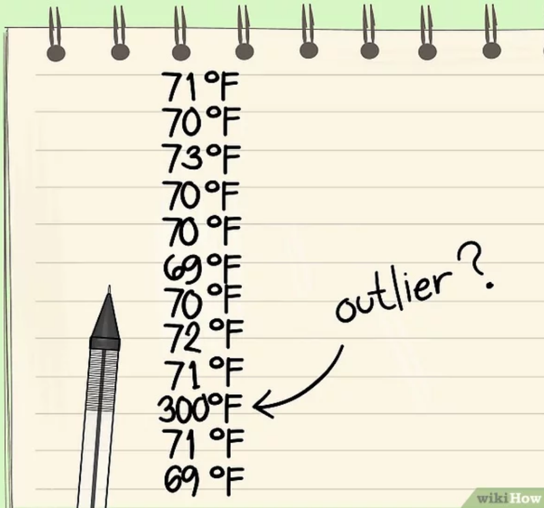

```{r setup, include=FALSE}
knitr::opts_chunk$set(echo = FALSE, warning = FALSE, message = FALSE)

## options(knitr.table.format = "html") 
options("kableExtra.html.bsTable" = T)
```

```{r}
change_margin = function(x, margin = "2cm"){
  ## função para adicionar uma margem à direita da tabela quando colocamos como float.
   gsub("margin-right: 10px;", paste("margin-right:", margin), x)
}
```


# Medidas de Dispersão 

## Exemplo: Salários de professores de música

```{r}
library(dplyr)
set.seed(3)
usa = rnorm(800, mean=40, sd=10)
den = rnorm(800, mean=40, sd=4)
dados = tibble(cidade=rep(c("Dinamarca", "USA"), each=800), salario=c(den, usa))
```

Lembram do exemplo dos salários de professores de música na Dinamarca e EUA?


A média dos salários são equivalentes. <br />
Então, para comparar, usamos uma medida de dispersão como, por exemplo, o **desvio padrão**:
$$s = \sqrt{\frac{1}{n-1} \sum_{i=1}^n(x_i-\bar{x})^2}$$

<br />
**Dinamarca**: $\bar x$ = `r round(mean(den), 2)` e $s$ = `r round(sd(den), 2)` <br />
**EUA**: $\bar x$ = `r round(mean(usa), 2)` e $s$ = `r round(sd(usa), 2)`


## Dispersão dos Dados {.build}

Considere dois conjuntos de dados: 

$$\begin{align*}
& A = \{1, 2, 3\} & \Longrightarrow & \qquad \overline{x}_A = 2, \quad s_A= 1 \\
& B = \{101, 102, 103\} & \Longrightarrow & \qquad \overline{x}_B = 102, \quad s_B= 1
\end{align*}$$
 
Ambos têm o mesmo desvio padrão. 

Se compararmos as escalas de cada conjunto de dados, poderíamos dizer que o segundo conjunto tem menor dispersão. 

Veja que:

* A maior observação do conjunto $A$, 3, é 3 vezes maior do que a menor observação, 1.
* Já a maior observação do conjunto $B$, 102, é 1\% maior do que  a menor observação, 101.


## Exemplo: Notas {.build}

Considere as notas de 2 provas:


```{r}
set.seed(3)
prova1 = rnorm(50, mean=70, sd=1)
prova2 = rnorm(50, mean=7, sd=1)
```


```{r, eval=FALSE, fig.height=2.5, fig.width=7}
par(mfrow=c(1, 2), mar=c(4, 4, 1, 1))
hist(prova1, freq=FALSE, xlab="Notas da Prova 1", ylab="Densidade", 
     main=" ", xlim=c(0,100), ylim=c(0,.5), cex.axis=1.2, cex.lab=1.1, 
     col="turquoise3", las=1)
hist(prova2, freq=FALSE, xlab="Notas da Prova 2", ylab="Densidade",
     main=" ", xlim=c(0,10), ylim=c(0,.5), cex.axis=1.2, cex.lab=1.1, 
     col="turquoise3", las=1)

## figura salva como histograma_notas.png
```

```{r, eval=FALSE, fig.height=2.5, fig.width=7}
library(ggplot2)
set.seed(3)
prova1 <- rnorm(50, mean=70, sd=1)
prova2 <- rnorm(50, mean=7, sd=1)
provas <- data.frame(tipo=rep(c("Prova 1", "Prova 2"), each=50), notas=c(prova1, prova2))

g1 = ggplot(data=provas, aes(notas, ..density..)) + 
    geom_histogram(bins=20, colour="black", fill="turquoise3") +
    labs(x="Notas", y="Densidade") +  
    facet_grid(~ tipo, scales = "free_x") + 
    theme(axis.title = element_text(face="bold", size=12, color="black"),
          axis.text = element_text(face="bold", size=12, color="black")) + 
  theme_bw()
```

**Prova 1**: Notas de 0 a 100 <br />
**Média da turma**: $\bar x_1 = 70$ <br />
**Desvio padrão**: $s_1 = 1$

<br />
**Prova 2**: Notas 0 a 10 <br />
**Média da turma**: $\bar x_2 = 7$ <br />
**Desvio padrão**: $s_2 = 1$

<br /><br />
Neste caso, como as escalas são diferentes, não podemos tirar conclusões usando apenas o desvio padrão.


## Coeficiente de Variação {.build}

**Coeficiente de variação (CV)**: razão do desvio padrão $s$ pela média $\bar x$, isto é
$$CV= \frac{s}{\bar{x}}.$$
</br>
**Exemplo:** 
$$\begin{align*}
& A = \{1, 2, 3\} & \Longrightarrow & \qquad \overline{x}_A = 2, \quad s_A= 1 \\
& B = \{101, 102, 103\} & \Longrightarrow & \qquad \overline{x}_B = 102, \quad s_B= 1
\end{align*}$$

Nesse caso, 
$$CV_A = \frac{s_A}{\overline{x}_A} = 0.5 \qquad \mbox{e} \qquad CV_B = \frac{s_B}{\overline{x}_B} = 0.0098.$$

## Coeficiente de Variação

Exemplos das notas de duas provas:


**Prova 1**: $\bar x_1 = 70$ e $s_1=1$ 

**Prova 2**: $\bar x_2 = 7$ e $s_2=1$ 

<br />
**Coeficiente de Variação:** é o desvio padrão escalonado pela média dos dados.

<br />
Vamos calcular os CVs para esses dois casos:
$$CV_1 = \frac{s_1}{\overline{x}_1} = 0.014 \qquad \mbox{e} \qquad CV_2 = \frac{s_2}{\overline{x}_2} \approx 0.14.$$


## Medidas de posição para descrever dispersão {.build}

> **Média e mediana**: medidas de posição **central**.

> **Amplitude e desvio padrão**: medidas de dispersão.

> Há outros tipos de medida de posição para descrever a distribuição dos dados: **quartis** e **percentis**.


> **Quartis** dividem os dados em 4 partes iguais: primeiro quartil ($Q_1$), segundo quartil ($Q_2$) e o terceiro quartil ($Q_3$).

> O **p-ésimo percentil** é o valor tal que uma porcentagem **p** dos dados ficam abaixo dele.


## Quartis {.build}


Para obter os quartis:

1) Ordene os dados em ordem crescente.

2) Encontre a mediana $Q_2$.

3) Considere o subconjunto de dados abaixo da mediana. $Q_1$ é a mediana deste subconjunto de dados.

4) Considere o subconjunto de dados acima da mediana. $Q_3$ é a mediana deste subconjunto de dados.


## Exemplo: Sódio em cereais matinais {.build}


Considere as quantidades de sódio (mg) em 20 cereais matinais: 

<center>
 0, 70, 125, 125, 140, 150, 170, 170, 180, **200**
 
**200**, 210, 210, 220, 220, 230, 250, 260, 290, 290
</center>

</br>
Para obter $Q1$, calcula-se a mediana considerando apenas as 10 primeiras observações ordenadas: 0, 70, 125, 125, $\underbrace{140, 150}_{Q_1=145}$, 170, 170, 180, **200**

Para obter $Q3$, calcula-se a mediana considerando apenas as 10 últimas observações ordenadas:
 **200**, 210, 210, 220, $\underbrace{220, 230}_{Q_3=225}$, 250, 260, 290, 290


## Simetria e Assimetria da Distribuição {.build}

Vimos na aula passada que as posições da média e mediana fornecem informação sobre o formato da distribuição.

```{r, fig.height=2.3, fig.width=7.5}
par(mfrow=c(1, 3), mar=c(0, 2, 2, 1))
set.seed(44)
sym <- rnorm(10000)
plot(density(sym), ylab="", main="Média=Mediana", xlab="", axes=FALSE, 
     xlim=c(-3,3), cex.lab=1.5, lwd=3)
abline(v=0, col="red", lty=2,lwd=3)
abline(v=0, col="blue", lty=2,lwd=3)
legend("topright", legend=c("Média", "Mediana"), col=c("blue", "red"), 
       lty=2, border="white", lwd=3)

set.seed(44)
asymDir = c(rchisq(1000, df=15))
plot(density(asymDir), ylab="", main="Média > Mediana", xlim=c(4, 35),
     axes=FALSE, xlab="", cex.lab=1.5, lwd=3)
abline(v=14, col="red", lty=2, lwd=3)
abline(v=18, col="blue", lty=2, lwd=3)

asymEsq = -asymDir
plot(density(asymEsq), ylab="", main="Média < Mediana", xlim=c(-35, -4),
     axes=FALSE, xlab="", cex.lab=1.5, lwd=3)
abline(v=-14, col="red", lty=2, lwd=3)
abline(v=-18, col="blue", lty=2, lwd=3)
#legend("topright", legend=c("Média", "Mediana"), col=c("blue", "red"), lty=2, border="white", lwd=3)
```


Em geral, se a distribuição é: <br />
- **Perfeitamente simétrica**: média = mediana. <br />
- **Assimétrica à direita**: média $>$ mediana. <br />
- **Assimétrico à esquerda**: média $<$ mediana.


## Quartis e Assimetria

 Os quartis também fornecem informação sobre o formato da distribuição.
```{r, fig.height=3, fig.width=6}
set.seed(2015)
par(mar = c(3, 3, 2, 1))
asymDir <- round(c(rchisq(1000, df=15)), 0)
a <- boxplot(asymDir, plot=FALSE)
q1 <- round(a$stats[2], 0)
q2 <- round(a$stats[3], 0)
q3 <- round(a$stats[4], 0)
plot(density(asymDir), ylab="",main=" ", xlim=c(4, 35), axes=FALSE, 
     xlab="", cex.lab=1.5, lwd=3)
abline(v=q1, col="red", lty=2, lwd=3)
abline(v=q2, col="red", lty=2, lwd=3)
abline(v=q3,col="red",lty=2,lwd=3)
axis(side=1, at=c(q1,q2,q3), labels=c(paste0("Q1=", q1), 
                                      paste0("Q2=", q2), paste0("Q3=", q3)))
```

A mediana $Q_2$ é 14. 

A distância entre $Q_1$ e $Q_2$ é `r q2-q1`, enquanto que a distância entre $Q_2$ e $Q_3$ é `r q3-q2`, indicando que a distribuição é assimétrica à direita.
 
 
## Quartis e simetria da distribuição {.build}


Para uma distribuição simétrica ou aproximadamente simétrica:

> * $Q_2-x_{(1)}\approx x_{(n)}-Q_2$

> * $Q_2-Q_1\approx Q_3-Q_2$

> * $Q_1-x_{(1)} \approx x_{(n)}-Q_3$

> * distâncias entre a mediana e $Q_1$, $Q_3$ menores do que as distâncias entre os extremos e $Q_1$, $Q_3$.


## Exemplo: Pesos de alunas de Educação Física  {.build}

Veja as medidas resumo dos pesos (em libras) de 64 alunas de Educação Física:
<font size=5>$\bar{x}=133$, $Q_1=119$, $Q_2=131.5$, e $Q_3=144$.</font>

Como interpretar os quartis?


* 25\% das alunas pesa até 119 libras.
* 25\% das alunas pesa mais do que 144 libras.
* 75\% das alunas pesa até 144 libras.

Você acredita que a distribuição seja simétrica?
<font size=5>
$$Q_2-Q_1\approx Q_3-Q_2\quad(?)$$

$$\underbrace{Q_2-Q_1}_{131.5-119=12.5}=\underbrace{Q_3-Q_2}_{144-131.5=12.5}$$</font>

 
## Intervalo Interquartílico {.build}

A vantagem do uso de quartis sobre o desvio padrão ou a amplitude, é que os quartis são mais resistentes a dados extremos, ou seja, são mais **robustos**.
 
**Intervalo interquartílico (IQ)** = $Q_3-Q_1$

Representa 50\% dos dados localizados na parte central da distribuição.

```{r, fig.height=3, fig.width=6}
par(mar = c(2, 3, 1, 1))
dens <- density(asymDir)
plot(dens, ylab="", main=" ", xlim=c(4, 35), axes=FALSE, xlab="", 
     cex.lab=1.5, lwd=3)
axis(side=1, at=c(q1, q2, q3), labels=c("Q1","Q2","Q3"))
x1 <- min(which(dens$x >= q1))  
x2 <- max(which(dens$x <  q3))
with(dens, polygon(x=c(x[c(x1, x1:x2, x2)]), y=c(0, y[x1:x2], 0),
                   col="lightpink"))
# abline(v=q1, col="red", lty=2, lwd=3)
# abline(v=q3, col="red", lty=2, lwd=3)
```


# Esquema dos 5 números e Boxplot

## Esquema dos 5 números


**Notação:** <br />
$x_{(1)}$: mínimo <br />
$x_{(k)}$: $k$-ésima observação depois de ordenar os dados <br />
$x_{(n)}$: máximo 

<br /><br />
Lembrando que a fórmula da mediana ($Q_2$) é dada por:
$$
Q_2= \begin{cases}
   x_{\left(\frac{n+1}{2}\right)} \,,& \mbox{se  $n$ é ímpar} \\ 
    \frac{x_{\left(\frac{n}{2}\right)}+x_{\left(\frac{n}{2}+1\right)}}{2}\,, & \mbox{se  $n$ é par}
  \end{cases}
$$


## Dados discrepantes (*Outliers*) {.build}

**Importante:** examinar os dados para verificar se há observações discrepantes.



* Média e desvio padrão são muito afetados por observações discrepantes.

* Após detectar a observação discrepante, verificar se não é um erro de digitação ou um caso especial da sua amostra.

* Com poucos dados, podemos detectar um dados discrepante facilmente, apenas observando a sequência ordenada.

* Podemos usar o IQ como um critério mais geral de detecção de dados discrepantes.


## Dados discrepantes (*Outliers*) {.build}

Como regra geral, dizemos que uma observação é um potencial *outlier* se está:

* abaixo de $Q_1-1.5\times IQ$ ou 
* acima de $Q_3+1.5 \times IQ$.

```{r, fig.height=2, fig.width=8}
par(mfrow=c(1, 4), mar=c(2, 2, 1, 1))
set.seed(44)
asymDir <- c(rchisq(1000, df=15))
asymEsq <- c(-asymDir, rep(-30, 30))
plot(density(asymEsq), ylab="", main=" ", xlim=c(-35, -4), axes=FALSE, 
     xlab="", cex.lab=1.5, lwd=3)
a <- boxplot(asymEsq, plot=FALSE)
IQ <- a$stats[4] - a$stats[2]
LI <- a$stats[2] - 1.5*IQ
abline(v=LI, col="red", lty=2, lwd=3)
axis(side=1, at=c(LI), labels=c("Q1 - 1.5 IQ"), cex.axis=1.5, cex.lab=1.5)

set.seed(44)
asymDir <- c(rchisq(1000, df=15))
asymEsq <- c(-asymDir)
plot(density(asymEsq), ylab="",main=" ", xlim=c(-35, -4), axes=FALSE, 
     xlab="", cex.lab=1.5, lwd=3)
a <- boxplot(asymEsq, plot=FALSE)
IQ <- a$stats[4] - a$stats[2]
LI <- a$stats[2] - 1.5*IQ
abline(v=LI, col="red", lty=2, lwd=3)
axis(side=1, at=c(LI), labels=c("Q1 - 1.5 IQ"),cex.axis=1.5,cex.lab=1.5)

set.seed(44)
asymDir <- c(rchisq(1000, df=15))
a <- boxplot(asymDir, plot=FALSE)
IQ <- a$stats[4] - a$stats[2]
LS <- a$stats[4] + 1.5*IQ
plot(density(asymDir), ylab="", main=" ", xlim=c(4, 35), axes=FALSE, 
     xlab="", cex.lab=1.5, lwd=3)
abline(v=LS, col="red", lty=2, lwd=3)
axis(side=1, at=c(LS), labels=c("Q3 + 1.5 IQ"), cex.axis=1.5, cex.lab=1.5)

set.seed(44)
asymDir <- c(rchisq(1000, df=15), rep(30, 30))
plot(density(asymDir), ylab="",main=" ", xlim=c(4, 35), axes=FALSE, 
     xlab="", cex.lab=1.5, lwd=3)
a <- boxplot(asymDir, plot=FALSE)
IQ <- a$stats[4] - a$stats[2]
LS <- a$stats[4] + 1.5*IQ
abline(v=LS, col="red", lty=2, lwd=3)
axis(side=1, at=c(LS), labels=c("Q3 + 1.5 IQ"), cex.axis=1.5, cex.lab=1.5)
```

Dizemos *potencial outlier*, pois se a distribuição tem cauda longa, algumas observações irão cair no critério, apesar de não serem *outliers*.


## Boxplot {.build}

**Boxplot**: representação gráfica do esquema dos 5 números. 

Esse gráfico permite resumir visualmente importante características dos dados (posição, dispersão, assimetria) e identificar a presença de *outliers*.


**ATENÇÃO:** Prestem atenção no que são os limites inferior e superior!!!


## Boxplot {.build}


Voltando no exemplo das quantidades de sódio (mg) em 20 cereais matinais:

<font size=5>
$$0, 70, 125, 125, 140, 150, 170, 170, 180, 200,$$ 
$$200, 210, 210, 220, 220, 230, 250, 260, 290, 290$$ 
</font>

Já calculamos anteriormente: <font size=5>$Q_2 = 200, Q_1 = 145 \mbox{ e } Q_3 = 225.$</font><br />
Esses valores podem ser representados pelo boxplot a seguir:

```{r}
cereais = c(0, 70, 125, 125, 140, 150, 170, 170, 180, 200,
             200, 210, 210, 220, 220, 230, 250, 260, 290, 290)
```

<center>
```{r, fig.width=5, fig.height=2.2}
par(mar=c(4, 1, 0, 1))
tmp = boxplot(cereais, horizontal=TRUE, outline=TRUE, ylim=c(-1, 330), 
        col="turquoise3", type=3, xlab="Quantidade de Sódio (mg)")
```
</center>


## Exemplo: Sódio em cereais matinais {.build}


Regra para detectar *outliers*:
<font size=5>
$IQ=Q_3-Q_1=225-145=80$
$Q_1-1.5\times IQ = 25 \quad \mbox{e} \quad Q_3+1.5\times IQ = 345$ </font>

Então, possíveis *outliers* são observações menores que 25 ou maiores que 345. 

**Limites Superior e Inferior:** as linhas pontilhadas denotam o mínimo/máximo dos dados que estão na região entre 25 e 345. 

**Limite superior:** a observação máxima dos dados, 290, está no intervalo, então a linha superior vai até 290.

**Limite inferior:** a observação mínima dos dados, 0, está fora do intervalo (outlier=0). Desconsiderando o outlier, o valor mínimo dos dados é 70, que está no intervalo. Portanto, a linha inferior vai até 70.


<!-- ## Construção do Boxplot -->

<!-- **Primeiro passo:** construir uma caixa que vai do primeiro ao terceiro quartil. -->

<!-- <center> -->
<!--   -->
<!-- </center> -->


<!-- ## Construção do Boxplot -->

<!-- **Segundo passo:** construir uma linha no meio da caixa, na altura da mediana ($Q_2$). -->

<!-- <center></center> -->


<!-- ## Construção do Boxplot -->

<!-- **Terceiro passo:** definir os limites para que uma observação seja considerada *outlier*. -->

<!-- <center></center> -->


<!-- ## Construção do Boxplot  -->

<!-- **Quarto passo:** desenhar uma linha que saia da parte inferior da caixa e desça até o menor valor dos dados, mas que não ultrapasse os limites do critério de outliers. Desenhar uma linha que saia da parte superior da caixa e suba até o maior valor dos dados, mas que não ultrapasse os limites do critério de outliers. Outliers, quando existem, aparecem indicados separadamente no gráfico. -->

<!-- <center></center> -->


## Construção de um Boxplot 


Assista ao vídeo da Khan Academy sobre como criar um boxplot:

https://youtu.be/OanEVzmBD8Y

<br /><br /><br />
Vejam e pratiquem com o tutorial:

**Como resumir dados quantitativos**

https://pt.khanacademy.org/math/ap-statistics/summarizing-quantitative-data-ap/stats-box-whisker-plots


## Exemplo: Taxa de desemprego na UE em 2003 {.build}

```{r}
desemprego = c(8.3, 6.0, 9.2, 9.3, 11.2, 9.5, 6.7, 4.4, 
                3.9, 4.6, 8.5, 8.9, 4.5, 6.0, 4.8)

library(dplyr)
library(knitr)
library(kableExtra)

des = tibble("País"=c("Bélgica", "Dinamarca", "Alemanha", "Grécia",
                         "Espanha", "França", "Portugal", "Holanda",
                         "Luxemburgo", "Irlanda", "Itália", "Finlândia",
                         "Áustria", "Suécia", "Reino Unido"),
                  Taxa=desemprego)
## des %>% 
  
cbind(des[1:8,], rbind(des[9:15,], c("", ""))) %>% 
  kable(align = c("l", "r", "l", "r")) %>% 
  kable_styling(bootstrap_options = c("striped", "condensed", "bordered"), 
                full_width = FALSE, font_size = 22, position = "float_left") %>%
  column_spec(column = c(1, 3), bold = T) %>% 
  column_spec(column = c(2, 4), width = "2cm") %>% 
  change_margin()
```

Responda: 

1. Qual a amplitude dos dados?

2. Encontre os valores da mediana e de $Q_1$ e $Q_3$?

3. Desenhe um boxplot.


## Exemplo: Taxa de desemprego na UE em 2003 {.build}

```{r}
Q1 = quantile(desemprego, prob=.25, type=2)
Q3 = quantile(desemprego,prob=.75, type=2)
IQ = IQR(desemprego, type=2)
LI = Q1-1.5*IQ
LS = Q3+1.5*IQ
```

Ordenando os dados:
<font size=5>
$$3.9,\; 4.4,\; 4.5,\; \mathbf{4.6},\; 4.8,\; 6.0,\; 6.0,\; \mathbf{6.7},\; 8.3,\; 8.5,\; 8.9,\; \mathbf{9.2},\; 9.3,\; 9.5,\; 11.2$$

<div class="column-left">

Amplitude: 11.2 - 3.9 = 7.3 <br />
Mediana = `r median(desemprego)` <br />
$Q_1$ = `r Q1` e $Q_3$ = `r Q3` <br />
$IQ = Q_3-Q_1$ =`r IQ` <br />
$Q_1-1.5\times IQ$ = `r LI` <br />
$Q_3 + 1.5\times IQ$  =`r LS` 
</font>

O mínimo e o máximo pertencem ao intervalo (`r LI`, `r LS`), portanto as linhas pontilhadas terminam no máximo (`r max(desemprego)`) e no mínimo (`r min(desemprego)`).
</div>

<div class="column-right">
<center>
```{r, fig.height=4, fig.width=3}
par(mar=c(1, 4, 2, 1))
boxplot(desemprego, type=2, col="lightblue", 
        ylab="Taxa de Desemprego", las = 1)
```
</center>
</div>


## Exemplo:  População dos estados brasileiros {.build}

A tabela abaixo apresenta a população (em 1000 habitantes) dos 26 estados brasileiros e o Distrito Federal.

```{r}
estados <- c(325,478,558,1158,1380,1785,2052,2079,2505,2777,2813,2823,2844,3098,
             3444,5004,5357,5652,6193,7431,7919,9564,10188,13071,14392,17892,37033)

med <- median(estados) # Q2
Q1 <- quantile(estados, prob=.25, type=2) # Q1
Q3 <- quantile(estados, prob=.75, type=2) # Q3
IQ <- IQR(estados, type=2) # IQ
```


Temos 27 estados ($n$ é ímpar). 

Portanto, a mediana é $x_{\left(\frac{n+1}{2}\right)}= x_{\left(\frac{27+1}{2}\right)}=x_{(14)}=3098$ (ES).

<br />
A metade inferior dos dados: 13 observações. <br />
A mediana deste subconjunto é $Q_1=x_{(7)}=2052$ (DF).

A metade superior dos dados: 13 observações. <br />
A mediana deste subconjunto é $Q_3=x_{(21)}=7919$ (PE).

$IQ=Q_3-Q_1=7919-2052=5867$


## Exemplo: População dos estados brasileiros {.build}

População (em 1000 habitantes):


<font size=5>
$Q_1-1.5\times IQ=-6748.5$

$Q_3+1.5\times IQ=16720$</font>

Temos outliers?


```{r, fig.width=5, fig.height=2.5}
par(mar=c(3, 1, 2, 1), mgp = c(2, 0.6, 0))
boxplot(estados, main = "Boxplot da população", horizontal = TRUE,
        xlab="População (em 1000 habitantes)", type=2, col="lightblue", las = 1)
```


## Exemplo: Sódio em cereais matinais 

```{r, fig.width=6, fig.height=5}
par(mfrow=c(2, 1))
nf <- layout(mat = matrix(c(1,2), 2, 1, byrow=TRUE),  heights = c(1, 2))
par(mar=c(4, 4, .5, .5))
boxplot(cereais, horizontal=TRUE,  outline=TRUE, ylim=c(-1, 330),
        col="turquoise3", type=3)
hist(cereais, xlim=c(-1, 330), breaks=seq(0, 320, by=40),
     main="", col="turquoise3", xlab="Sódio (mg)", ylab="Frequência", las=1)
```


## Boxplot x Histograma {.build}

Boxplot não substitui o histograma e vice-versa. 

Por exemplo, se a distribuição é bimodal, não observamos isso pelo boxplot.

```{r, fig.width=5.5, fig.height=4}
mu1 <- log(1)   
mu2 <- log(50)
sig1 <- log(3)
sig2 <- log(3)
cpct <- 0.4   

bimodalDistFunc <- function(n, cpct, mu1, mu2, sig1, sig2){
    set.seed(4)
    y0 <- rlnorm(n, meanlog=mu1, sdlog=sig1)
    set.seed(5)
    y1 <- rlnorm(n, meanlog=mu2 , sdlog=sig2)
    
    flag <- rbinom(n, size=1, prob=cpct)
    y <- y0*(1 - flag) + y1*flag 
}

bimodalData <- bimodalDistFunc(n=10000, cpct, mu1, mu2, sig1, sig2)

nf <- layout(mat=matrix(c(1, 2), 2, 1, byrow=TRUE),  heights=c(1, 1.5))
par(mar=c(3, 4, .2, .2))
boxplot(log(bimodalData), horizontal=TRUE, outline=TRUE, ylim=c(-5,10), 
        col="turquoise3", type=3)
hist(log(bimodalData), nclass=20, xlab="", ylab="Frequência", 
     col="turquoise3", main="", xlim=c(-5, 10), las=1)
```


## Exemplo: QI

Para os dados dos QI's das 32 crianças, vamos calcular as medidas resumo, fazer o boxplot e histograma.
```{r}
QI = c(114, 122, 103, 118, 99, 105, 134, 125, 117, 106, 109, 104, 111, 127, 133, 111, 117, 103, 120, 98, 100, 130, 141, 119, 128, 106, 109, 115, 113, 121, 100, 130)
```

```{r}
summary(QI, quantile.type = 2)
```

```{r, fig.height=3, fig.width=10}
## par(mar=c(5, 5, 3, 1))
par(mfrow=c(1, 2), mar=c(5, 5, 2, 2))
boxplot(QI, las=1, horizontal = TRUE,
     main = "Boxplot dos QIs",
     xlab = "QI score", 
     col = "turquoise3", cex.lab = 1.2, cex.main = 1.2, cex.axis = 1.2)

hist(QI, col="turquoise3", las = 1, breaks = 10, main = "Histograma dos QIs", 
     xlab="QI score", ylab="Frequência", cex.lab=1.2, cex.axis=1.2)
```


## Exemplo: `SleepStudy`

Vamos obter as medidas resumo e fazer o boxplot da variável `AverageSleep` do `SleepStudy`.


```{r, fig.height=3, fig.width=5.5}
library(Lock5Data)  ## carregando o pacote
data(SleepStudy) ## carregando o banco de dados

summary(SleepStudy$AverageSleep)

## par(mar=c(5, 5, 3, 1))
boxplot(SleepStudy$AverageSleep, las=1, horizontal = TRUE,
     main = "Boxplot do Tempo Médio de Sono",
     xlab = "Tempo médio de sono (em horas)", 
     col = "turquoise3", cex.lab = 1.3, cex.main = 1.3, cex.axis = 1.3)
```


## Agradecimentos

Slides produzidos pelos professores:

* Benilton Carvalho
* Larissa Matos
* Samara Kiihl
* Tatiana Benaglia
<br />

<center></center>
<center>
<https://xkcd.com/539/>
</center>