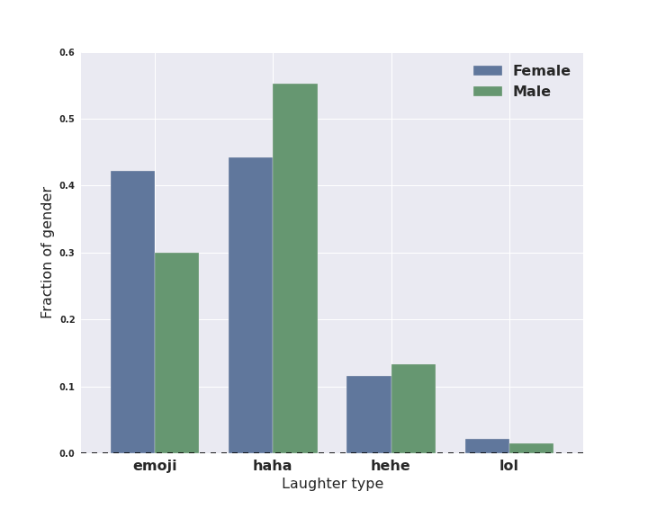
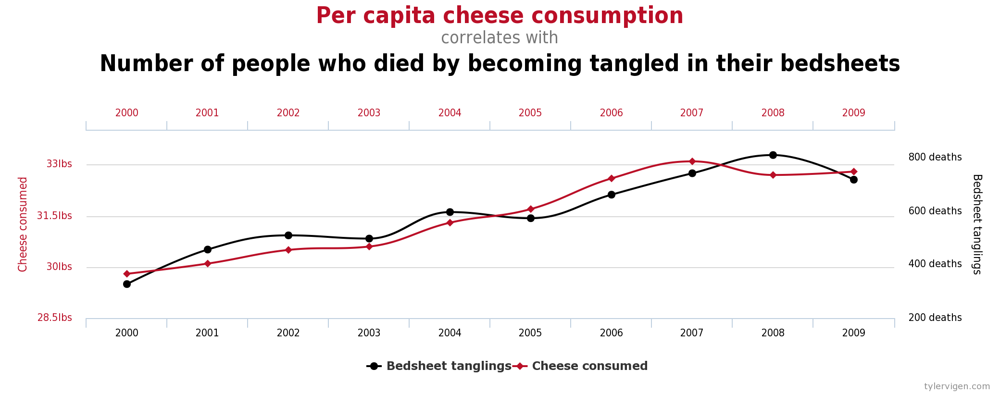

```{r setup, include=FALSE}
knitr::opts_chunk$set(echo = FALSE, warning = FALSE, message = FALSE)

## options(knitr.table.format = "html") 
options("kableExtra.html.bsTable" = T)
```

```{r}
change_margin = function(x, margin = "2cm"){
  ## função para adicionar uma margem à direita da tabela quando colocamos como float.
   gsub("margin-right: 10px;", paste("margin-right:", margin), x)
}
```


```{r, include=FALSE}
library(reshape2)
library(ggplot2)
library(plotly)

library(dplyr)
library(knitr)
library(kableExtra)
```


# Análise Descritiva Bivariada

## Associação entre duas variáveis {.build}

Sua opinião sobre o comportamento de uma variável muda na presença de informação de uma segunda variável?

A **distribuição conjunta** das duas variáveis descreve a associação existente entre elas.

**Grau de dependência**: como uma variável "explica" ou se "associa" a outra.

Assim como na análise univariada estas relações podem ser resumidas por gráficos, tabelas e/ou medidas estatística. O tipo de resumo vai depender dos tipos das variáveis envolvidas. Vamos considerar três possibilidades:

* as duas variáveis são qualitativas; 
* as duas variáveis são quantitativas; e
* uma variável é quantitativa e a outra qualitativa.


## Mais sobre análise bivariada

* As análise mostradas a seguir não esgotam as possibilidades de análises envolvendo duas variáveis e devem ser vistas apenas como uma sugestão inicial.


* Relações entre duas variáveis devem ser examinadas com cautela pois podem ser mascaradas por uma ou mais variáveis adicionais não considerada na análise. Estas são chamadas variáveis de **confundimento**. Análises com variáveis de confundimento não serão discutidas neste ponto.


# Associação entre duas variáveis qualitativas

## Qualitativa vs Qualitativa

Considere as variáveis Gênero (`Genero`) e Nível de Ansiedade (`Ansiedade`) do conjunto de dados `SleepStudy`, já utilizado em aulas anteriores. 

Nosso objetivo é estudar o comportamento conjunto dessas variáveis. 

```{r}
# Carregando os dados
library(Lock5Data)
data(SleepStudy)
dados = SleepStudy

# Transformando a variável Gender em fator
dados$Gender = factor(dados$Gender, levels = c(0, 1), 
                      labels = c("Feminino", "Masculino"))

# Transformando a variável AnxietyStatus em fator ordenado
dados$AnxietyStatus = ordered(dados$AnxietyStatus, 
                              levels = c("normal", "moderate", "severe"),
                              labels = c("Normal", "Moderado", "Severo"))
```


```{r}
tabGender = table(dados$Gender, dados$AnxietyStatus)
  
tabGender %>% 
  addmargins(FUN = list(Total = sum), quiet = TRUE) %>% 
  kable(digits=2, align = "c", 
        caption = "Tabela de Nível de Ansiedade por Gênero") %>% 
  kable_styling(bootstrap_options = "striped", full_width = FALSE, 
                font_size = 22, position = "float_left") %>% 
  add_header_above(c("Gênero" = 1, "Nível de Ansiedade" = 3, " " = 1)) %>%
  column_spec(c(1, 5), bold = TRUE) %>% 
  row_spec(3, bold = TRUE) %>% 
  change_margin()
```

Nessa tabela temos:

* 37 mulheres têm ansiedade no nível moderado.
* Na última coluna: frequência de cada nível da variável `Gênero`.
* Na última linha: frequência de cada nível da variável `Ansiedade`.

Parte interna da tabela: frequências conjuntas entre `Gênero` e `Ansiedade`.

Essa tabela é chamada de **Tabela de Contingência**.


## Proporções Condicionais {.build}

Podemos considerar também proporções condicionais (frequências relativas):

* em relação ao total de elementos; 
* em relação ao total de cada linha; 
* em relação ao total de cada coluna. 

A proporção condicional escolhida depende do estudo que pretendemos fazer.

<br />
**Proporções condicionais** são estimativas das probabilidades condicionais!

No caso das tabelas de contingência serem geradas à partir de uma **amostra**, temos que as proporções condicionais são **estimativas** das probabilidades condicionais da população representada pela amostra.


## Tabela de Frequências Relativas

Distribuição das frequências relativas ao total da amostra. 

No total, nossa amostra contém informações de `r length(dados$Gender)` estudantes.


```{r}
tabGender %>% 
  prop.table() %>% 
  addmargins(FUN = list(Total = sum), quiet = TRUE) %>% 
  kable(digits=2, align = "c", 
        caption = "Tabela de Frequências Relativas ao Total da Amostra") %>% 
  kable_styling(bootstrap_options = "striped", full_width = FALSE, 
                font_size = 22, position = "float_left") %>% 
  add_header_above(c("Gênero" = 1, "Nível de Ansiedade" = 3, " " = 1)) %>%
  column_spec(c(1, 5), bold = TRUE) %>% 
  row_spec(3, bold = TRUE) %>% 
  change_margin()
```

<br />
Temos que:

* 15\% dos estudantes são mulheres **e** sofrem de ansiedade no nível moderado 

* 31\% dos estudantes são homens **e** tem nível de ansiedade normal


## Frequências relativas ao total das colunas 

Distribuição das frequências relativas ao total de cada coluna.

```{r tab1colunas}
tabGender %>% 
  prop.table(2) %>% 
  addmargins(1, FUN = list(Total = sum), quiet = TRUE) %>% 
  kable(digits=2, align = "c", 
        caption = "Tabela de Frequências Relativas ao Total das Colunas") %>% 
  kable_styling(bootstrap_options = "striped", full_width = FALSE, 
                font_size = 22, position = "float_left") %>% 
  add_header_above(c("Gênero" = 1, "Nível de Ansiedade" = 3)) %>%
  column_spec(1, bold = TRUE) %>% 
  row_spec(3, bold = TRUE) %>% 
  change_margin()
```

<br />
Entre os alunos com  ansiedade no nível normal: 

$56\%$ são mulheres 

$44\%$ são homens 

<br /><br /><br />
Essa tabela permite comparar a distribuição de gênero  conforme o nível de ansiedade.


## Distribuição de Gênero por Nível de Ansiedade

Para representar a tabela de frequências relativas, usamos um gráfico de barras.

```{r tab1colunas}
```

```{r, fig.width=5, fig.height=3.5}
library(RColorBrewer)
mycol = brewer.pal(8, "Spectral")

par(mar=c(4, 4, 1, 2))
barplot(prop.table(tabGender, 2), col=mycol[c(1, 8)], 
        xlab="Nível de Ansiedade", ylab="Proporção", main=" ",
        beside=TRUE, legend.text=FALSE, ylim=c(0, 1), 
        cex.axis=1.2, cex.lab=1.2, cex=1.2, las=1, bty="n") 
legend("topleft", c("Female", "Male"), fill = mycol[c(1, 8)],
       title = "Gênero", bty="n", cex=1)
```

Observando o gráfico e a tabela de proporções parece haver evidências de associação entre gênero e nível de ansiedade?


## Frequências relativas ao total das linhas 

Distribuição das frequências relativas ao total de cada linha.

```{r tab1linhas}
tabGender %>% 
  prop.table(1) %>% 
  addmargins(2, FUN = list(Total = sum), quiet = TRUE) %>% 
  kable(digits=2, align = "c", 
        caption = "Tabela de Frequências Relativas ao Total das Linhas") %>% 
  kable_styling(bootstrap_options = "striped", full_width = FALSE, 
                font_size = 20, position = "float_left") %>% 
  add_header_above(c("Gênero" = 1, "Nível de Ansiedade" = 3, " " = 1)) %>%
  column_spec(c(1, 5), bold = TRUE) %>% 
  change_margin()
```

<font size=5>
Entre os alunos do sexo masculino: 

$77\%$ sofrem de ansiedade no nível normal <br />
$19\%$ sofrem de ansiedade no nível moderado<br />
$4\%$ sofrem de ansiedade no nível severo </font>

<br /><br />
Essa tabela permite comparar a distribuição do nível de ansiedade conforme o gênero.


## Distribuição de Nível de Ansiedade por Gênero

Vamos representar a tabela de frequências relativas em um gráfico de barras.

```{r tab1linhas}
```

```{r, fig.width=4.5, fig.height=3.3}
par(mar=c(4, 4, 1, 2))
barplot(t(prop.table(tabGender, 1)), 
        col=mycol[c(7, 4, 1)], 
        xlab="Gênero", ylab="Proporção", main=" ",
        beside=TRUE, legend.text=FALSE, ylim=c(0, 1), 
        cex.axis=1.2, cex.lab=1.2, cex=1.2, las=1, bty="n") 
legend(1, 1, levels(dados$AnxietyStatus), 
       title = "Ansiedade", fill = mycol[c(7, 4, 1)], 
       bty="n", cex=1, horiz = TRUE)
```

Observando o gráfico e a tabela de proporções parece haver evidências de associação entre nível de ansiedade e gênero?


## Exemplo: Grau de instrução X Procedência {.build}

Queremos estudar o comportamento conjunto de duas variáveis:  Grau de Instrução ($X$) e Região de Procedência ($Y$).

```{r}
x = matrix(c(4, 5, 2, 3, 7, 2, 5, 6, 2), nrow=3, byrow=TRUE)
rownames(x) = c("Capital","Interior", "Outra")
colnames(x) = c("Fundamental", "Médio", "Superior")

y = rbind(x, colSums(x))
y = cbind(y, rowSums(y))
rownames(y) = c("Capital", "Interior", "Outra", "Total")
## colnames(y) = c("Ensino Fundamental", "Ensino Médio", "Ensino Superior", "Total")
colnames(y) = c("Fundamental", "Médio", "Superior", "Total")

y %>% 
  kable(caption = "Grau de Instrução e Região de Procedência", align = "c") %>% 
  kable_styling(bootstrap_options = "striped", full_width = FALSE, 
                font_size = 20, position = "float_left") %>% 
  add_header_above(c("Procedência" = 1, "Ensino" = 3, " " = 1)) %>%
  column_spec(c(1, 5), bold = TRUE) %>% 
  row_spec(4, bold = TRUE) %>% 
  change_margin()
```

</br>
Nessa tabela temos:

* 4 pessoas da capital com ensino fundamental.
* Na última coluna: frequência de cada nível da variável $Y$.
* Na última linha: frequência de cada nível da variável $X$.

Parte interna da tabela de contingência: frequências conjuntas entre $X$ e $Y$.


## Tabela de Frequências Relativas {.build}

Distribuição das frequências relativas ao total da amostra.

```{r}
addmargins(prop.table(x), FUN = list(Total = sum), quiet=TRUE) %>% 
  kable(digits=2, align = "c", 
        caption = "Tabela de Frequências Relativas ao Total da Amostra") %>% 
  kable_styling(bootstrap_options = "striped", full_width = FALSE, 
                font_size = 22, position = "float_left") %>% 
  add_header_above(c("Procedência" = 1, "Ensino" = 3, " " = 1)) %>%
  column_spec(c(1, 5), bold = TRUE) %>% 
  row_spec(4, bold = TRUE) %>% 
  change_margin()
```

</br>

Do total de 36 funcionários na amostra:

* 11\% são da capital **e** possuem ensino fundamental.
* 19\% são do interior **e** possuem ensino médio.
* 50\% possuem ensino médio.
* 33\% são do interior. 


## Frequências relativas ao total das colunas  {.build}

Distribuição das frequências relativas ao total de cada coluna.

```{r}
addmargins(prop.table(x, 2), 1, FUN = list(Total = sum)) %>% 
  kable(digits=2, align = "c", 
        caption = "Tabela de Frequências Relativas ao Total das Colunas") %>% 
  kable_styling(bootstrap_options = "striped", full_width = FALSE, 
                font_size = 22, position = "float_left") %>% 
  add_header_above(c("Procedência" = 1, "Ensino" = 3)) %>%
  column_spec(1, bold = TRUE) %>% 
  row_spec(4, bold = TRUE) %>% 
  change_margin()
```

</br>
Entre os funcionários com ensino médio:

* $28\%$ são da capital.
* $39\%$ são do interior.
* $33\%$ são de outros locais.

<br /><br /><br />
Permite comparar a distribuição de procedência ($Y$) conforme o grau de instrução ($X$).


## Procedência conforme o grau de instrução 

<center>
```{r, eval=FALSE, fig.width=8, fig.height=4.5}
## Se quiser fazer o barplot normal trocar por 'eval=TRUE'
par(mar=c(4.1, 4.1, 1.1, 2.1))
barplot(prop.table(x, 2), xlab=" ", ylab="Proporção", main=" ",
        beside=TRUE, legend.text=TRUE, ylim=c(0, .6), 
        col=c("lightgreen", "lightyellow", "lightpink"), cex.axis=1.3,
        cex.lab=1.3, cex=1.3, las=1) 
```
</center>

```{r, fig.width=10, fig.height=4.5}
## Definir os parâmetros dos eixos para todos os gráficos
eixos <- theme_bw() +
  theme(axis.text = element_text(size=14), 
        axis.title = element_text(size=14),
        legend.title = element_text(size=14, face="bold"), 
        legend.text=element_text(size=14))

x.long <- melt(prop.table(x, 2), varnames=c("Procedência", "Instrução"),
               value.name="Proporção")

g = ggplot(x.long, aes(x=Instrução, y=Proporção, fill=Procedência)) + 
    geom_bar(stat="identity", width=0.7, position="dodge", colour="lightgrey") +
    scale_fill_brewer(name="Procedência", palette="Accent") +
    xlab("") + ylim(0, 0.5) + eixos 
## ggplotly(g)
g
```

Observando o gráfico e a tabela de proporções, parece haver evidências de associação entre o grau de instrução e a procedência do funcionário.


## Frequências relativas ao total das linhas {.build}

Distribuição das frequências relativas ao total de cada linha.

```{r}
addmargins(prop.table(x, 1), 2, FUN = list(Total = sum)) %>% 
  kable(digits=2, align = "c", 
        caption = "Tabela de Frequências Relativas ao Total das Linhas") %>% 
  kable_styling(bootstrap_options = "striped", full_width = FALSE, 
                font_size = 22, position = "float_left") %>% 
  add_header_above(c("Procedência" = 1, "Ensino" = 3, " " = 1)) %>%
  column_spec(c(1, 5), bold = TRUE) %>% 
  change_margin()
```

<br />
Entre os funcionários do interior:

* $25\%$ possuem Ensino Fundamental
* $58\%$ possuem Ensino Médio.
* $17\%$ possuem Ensino Superior.

<br /><br /><br />
Permite comparar a distribuição do grau de instrução ($X$) conforme a procedência ($Y$).


## Grau de instrução conforme a procedência

<center>
```{r, eval=FALSE, fig.width=8, fig.height=4.5}
par(mar=c(3.1, 4.1, 1.1, 2.1))
barplot(t(prop.table(x, 1)), xlab=" ", ylab="Proporção", main=" ",
        beside=TRUE, legend.text=TRUE, ylim=c(0, .8), 
        col=c("lightgreen", "lightyellow", "lightpink"), cex.axis=1.3,
        cex.lab=1.3, cex=1.3, las=1) 
```
</center>

```{r, fig.width=10, fig.height=5}
x.long <- melt(prop.table(x, 1), varnames=c("Procedência", "Instrução"),
               value.name="Proporção")

g <- ggplot(x.long, aes(x=Procedência, y=Proporção, fill=Instrução))+
    geom_bar(stat="identity", width=0.7, position="dodge", colour="lightgrey") +
    scale_fill_brewer(name="Grau de Instrução", palette="Accent") +
    xlab("") + ylim(0, 0.7) + eixos
## ggplotly(g)
g
```


## Exemplo: Marvel vs DC

Existe associação entre o gênero dos personagens ($X$) e a editora ($Y$)?


```{r}
herois = read.csv("heroes_information.csv")

library(dplyr)
herois_3 =
  herois %>%
   filter((Publisher == "DC Comics") | (Publisher == "Marvel Comics")) %>%
   filter((Gender == "Male") | (Gender == "Female")) %>%
   filter((Alignment == "good") | (Alignment == "bad") | (Alignment == "neutral"))

library(tidyr)
herois_3%>%
  group_by(Gender, Publisher) %>%
  summarise(n=n()) %>%
  spread(Gender, n) %>%
  kable() %>% 
  kable_styling(bootstrap_options = "striped", full_width = FALSE, 
                font_size = 22, position = "left") %>% 
  column_spec(1, bold=TRUE)
```

</br>
A proporção de personagens femininos é similar em cada editora?

Devemos avaliar: 

* Distribuição das frequências relativas ao total de cada coluna? <br />
* Distribuição das frequências relativas ao total de cada linha?

<font size=4>
Banco de dados: https://www.kaggle.com/claudiodavi/superhero-set/home
</font>


## Exemplo: Marvel vs DC

Por coluna (100% em cada gênero):

```{r}
herois_3%>%
  group_by(Gender, Publisher)%>%
  summarize(n=n())%>%
  mutate(prop=round(n/sum(n), 3))%>%
  subset(select=c(Gender, Publisher, prop))%>%   #drop the frequency value
  spread(Gender, prop)%>%
  kable(digits = 2) %>% 
  kable_styling(bootstrap_options = "striped", full_width = FALSE, 
                font_size = 22, position = "float_left") %>% 
  column_spec(1, bold=TRUE) %>% 
  change_margin()
```

* Dentre os personagens de gênero feminino, 64%  estão na Marvel. <br />
* Dentre os personagens de gênero masculino, 62%  estão na Marvel.

<br />

Por linha (100% em cada editora):

```{r}
herois_3%>%
  group_by(Publisher, Gender)%>%
  summarize(n=n())%>%
  mutate(prop=round(n/sum(n), 3))%>%
  subset(select=c(Gender, Publisher, prop))%>%   #drop the frequency value
  spread(Gender, prop)%>%
  kable(digits = 2) %>% 
  kable_styling(bootstrap_options = "striped", full_width = FALSE, 
                font_size = 22, position = "float_left") %>% 
  column_spec(1, bold=TRUE) %>% 
  change_margin()
```


* Dentre os personagens da Marvel, 31%  são do gênero feminino. <br />
* Dentre os personagens da DC, 29%  são do gênero feminino.


## Exemplo: Marvel vs DC

<center>
```{r, fig.width=8, fig.height=4.5}
herois_4 <- herois_3%>%
  group_by(Publisher, Gender)%>%
  summarize(n=n())%>%
  mutate(prop=round(n/sum(n), 3))

g = ggplot(as.data.frame(herois_4), aes(x=Publisher, y=prop, fill=Gender))+
    geom_bar(stat="identity", width=0.6, position="dodge", colour="lightgrey") +
    scale_fill_brewer(name="Gênero", palette="Set2") +
    xlab("Editora") + ylab("Proporção") + ylim(0, 0.8) + eixos
## ggplotly(g)
g
```
</center>

Observando o gráfico e a tabela de proporções condicionais, parece não haver evidências de associação entre gênero e editora.


## Exemplo: Escolha da carreira {.build}

Existe dependência entre o sexo ($X$) e a carreira escolhida ($Y$) por 200 alunos de Economia e Administração?

```{r, echo=FALSE}
x <- matrix(c(85, 35, 55, 25), nrow=2, byrow=TRUE)
rownames(x) <- c("Economia", "Administração")
colnames(x) <- c("Masculino", "Feminino")
 
y <- rbind(x, c(85 + 55, 35 + 25))
y <- cbind(y, c(85 + 35, 55 + 25, sum(x)))
rownames(y) <- c("Economia", "Administração", "Total")
colnames(y) <- c("Masculino", "Feminino", "Total")

y %>% 
  kable() %>% 
  kable_styling(bootstrap_options = "striped", full_width = FALSE, 
                font_size = 22, position = "float_left") %>% 
  column_spec(c(1, 4), bold=TRUE) %>% 
  row_spec(3, bold = TRUE) %>% 
  change_margin()
```

* A proporção de alunos em Economia é similar para cada sexo?

* Ser similar em cada sexo não quer dizer que seja 50% na Economia e 50% na Administração em cada sexo.

<br />

* Queremos saber se o padrão das proporções dos cursos é parecido ou não entre os sexos.

* Usaremos a distribuição das frequências relativas ao total de cada coluna.


## Exemplo: Escolha da carreira {.build} 

Veja a tabela das frequências relativas ao total de cada coluna.

```{r}
y2 <- addmargins(round(prop.table(y[-3,], 2), 2), 1)
rownames(y2) <- c("Economia", "Administração", "Total")

y2 %>% 
kable() %>% 
  kable_styling(bootstrap_options = "striped", full_width = FALSE, 
                font_size = 22, position = "float_left") %>% 
  column_spec(c(1, 4), bold=TRUE) %>% 
  row_spec(3, bold = TRUE) %>% 
  change_margin()
```

* No geral, sem considerar os sexos (última coluna), temos que $60\%$ dos estudantes preferem economia e $40\%$ administração.

<br />

* Se sexo e carreira escolhida forem independentes (sem associação), espera-se que, para cada sexo, a escolha das carreiras tenha essas mesmas proporções.

**Sexo masculino**: $61\%$ na carreira de economia e $39\%$ na de administração. <br />
**Sexo feminino**: $58\%$ na carreira de economia e $42\%$ na de administração.

Os dados indicam que não há associação entre as variáveis.


## Exemplo: Escolha da carreira conforme gênero

<center>
```{r, eval=FALSE, fig.width=7, fig.height=4.5}
par(mar=c(4.1, 4.1, 1.1, 2.1))
barplot(prop.table(x, 2), xlab=" ", ylab="Proporção", main=" ", beside=TRUE,
        legend.text=TRUE, ylim=c(0, 0.9), col=c("lightgreen", "lightpink"),
        cex.axis=1.3, cex.lab=1.3, cex=1.3, las=1) 
```
</center>

<center>
```{r, fig.width=8, fig.height=4.5}
x.long <- melt(prop.table(x, 2), varnames=c("Carreira", "Sexo"), 
               value.name="Proporção")

g <- ggplot(x.long, aes(x=Sexo, y=Proporção, fill=Carreira))+
    geom_bar(stat="identity", width=0.6, position="dodge", colour="lightgrey") +
    scale_fill_brewer(name="Carreira", palette="Set2") +
    xlab("Sexo") + ylim(0, 0.7) + eixos
## ggplotly(g)
g
```
</center>

Observando o gráfico e a tabela de proporções condicionais  parece não haver evidências de associação entre gênero e escolha da carreira.


## Exemplo: Pesticidas{.build}

Uma [pesquisa](http://www.tandfonline.com/doi/abs/10.1080/02652030110113799#.VbOlP-hVhBA) foi feita para investigar a presença de pesticidas em alimentos orgânicos e convencionais. Os resultados estão na tabela abaixo:

```{r}
# A tabela a seguir apresenta a distribuição conjunta das frequências do tipo de alimento e presença de pesticida.
x <- matrix(c(29, 98, 19485, 7086), nrow=2, byrow=TRUE)
rownames(x) <- c("Orgânico", "Convencional")
colnames(x) <- c("Presente", "Ausente") 

y <- rbind(x, c(29 + 19485, 98 + 7086))
y <- cbind(y, c(29 + 98, 19485 + 7086, sum(x)))
rownames(y) <- c("Orgânico", "Convencional", "Total")
colnames(y) <- c("Presente", "Ausente", "Total")

y %>% 
  kable() %>% 
  kable_styling(bootstrap_options = "striped", full_width = FALSE, 
                font_size = 22, position = "float_left") %>% 
  column_spec(c(1, 4), bold=TRUE) %>% 
  row_spec(3, bold = TRUE) %>% 
  add_header_above(c("Alimento" = 1, "Pesticida" = 2, " " = 1)) %>% 
  change_margin()
``` 

Algumas perguntas que podemos responder:

Qual a proporção de alimentos com pesticidas? <font size=5>
$$\frac{19514}{26698} = `r round(19514/26698, 3)`$$</font>

Qual a proporção de alimentos com pesticidas dentre os orgânicos? 

Qual a proporção de alimentos com pesticidas dentre os convencionais?

<font size=4.5>
Fonte: https://doi.org/10.1080/02652030110113799
</font>


## Proporção Condicional {.build}

**Proporção condicional**: condicionalmente à informação de uma variável, observamos a proporção da outra variável.

> - Qual a proporção de pesticidas entre alimentos orgânicos?

- Qual a proporção de pesticidas entre alimentos convencionais?

No exemplo dos pesticidas, condicionado no tipo de alimento, temos:

```{r}
a = addmargins(round(prop.table(x, 1), 2), 2, FUN = list("Total" = sum))
a %>% 
  kable(digits = 3) %>% 
  kable_styling(bootstrap_options = "striped", full_width = FALSE, 
                font_size = 22, position = "float_left") %>% 
  column_spec(c(1, 4), bold=TRUE) %>% 
  add_header_above(c("Alimento" = 1, "Pesticida" = 2, " " = 1)) %>% 
  change_margin()
```

<!-- |             | Pesticida Presente| Pesticida Ausente| Total| -->
<!-- |:------------|------------------:|-----------------:|-----:| -->
<!-- |Orgânico     |               0.23|              0.77|     1| -->
<!-- |Convencional |               0.73|              0.27|     1| -->


## Presença de pesticida por tipo de alimento
<center>
```{r, eval=FALSE, fig.width=7, fig.height=4.5}
par(mar=c(5.1, 4.1, 1.1, 2.1))
barplot(t(prop.table(x, 1)), xlab="Tipo de Alimento", 
        ylab="Proporção", main=" ", beside=TRUE, legend.text=TRUE,
        ylim=c(0, 1.1), col=c("lightpink","lightgreen"), cex.axis=1.3,
        cex.lab=1.3, cex=1.3, las=1)
```
</center>

<center>
```{r, fig.width=8, fig.height=4.5}
colnames(x) <- c("Presente", "Ausente") 
x.long <- melt(prop.table(x, 1), varnames=c("Alimento", "Pesticida"), 
               value.name="Proporção")

g <- ggplot(x.long, aes(x=Alimento, y=Proporção, fill=Pesticida))+
    geom_bar(stat="identity", width=0.6, position="dodge", colour="lightgrey") +
    scale_fill_brewer(name="Pesticida", palette="Set2") +
    xlab("Tipo de Alimento") + ylim(0, 0.9) + eixos
## ggplotly(g)
g
```
</center>

Observando o gráfico e a tabela de proporções condicionais, parece haver evidências de associação entre presença de pesticida e tipo de alimento.


## Exemplo: Renda e Felicidade

Pesquisa da [GSS](http://www3.norc.org/GSS+Website/) de 2002.
 
* Você se considera feliz?
  
* Comparando com as demais famílias dos EUA, como você considera  sua renda familiar?
  
```{r}
x <- matrix(c(17, 90, 51, 45, 265, 143, 31, 139, 71), nrow=3, byrow=TRUE)
rownames(x) <- c("Acima da média", "Na média", "Abaixo da média")
colnames(x) <- c("Não muito feliz", "Feliz", "Muito feliz")

y <- rbind(x, colSums(x))
y <- cbind(y, as.vector(rowSums(y)))
rownames(y) <- c("Acima da média", "Na média", "Abaixo da média", "Total")
colnames(y) <- c("Não muito feliz", "Feliz", "Muito feliz", "Total")

kable(y, align = "c") %>% 
  kable_styling(bootstrap_options = "striped", full_width = FALSE, 
                font_size = 22, position = "left") %>% 
  column_spec(c(1, 5), bold=TRUE) %>% 
  row_spec(4, bold = TRUE) %>% 
  change_margin()
```


<!-- |      Renda     | Não muito feliz| Feliz| Muito feliz| Total| -->
<!-- |:---------------|---------------:|-----:|-----------:|-----:| -->
<!-- |Acima da média  |              17|    90|          51|   158| -->
<!-- |Na média        |              45|   265|         143|   453| -->
<!-- |Abaixo da média |              31|   139|          71|   241| -->
<!-- |Total           |              93|   494|         265|   852| -->


## Exemplo: Renda e Felicidade {.build}

```{r}
kable(y, align = "c") %>% 
  kable_styling(bootstrap_options = "striped", full_width = FALSE, 
                font_size = 18, position = "float_left") %>% 
  column_spec(c(1, 5), bold=TRUE) %>% 
  row_spec(4, bold = TRUE) %>% 
  change_margin()
```

No geral, qual a proporção de pessoas diz que está **muito feliz**?
 
$$\frac{265}{852} = `r round(265/852, 2)`$$
<br />
Será que o nível de felicidade muda para cada tipo de renda? Como comparar?

Proporções condicionais do nível de felicidade para cada nível de renda:

```{r}
a = addmargins(round(prop.table(x, 1), 2), 2, FUN = list("Total" = sum))

kable(a, align = "c", digits = 2) %>% 
  kable_styling(bootstrap_options = "striped", full_width = FALSE, 
                font_size = 18, position = "float_left") %>% 
  column_spec(c(1, 5), bold=TRUE) %>% 
  change_margin()
```


## Nível de felicidade por nível de renda

<center>
```{r, eval=FALSE, fig.width=8, fig.height=4.5}
par(mar=c(5.1, 4.1, 1.1, 2.1))
barplot(t(prop.table(x, 1)), xlab="Renda", ylab="Proporção", main=" ",
        beside=TRUE, legend.text=TRUE, ylim=c(0, .9), 
        col=c("lightgreen", "lightyellow", "lightpink"), cex.axis=1.3, 
        cex.lab=1.3, cex=1.3, las=1) 
```
</center>

<center>
```{r, fig.width=10, fig.height=4.5}
x.long <- melt(prop.table(x, 1), varnames=c("Renda", "Felicidade"),
               value.name="Proporção")

g <- ggplot(x.long, aes(x=Renda, y=Proporção, fill=Felicidade))+
    geom_bar(stat="identity", width=0.7, position="dodge", colour="lightgrey") +
    scale_fill_brewer(name="Nível de Felicidade", palette="Accent") +
    xlab("Renda") + ylim(0, 0.7) + eixos
## ggplotly(g)
g
```
</center>

Observando o gráfico e a tabela de proporções condicionais, parece não haver evidências de associação entre nível de felicidade e nível de renda.


## Exemplo: Bebidas alcoólicas {.build}

A Escola de Saúde Pública da Harvard fez uma pesquisa com 200 cursos de graduação em 2001.

> A pesquisa pergunta aos alunos sobre hábitos relacionados à bebida. 

<div class="columns-2">

> * 4 drinks seguidos, entre mulheres, é classificado como bebida em excesso.

> * 5 drinks seguidos, entre homens, é classificado como bebida em excesso.

> <center></center>

</div>


## Exemplo: Bebidas alcoólicas {.build}

```{r}
x <- matrix(c(1908, 2017, 2854, 4125), nrow=2, byrow=TRUE)
rownames(x) <- c("Masculino", "Feminino")
## colnames(x) <- c("Bebida em excesso - Sim", "Bebida em excesso - Não")
colnames(x) <- c("Sim", "Não")

y <- rbind(x, colSums(x))
y <- cbind(y, as.vector(rowSums(y)))
rownames(y) <- c("Masculino", "Feminino", "Total")
colnames(y) <- c("Sim", "Não", "Total")
#kable(y)

y %>% 
  kable() %>% 
  kable_styling(bootstrap_options = "striped", full_width = FALSE, 
                font_size = 22, position = "float_left") %>% 
  column_spec(c(1, 4), bold=TRUE) %>% 
  row_spec(3, bold = TRUE) %>% 
  add_header_above(c("Gênero" = 1, "Bebidas em Excesso?" = 2, " " = 1)) %>% 
  change_margin()
```

<!-- |          | Bebida em excesso - Sim| Bebida em excesso - Não| Total| -->
<!-- |:---------|-----------------------:|-----------------------:|-----:| -->
<!-- |Masculino |                    1908|                    2017|  3925| -->
<!-- |Feminino  |                    2854|                    4125|  6979| -->
<!-- |Total     |                    4762|                    6142| 10904| -->

</br>
Qual o número de alunos:

* do sexo masculino e que beberam em excesso?

* do sexo feminino e que beberam em excesso?

<br />
Usando diretamente a tabela, podemos responder à pergunta:

**Há diferença entre homens e mulheres na proporção de ocorrência de bebida em excesso?**


## Exemplo: Bebidas alcoólicas

Proporções condicionais de ocorrência de bebida em excesso por gênero:
```{r, echo=FALSE}
a = addmargins(round(prop.table(x, 1), 2), 2, FUN = list("Total" = sum))

kable(a) %>% 
  kable_styling(bootstrap_options = "striped", full_width = FALSE, 
                font_size = 22, position = "left") %>% 
  column_spec(c(1, 4), bold=TRUE) %>% 
  add_header_above(c("Gênero" = 1, "Bebidas em Excesso?" = 2, " " = 1)) %>% 
  change_margin()
```

Proporção de ocorrência de bebida em excesso entre homens: 
$$\frac{1908}{3925}=`r round(1908/3925, 2)`$$

Proporção de ocorrência de bebida em excesso entre mulheres: 
$$\frac{2854}{6979}=`r round(2854/6979, 2)`$$

## Ocorrência de bebida em excesso por gênero
<center>
```{r, eval=FALSE, fig.width=7, fig.height=4.5}
par(mar=c(5.1, 4.1, 1.1, 2.1))
barplot(t(prop.table(x, 1)), xlab="", ylab="Proporção", main=" ",
        beside=TRUE, legend.text=TRUE, ylim=c(0, .9), 
        col=c("lightpink", "lightgreen"), cex.axis=1.3, cex.lab=1.3, 
        cex=1.3, las=1)
```
</center>

<center>
```{r, fig.width=8, fig.height=4.5}
colnames(x) <- c("Sim", "Não")
x.long <- melt(round(prop.table(x, 1), 2), varnames=c("Sexo", "Excesso_Bebida"),
               value.name="Proporção")

g <- ggplot(x.long, aes(x=Sexo, y=Proporção, fill=Excesso_Bebida)) +
    geom_bar(stat="identity", width=0.6, position="dodge", colour="lightgrey") +
    scale_fill_brewer(name="Excesso?", palette="Set2") +
    xlab("Sexo") + ylim(0, 0.7) + eixos
## ggplotly(g)
g
```
</center>

Observando o gráfico e a tabela de proporções condicionais, parece haver evidências de associação entre gênero e bebida em excesso.


## Exemplo: Tipo de risada e gênero

<center></center>

<font size=4>
**Fonte**: [https://research.facebook.com/blog/1605690073053884/the-not-so-universal-language-of-laughter/](https://research.facebook.com/blog/1605690073053884/the-not-so-universal-language-of-laughter/)
</font>


## Exemplo: Tipo de risada e cidade

<center></center>

<font size=4>
**Fonte**: [https://research.facebook.com/blog/1605690073053884/the-not-so-universal-language-of-laughter/](https://research.facebook.com/blog/1605690073053884/the-not-so-universal-language-of-laughter/)
</font>


# Associação entre duas variáveis quantitativas

## Associação entre duas variáveis quantitativas

* Associação entre duas variáveis **qualitativas**: comparar proporções condicionais. 

* Associação entre duas variáveis **quantitativas**: comparamos como a mudança de uma variável afeta a outra variável.


<br />
**Gráfico de Dispersão**: a forma mais utilizada para representar graficamente a relação entre duas variáveis quantitativas. Em inglês, é chamado de *scatterplot*.

**Coeficiente de Correlação**: medida resumo que representa a associação linear entre duas variáveis quantitativas.


## Exemplo: Tempo de serviço e total de clientes

Agente | Anos de Serviço ($X$) | Nº de Clientes ($Y$)
-------|-----------------------|--------------------------
A | 2 | 48 
B | 4 | 56 
C | 5 | 64 
D | 6 | 60 
E | 8 | 72 
Total | 25 | 300 


## Exemplo: Tempo de serviço e total de clientes
<center>
```{r, fig.height=4.5, fig.width=7}
x <- c(2, 4, 5, 6, 8)
y <- c(48, 56, 64, 60, 72)
# par(mar=c(5.1, 4.1, 1.1, 2.1))
# plot(x=x, y=y, xlab="Tempo de serviço (anos)", ylab="Número de clientes", 
#      main=" ", pch=19, cex.axis=1.2, cex.lab=1.2, las=1, col="blue", lwd=2)

df <- data.frame(x=x, y=y)

library(RColorBrewer)
mycol <- brewer.pal(8, "Dark2")

g <- ggplot(df, aes(x, y)) + 
    geom_point(col=mycol[1], size=3) + 
    xlab("Tempo de serviço (anos)") + ylab("Número de clientes") + eixos
## ggplotly(g)
g
```
</center>

O gráfico indica uma possível relação linear positiva entre as variáveis anos de serviço e número de clientes.


## Exemplo: Renda e gasto com assistência médica

$X$: Renda Mensal Bruta <br />
$Y$: $\%$ da Renda gasta com Assistência Médica 

```{r}
x <- c(12, 16, 18, 20, 28, 30, 40, 48, 50, 54)
y <- c(7.2, 7.4, 7, 6.5, 6.6, 6.7, 6, 5.6, 6, 5.5)

data <- data.frame(Familia=c("A","B","C","D","E","F","G","H","I","J"), X=x, Y=y)

data %>% 
  kable() %>% 
  kable_styling(bootstrap_options = c("striped", "bordered", "condensed"), 
                full_width = FALSE, 
                font_size = 18, position = "float_left") %>% 
  column_spec(1, bold=TRUE) %>% 
  change_margin(margin = "4cm")
```


```{r, fig.height=3.5, fig.width=6}
# par(mar=c(5.1, 4.1, 1.1, 2.1))
# plot(x=x, y=y, xlab="Renda bruta", ylab=" % da renda gasta com assistência",
#      main=" ", pch=19, cex.axis=1.2, cex.lab=1, col="blue", lwd=2, las=1)

g <- ggplot(data, aes(X, Y)) + 
    geom_point(col=mycol[1], size=3) +
    labs(x="Renda Bruta", y="% da renda gasta com assistência") + eixos
## ggplotly(g)
g
```

A relação entre $X$ e $Y$ parece ser linear negativa.


## Exemplo `SleepStudy`

Considere o número de bebidas alcoólicas por semana (`Drinks`) e média de horas de sono (`AverageSleep`).

```{r, fig.width=6, fig.height=3.5}
par(mar=c(4, 4, 1, 2))
plot(x=dados$Drinks, y=dados$AverageSleep, 
     xlab="Número de bebidas alcoólicas", 
     ylab="Média de horas de sono", main="", pch = 16, las=1, 
     cex=1.2, cex.axis=1.2, cex.lab=1.2, col=rgb(0.4,0.4,0.8,0.6))
```

Nesse caso, parece não existir uma associação entre o número de bebidas alcoólicas por semana e média de horas de sono.


## Coeficiente de Correlação {.build}

**Objetivo:** obter uma medida que permita quantificar a relação linear que pode existir entre duas variáveis (positiva, negativa, muita ou pouca).

Dado $n$ pares de observações $(x_{1},y_{1}),(x_{2},y_{2}),...,(x_{n},y_{n})$: 
$$Corr(X,Y)=\frac{1}{n-1}\sum_{i=1}^{n}\left(\frac{x_{i}-\bar{x}}{s_x}\right)\left(\frac{y_{i}-\bar{y}}{s_y}\right)$$
onde $s_x$ é o desvio padrão de $X$ e $s_y$ é o desvio padrão de $Y$.

Essa medida leva em consideração todos os desvios $(x_{i}-\bar{x})$ e $(y_{i}-\bar{y})$ padronizados da forma $z_{x_i}=\frac{x_{i}-\bar{x}}{s_x}$ e $z_{y_i}=\frac{y_{i}-\bar{y}}{s_y}$.

**Interpretação:** $z_{x_i}$ indica o número de desvios-padrão que a observação $x_i$ está afastada da média de X.


## Propriedades do Coeficiente de Correlação {.build}


* $-1 \leq Corr(X, Y) \leq 1$

* $Corr(X, Y)$ próxima de 1: $X$ e $Y$ estão positivamente associadas e o tipo de associação entre as variáveis é linear.

* $Corr(X, Y)$ próxima de -1: $X$ e $Y$ estão negativamente associadas e o tipo de associação entre as variáveis é linear.

* Se $z_{x}$ e $z_y$ têm o mesmo sinal, estamos somando um termo positivo na expressão da correlação. 

* Se $z_{x}$ e $z_y$ têm sinais opostos, estamos somando um termo negativo na expressão da correlação. 

* Correlação é a média dos produtos de $z_x$ e $z_y$.


## Correlação

<center></center>


## Correlação

<center></center>


## Exemplo: Tempo de serviço e total de clientes {.build}

Agente | Anos de Serviço ($X$) | Nº de Clientes ($Y$)
-------|-----------------------|--------------------------
A | 2 | 48 
B | 4 | 56 
C | 5 | 64 
D | 6 | 60 
E | 8 | 72 
Total | 25 | 300 

> Anos de Serviço ($X$): $\quad \bar{x}=5 \quad \mbox{e} \quad s_x=2.24$ </br>
> Nº de Clientes ($Y$): $\quad \bar{y}=60 \quad \mbox{e} \quad s_y=8.94$


## Exemplo: Tempo de serviço e total de clientes {.build}

Agente | $X$ | $Y$ | $z_x=\frac{x_{i}-\bar{x}}{s_x}$ | $z_y=\frac{y_{i}-\bar{y}}{s_y}$ | $z_x\times z_y$ 
-------|----:|----:|---------------------:|---------------------:|------------:
A | 2 | 48 | -1.34 | -1.34 | 1.8
B | 4 | 56 | -0.45 | -0.45 | 0.2 
C | 5 | 64 | 0 | 0.45 | 0 
D | 6 | 60 | 0.45 | 0 | 0 
E | 8 | 72  | 1.34 | 1.34 | 1.8 

$$Corr(X, Y)=\frac{1}{n-1}\sum_{i=1}^{n}z_{x_i}z_{y_i}=\frac{3.8}{5-1}=0.95$$


## Exemplo: Fitbit {.build}

Número de passos diários coletados para uma pessoa usando um [Fitbit](http://en.wikipedia.org/wiki/Fitbit) durante 297 dias.

<center>
```{r, echo=FALSE, fig.height=3.5, fig.width=5,warning=FALSE,message=FALSE}
fitbit <- read.csv("Fitbit.csv", sep=";")
fitbit <- fitbit[-which(fitbit$steps<300), ] # removendo os dias em que não usou Fitbit

nf <- graphics::layout(mat = matrix(c(1, 2), 2, 1, byrow=TRUE),  height=c(1, 2))
par(mar=c(3, 4, .2, .2))
boxplot(fitbit$steps, horizontal=TRUE, outline=TRUE, ylim=c(0, 31000),
        col="lightblue", type=3)
par(mar=c(5, 4, .2, .2))
hist(fitbit$steps, nclass=20, xlab="Número de passos por dia",
     ylab="Frequência", col="lightblue", main="", xlim=c(0, 31000), las=1)
abline(v=mean(fitbit$steps), col="red", lty=2, lwd=2)
```
</center>

> Qual é maior? Média ou mediana?

> Média é `r round(mean(fitbit$steps),0)` e mediana é `r round(median(fitbit$steps),0)`.


## Exemplo: Fitbit  {.build}

> Além do total de passos, Fitbit também registra o tempo gasto em cada tipo de atividade.

> Há relação entre o total de passos e o tempo gasto em atividade intensa?

<center>
```{r, fig.height=3.5, fig.width=5.5}
# par(mar=c(4.1, 4.1, 0.1, 2.1))
# plot(x=fitbit$steps, y=fitbit$minutesVeryActive, xlab="Número de Passos", 
#      ylab="Tempo (min) de atividade intensa", col="blue", las=1)

g <- ggplot(fitbit, aes(steps, minutesVeryActive)) + 
    geom_point(col=mycol[1], size=3, alpha=0.6) +
    labs(x="Número de Passos", y="Atividade intensa (min)") + eixos
## ggplotly(g)
g
```
</center>

> Correlação: `r round(cor(x=fitbit$steps, y=fitbit$minutesVeryActive), 2)`


## Exemplo: Fitbit {.build}

> Há relação entre o total de passos e o tempo (em minutos) de sedentarismo?

<center>
```{r, fig.height=4, fig.width=6}
## par(mar=c(5.1, 4.1, 1.1, 2.1))
## plot(x=fitbit$steps[fitbit$minutesSedentary > 1000], 
##      y <- fitbit$minutesSedentary[fitbit$minutesSedentary > 1000],
##      xlab="Número de Passos", ylab="Tempo (min) sedentário", 
##      col="blue", cex.lab=1.2, las=1)

fitbit2 <- subset(fitbit, minutesSedentary > 1000)
g <- ggplot(fitbit2, aes(steps, minutesSedentary)) + 
    geom_point(col=mycol[1], size=3, alpha=0.6) +
    labs(x="Número de Passos", y="Tempo sedentário (min)") + eixos
## ggplotly(g)
g
```
</center>

> Correlação: `r round(cor(x=fitbit$steps[fitbit$minutesSedentary > 1000], y=fitbit$minutesSedentary[fitbit$minutesSedentary > 1000]), 2)`


## Exemplo: Fitbit {.build}

Baseado na altura, peso e gênero, o Fitbit estima o comprimento de cada passo.

> Há relação entre o total de passos e distância percorrida?

<center>
```{r, fig.height=3.5, fig.width=5.5}
# par(mar=c(5.1, 4.1, 1.1, 2.1))
# plot(x=fitbit$steps, y=fitbit$distance, xlab="Número de Passos",
#      ylab="Distância (km)", cex.lab=1.2, col="blue", las=1)

g <- ggplot(fitbit, aes(steps, distance)) + 
    geom_point(size=3, colour=mycol[1], alpha=0.6) +
    labs(x="Número de Passos", y="Distância (km)") + eixos
## ggplotly(g)
g
```
</center>

> Correlação: `r round(cor(x=fitbit$steps, y=fitbit$distance), 2)`


<!-- ## Compartilhei, pois li e achei legal! {.build} -->

<!-- > Recebemos na nossa linha do tempo do Facebook diversas notícias compartilhadas pelos amigos.  -->

<!-- > Imagina-se que uma notícia com grande número de compartilhamentos seja uma leitura interessante, fazendo com que o leitor leia até o final. -->

<!-- > Mas será que seu amigo de fato leu a notícia toda, antes de sair compartilhando?  -->

<!-- > Você lê a notícia toda para só depois compartilhar? -->


<!-- ## {.build} -->

<!-- [Dados](http://flowingdata.com/2014/03/12/how-people-really-read-and-share-online/): 10 mil notícias. Para cada notícia calcula-se o **número de compartilhamentos** e o **tempo médio gasto pelo leitor** naquela notícia. -->

<!-- <center></center> -->

<!-- > Você fica surpreso com este gráfico? O que ele está mostrando? -->


## Cuidado: correlação e *outliers*

<center></center>

<font size=4>
**Fonte**: [http://simplystatistics.org/2015/08/12/correlation-is-not-a-measure-of-reproducibility/](http://simplystatistics.org/2015/08/12/correlation-is-not-a-measure-of-reproducibility/)
</font>


## Cuidado: correlação não implica causa!

<center></center>


## Consumo de Queijo e Morte com Lençol

<center></center>

</br></br></br><font size=4>
**Fonte:** [http://www.tylervigen.com/spurious-correlations](http://www.tylervigen.com/spurious-correlations)
</font>


## Doutorado em Matemática e Suicídio {.smaller}

<center></center>

</br><font size=4>
**Fonte:** [http://twentytwowords.com/funny-graphs-show-correlation-between-completely-unrelated-stats-9-pictures/3/](http://twentytwowords.com/funny-graphs-show-correlation-between-completely-unrelated-stats-9-pictures/3/)
</font>


## Taxa de analfabetismo e mortalidade infantil {.smaller}

<center></center>

Mortalidade: número de mortes de crianças de até 5 anos por mil nascidos vivos. 

Analfabetismo: % de analfabetos na população de 18 anos ou mais.

**Fonte:** [http://blog.estadaodados.com/analfabetismo-mortalidade/](http://blog.estadaodados.com/analfabetismo-mortalidade/)


## Google Correlate

Quais os termos de busca mais se correlacionam a outros?

[Exemplo](http://blog.estadaodados.com/nas-buscas-do-google-brasil-agua-se-correlaciona-com-falta/):

<center></center>


## Cuidado: Correlação não implica causa!

<center></center>


# Associação entre qualitativa e quantitativa

## Exemplo: Acidentes de carro em NY {.smaller}
**Variável quantitativa:** número de acidentes de carro diários

**Variável qualitativa:** região de NY

<center></center> 


## Acidentes de carro diários por região de NY

<center></center> 


## Acidentes de carro diários por região de NY

<center></center> 

<font size=4>
**Fonte:** [https://plot.ly/4916/~etpinard/](https://plot.ly/4916/~etpinard/)
</font>


## Exemplo: Tipo de risada e idade

<center></center>

</br><font size=4>
**Fonte:** [https://research.facebook.com/blog/1605690073053884/the-not-so-universal-language-of-laughter/](https://research.facebook.com/blog/1605690073053884/the-not-so-universal-language-of-laughter/)
</font>


## Exemplo `SleepStudy`

Vamos fazer um boxplot da variável número de bebidas alcoólicas por semana (`Drinks`) para cada nível de Gênero (`Gender`). 

```{r, fig.width=5, fig.height=3.5}
library(RColorBrewer)
mycol = brewer.pal(8, "Spectral")

par(mar=c(4, 4, 1, 2))
boxplot(dados$Drinks ~ dados$Gender,
        col=mycol[c(1, 8)], las=1, xlab = "Gênero", 
        ylab="drinks", cex.lab=1.2, cex.axis=1.2)
```

Podemos também calcular as estatísticas sumárias, como fizemos no caso univariado, mas aqui para cada gênero. 


## Minimizar a Taxa Informação:Tinta

<center></center>

</br><font size=4>
**Fonte:** [Online Dashboards: Eight Helpful Tips You Should Hear From Visualization Experts](https://blog.plot.ly/post/123617968702/online-dashboards-eight-helpful-tips-you-should)
</font>


## Leituras

* [OpenIntro](https://www.openintro.org/stat/textbook.php): seções 1.6, 1.7
* [Ross](http://www.sciencedirect.com/science/book/9780123743886): seções 2.5, 3.7

Leitura complementar: [Online Dashboards: Eight Helpful Tips You Should Hear From Visualization Experts](http://blog.plot.ly/post/123617968702/online-dashboards-eight-helpful-tips-you-should)


<br />

Slides produzidos pelos professores:

* Samara Kiihl
* Tatiana Benaglia
* Benilton Carvalho
* Larissa Matos
