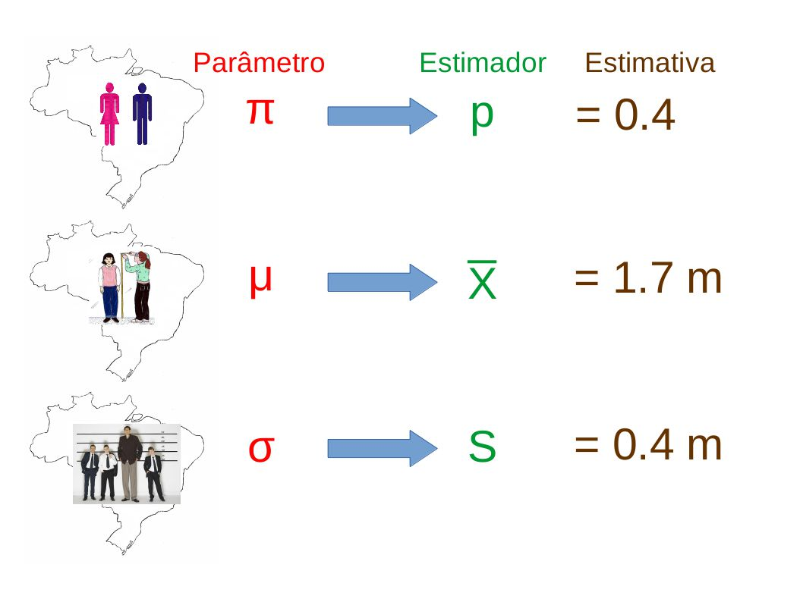

# Fundamentos de Inferência

## Introdução {.build}


> Um dos principais objetivos da Estatística é tirar conclusões a partir dos dados.

> Dados em geral consistem de uma amostra de elementos de uma população de interesse.

> O objetivo é usar a amostra e tirar conclusões sobre a população.

> Quão confiável será utilizar a informação obtida apenas de uma amostra para concluir algo sobre a população?


## Introdução {.build}


<br />

**População**: todos os elementos ou resultados de um problema que está sendo estudado.

<br />
**Amostra:** qualquer subconjunto da população que contém os elementos que podem ser observados e é onde as quantidades de interesse podem ser medidas. 


## Inferência Estatística {.build}


**Variável Aleatória**: Característica numérica do resultado de um experimento.

**Parâmetros**: Característica numérica (desconhecida) da distribuição dos elementos da população.

**Estimador/Estatística**: Função da amostra, construída com a finalidade de representar, ou estimar um parâmetro de interesse na população. 

**Estimativa**: Valor numérico que um estimador assume para uma dada amostra.

**Erro amostral:** é a diferença entre um estimador e o parâmetro que se quer estimar.


## Inferência Estatística 

<center></center>


## Estatística {.build}


> Seja $X_{1},...,X_{n}$ uma amostra e $$T = f(X_{1}, \ldots, X_{n})$$ é uma estatística.

**Exemplos:**

> * $\bar X_{n}=\frac{1}{n}\sum_{i=1}^{n}X_{i}=\frac{1}{n}(X_{1}+...+X_{n})$

> * $X_{(1)}=min\{X_{1},...,X_{n}\}$ ou $X_{(n)}=max\{X_{1},...,X_{n}\}$

> * $X_{(i)}$ é o i-ésimo valor da amostra ordenada 

> Note que uma estatística é uma função que em uma determinada amostra assume um valor específico (estimativa).


## Estatística {.build}



Para que serve uma estatística? 

Para "estimar" características de uma população. 

> **População:**

* Média $\mu$
* Variância $\sigma^2$

> **Amostra:**

* Média Amostral $\bar X = \frac{1}{n} \sum_{i=1}^{n} X_i$
* Variância Amostral $S^2 = \frac{1}{n} \sum_{i=1}^n(X_i - \bar X)^2$ 


## Exemplo {.build}

Temos interesse em conhecer a média e variância das alturas dos brasileiros adultos. Sabemos que a distribuição das alturas pode ser representada por um modelo normal. 


> **Solução 1:** Medir a altura de todos os brasileiros adultos (censo).

> **Solução 2:** Selecionar de forma aleatória algumas pessoas (amostra), analisá-las e inferir propriedades para toda a população.


## Exemplo {.build}

Seja $\theta$ a proporção de alunos na Unicamp que concorda com a presença da PM no campus.

> * Inviável perguntar para todos os estudantes: coleta-se uma amostra. 

> * Planejamento amostral:  obter uma amostra aleatória simples de tamanho $n=100$ alunos, sem reposição. 

> * Cada $X_{i}$, $i=1,...,100$, vai assumir o valor 1 se o aluno $i$ concorda com presença da PM, e 0 se não. 

> * Estatística: $T = \frac{X_{1} + \ldots + X_{100}}{100}$ (proporção amostral) 

> * Uma vez que a coleta foi implementada, $T$ assume um valor, por exemplo, 0.63, que será usado para estimar $\theta$, ou seja, $\widehat \theta = 0.63$.


## Parâmetro {.build}

> *  Cada quantidade de interesse (como $\theta$ no exemplo anterior) é chamada de parâmetro da população. 

> *  Para apresentar uma estimativa de um parâmetro ($\widehat \theta$), devemos escolher uma estatística ($T$). 

> *  Note que da maneira que o plano amostral foi executado (amostra aleatória simples), a estatística $T$ é uma variável aleatória, visto que cada vez que executarmos o plano amostral poderemos obter resultados diversos.

> *  Portanto, a estatística $T$ possui uma distribuição de probabilidade, chamada de **distribuição amostral** de T.


# Distribuição Amostral

## Exemplo {.build}

Imagine um fenômeno de interesse que possa ser representado por uma v.a. $X$ que assume os valores $1$ ou $2$ com igual probabilidade.

Nesse caso,

$\begin{aligned}
\mu = \mathbb E(X) &= 1 \times P(X=1) + 2 \times P(X=2) \\ 
&= 1\times \frac{1}{2} + 2\times \frac{1}{2} = \frac{3}{2}
\end{aligned}$

<br /> 
$\begin{aligned}
\sigma^2 &= Var(X) = \mathbb E[(X - \mu)^2] \\
&= (1-1.5)^2 \times P(X=1) + (2 - 1.5)^2 \times P(X=2) \\
&= \frac{1}{4}
\end{aligned}$


## Exemplo {.build}

Imagine que uma população de interesse tenha distribuição como a de $X$ definida anteriormente.

> Imagine também que, embora saibamos que os valores possíveis sejam $1$ e $2$, não tenhamos conhecimento sobre suas respectivas probabilidades.

> Isto é, se temos $N$ elementos nessa população, podemos pensar que a característica de interesse de cada elemento $i$ segue uma v.a. $X_i$ em que $P(X_i=1)=P(X_i=2)=1/2$, mas nós não sabemos disso.

> Imagine que o interesse seja $\mu$.


## Exemplo {.build}

Vamos coletar uma amostra aleatória simples com reposição ($AAS_c$) de tamanho $n=2$ e calcular a média amostral.

> Usaremos esta média amostral para estimar $\mu$.

> Quão útil é esta estimativa que se baseia em apenas 2 elementos da população?

> Quão precisa?


## Exemplo {.build }

> Imagine que o aluno $A$ coleta uma $AAS_c$ com $n=2$ a partir da população, obtém os dados e calcula $\bar X$.

> O aluno $B$ coleta uma $AAS_c$ com $n=2$ a partir da população, obtém os dados e calcula $\bar X$.

> As duas médias amostrais serão necessariamente iguais?

> A média amostral é uma v.a. e, portanto, tem uma distribuição de probabilidade.


## Exemplo {.build .smaller}

> Todas as combinações possíveis de valores para o primeiro e para o segundo elemento amostrados segundo o plano $AAS_c$ com $n=2$ são:

Possibilidades        | $(X_1 = 1, X_2 = 1)$ | $(X_1 = 1, X_2 = 2)$ | $(X_1 = 2, X_2 = 1)$ | $(X_1=2,X_2=2)$
----------------------|----------------------|----------------------|----------------------|-----------------
$\bar X$              | 1                    | 1.5                  | 1.5                  |   2
$P(X_1 = i, X_2 = j)$ | 0.25                 | 0.25                 | 0.25                 | 0.25

<br />

> $\displaystyle \mathbb E(\bar X) = 1 \times \frac{1}{4} + 1.5 \times \frac{1}{2} + 2 \times \frac{1}{4} = \frac{3}{2} = 1.5$

> $\begin{aligned}
Var(\bar X) &= \mathbb E[(\bar X - \mathbb E(\bar X))^2 ] \\
&= (1 - 1.5)^2 \times \frac{1}{4} + (1.5 - 1.5)^2 \frac{1}{2} + (2 - 1.5)^2 \frac{1}{4} = \frac{1}{8}
\end{aligned}$

> Note que: $\displaystyle \mathbb E(\bar X) = \mu = \mathbb E(X)$ e $\displaystyle Var(\bar X) = \frac{\sigma^2}{n} = \frac{Var(X)}{n}$.


## Exemplo

Distribuição de probabilidade de $X$ (esquerda) e de $\bar X$ (direita):

<center></center>


## Distribuição Amostral {.build}

**Resultado:** Seja $X$ uma v.a. com média $\mu$ e variância $\sigma^{2}$ e $X_{1}, \ldots, X_{n}$ uma amostra aleatória simples de $X$. A média amostral
$$\bar X_n = \frac{X_1 + \ldots + X_n}{n}$$ 
tem as seguintes propriedades:

> $$\mathbb E (\bar X_n) = \mu \qquad \mbox{e} \qquad Var(\bar X_n) = \frac{\sigma^2}{n}.$$ 

Ou seja, embora $\mu$ seja desconhecido, sabemos que o valor esperado da média amostral é $\mu$. 

Além disso, conforme o tamanho amostral aumenta, a imprecisão da média amostral para estimar $\mu$ fica cada vez menor, pois $Var(\bar X) = \sigma^2/n$.


## Exemplo

> **Exemplo:** $X_1, X_2, X_3$ ensaios de Bernoulli(p) independentes. 

> * $\mu = \mathbb E(X_i) = 0.3 \qquad \Rightarrow \qquad \mathbb E (\bar X_3) = 0.3.$ 

> * $\sigma^2 = Var(X_i) = p(1 - p) = 0.3(0.7) = 0.21 \;\; \Rightarrow \;\; Var(\bar X_3) = \frac{0.21}{3} = 0.07$


# Teorema do Limite Central

## Teorema do Limite Central {.build}

Usando o resultado enunciado anteriormente, temos a esperança e a variância da média amostral $\bar X$: $\mathbb E(\bar X) = \mu$ e $Var(\bar X) = \frac{\sigma^2}{n}$.

> No entanto, para conhecermos a distribuição de probabilidade de $\bar X$, como foi feito no exemplo anterior, é preciso conhecer todos os valores possíveis de $X$ e suas respectivas probabilidades. 

> Mas, se conhecermos tudo isso, não precisamos fazer amostragem nem inferência: saberemos tudo o que desejarmos daquela população!

> O exemplo anterior foi um caso hipotético apenas para demonstrar como a média amostral $\bar X$ se comporta quando realizamos a amostragem.

> Na prática, não teremos informações suficientes para de fato descrevermos a distribuição exata de $\bar X$.


## Teorema Central do Limite (TLC) {.build}

**Resultado** 

Para uma amostra aleatória simples $X_1, \ldots ,X_n$ coletada de uma população com média $\mu$ e variância $\sigma^{2}$, a distribuição amostral de $\bar X_{n}$ aproxima-se de uma **distribuição Normal** de média $\mu$ e variância $\frac{\sigma^{2}}{n}$, quando $n$ for suficientemente grande.

>

Definimos também: 

$$Z = \frac{\bar X_{n} - \mu}{\sigma / \sqrt{n}} \sim N(0,1)$$ 


## Teorema do Limite Central

<center></center>


## Exemplo {.build}

Seja $X_{1}, \ldots ,X_{n}$ uma amostra aleatória de tamanho $n$ tal que $X \sim Exp(2)$: 
$$f_{X_i}(x) = 2e^{-2x}, \qquad \mbox{para } x \geq 0$$

Então $\mathbb E(X_i) = \frac{1}{2}$ e $Var(X_i) = \frac{1}{4}$.

Suponha que $X_{i}$ modela o tempo de vida de um transistor em horas. Os tempos de vida de 100 transistores são coletados. Desejamos estudar a variável aleatória $\bar X_{100}$ (média amostral de uma amostra de tamanho 100). Sabemos:
$$\mathbb E(\bar X_{100}) = \frac{1}{2} \qquad \mbox{e} \qquad Var(\bar X_{100}) = \frac{1/4}{100} = \frac{1}{400}.$$

Pelo TLC, temos que: $\displaystyle \bar X_{n}\sim N \left(\frac{1}{2},\frac{1}{400}\right)$


## Exemplo

$\begin{aligned}
F_{\bar X_{100}}(x) = P\left(\bar X_{100} \leq x\right) & = P\left(\frac{\bar X_{100}-(1/2)}{(1/2)/\sqrt{100}} \leq \frac{x-(1/2)}{(1/2)/\sqrt{100}}\right)  \\
& = P\left(Z \leq 10(2x-1) \right) 
\end{aligned}$

e

$\begin{aligned}
P\left(\bar X_{100} \geq x\right) & = 1 - P\left(\bar X_{100} < x\right)  \\
 & = 1 - P\left(\frac{\bar X_{100}-(1/2)}{(1/2)/\sqrt{100}} \leq \frac{x-(1/2)}{(1/2)/\sqrt{100}}\right)  \\
& = 1 - P\left(Z \leq 10(2x-1) \right) 
\end{aligned}$


## Exemplo {.build}

$X=$ resultado obtido no lançamento de um dado honesto.

$x$ | 1 | 2 | 3 | 4 | 5 | 6
----|---|---|---|---|---|----
$p(x)=P(X=x)$ | $\frac{1}{6}$ | $\frac{1}{6}$ | $\frac{1}{6}$ | $\frac{1}{6}$ | $\frac{1}{6}$ | $\frac{1}{6}$


> $\mathbb E(X) = \frac{1}{6}\times(1+2+3+4+5+6) = \frac{21}{6} = 3.5$

> $Var(X) = \frac{1}{6}[(1+4+9+16+25+36)-\frac{1}{6}\times(21)^{2}] = \frac{35}{2} = 17.5$

> * $X_i$: resultado do $i$-ésimo lançamento de um dado honesto.

> * $X_i$ tem distribuição uniforme discreta $\forall i$.

> * $\mu = \mathbb E(X_i) = 3.5 \qquad$ e $\qquad \sigma^2 = Var(X_i) = 17.5$, $\forall i$.


## Exemplo {.build .smaller}

> Se temos uma amostra aleatória simples de tamanho $n$: $X_1,X_2,\ldots, X_n$, pelo TLC sabemos que a distribuição amostral de $\bar X_n$ é aproximadamente Normal$\left( 3.5, \frac{17.5}{n} \right)$.


> O primeiro histograma a seguir mostra o resultado de 10000 repetições do seguinte experimento: observar o resultado do lançamento de 1 dado. Repare que é muito próximo de uma distribuição uniforme discreta (chance 1/6 para cada resultado).

> O segundo histograma mostra o resultado de 10000 repetições do seguinte experimento: observar a média do lançamento de 2 dados  (equivalente a observar a média de 2 lançamentos de um dado). 


> O último histograma mostra o resultado de 10000 repetições do seguinte experimento: observar a média do lançamento de 100 dados (equivalente a observar a média de 100 lançamentos de um dado). 

> Repare que conforme o número de dados (tamanho amostral) aumenta, a distribuição da média amostral se aproxima da distribuição normal com média 3.5 e variância cada vez menor (17.5/n).


## Exemplo

<center>
```{r, echo=FALSE, fig.width=10, fig.height=5}
par(mfrow=c(2, 3), mar=c(3, 4, 2, 2))
n1 <- sample(1:6, 10000, replace=TRUE)
barplot(table(n1), ylim=c(0, 1800), main="Média de 1 dado", col="blue", las=1)

n1a <- sample(1:6, 10000, replace=TRUE)
n2a <- sample(1:6, 10000, replace=TRUE)
n2 <- (n1a + n2a)/2
barplot(table(n2), ylim=c(0, 1800), main="Média de 2 dados", col="blue", las=1)

n1a <- sample(1:6, 10000, replace=TRUE)
n2a <- sample(1:6, 10000, replace=TRUE)
n3a <- sample(1:6, 10000, replace=TRUE)
n3 <- (n1a+n2a+n3a)/3
barplot(table(n3), ylim=c(0, 1800), main="Média de 3 dados", col="blue", las=1)


n=10
N <- matrix(sample(1:6, 10000*n, replace=TRUE), ncol=n)
nn <- apply(N, 1, mean)

#barplot(table(nn),ylim=c(0,1800),main="Média de 10 dados",col="blue")
hist(nn, xlim=c(1, 6), main="Média de 10 dados", col="blue", xlab=" ", ylab="",
     ylim=c(0, 1800), las=1)

n=50
N <- matrix(sample(1:6, 10000*n, replace=TRUE), ncol=n)
nn <- round(apply(N, 1, mean), 2)

#barplot(table(nn), ylim=c(0,1800), main="Média de 50 dados", col="blue")
hist(nn, xlim=c(1, 6), main="Média de 50 dados", col="blue", xlab=" ", ylab="",
     ylim=c(0, 1800), las=1)


n=100
N <- matrix(sample(1:6, 10000*n, replace=TRUE), ncol=n)
nn <- round(apply(N, 1, mean), 2)

#barplot(table(nn),ylim=c(0,1800), main="Média de 100 dados",col="blue")
hist(nn, xlim=c(1, 6), main="Média de 100 dados", col="blue", xlab=" ", ylab="",
     ylim=c(0, 1800), las=1)
```
</center>


## Teorema do Limite Central (TLC)

Você pode verificar o comportamento de $\bar X$ para várias distribuições de $X$:

https://nishantsbi.shinyapps.io/CLT_Shiny

https://gallery.shinyapps.io/CLT_mean/


# Aproximação da Distribuição Binomial pela Normal

## Aproximação da Binomial pela Normal {.build}

> Consideremos uma população em que a proporção de indivíduos portadores de uma certa característica seja $p$. 
$$ X_{i} = \left\{
\begin{array}{ll}
1, & \mbox{se o indivíduo i possui a característica} \\
0, & \mbox{caso contrário} \\
\end{array}
\right.$$ 

> Veja que $X_{i}\sim Bernoulli(p)$; $i = 1, 2, \ldots, n$. 

> Se as observações são independentes: $S_{n} = X_{1} + \ldots + X_{n} \sim  Bin(n,p)$. 

> Após a coleta de uma amostra aleatória simples de $n$ indivíduos, podemos considerar que um estimador de $p$ é dado por: 

> $$\widehat{p} = \frac{S_{n}}{n} \quad \mbox{(média amostral)}.$$


## Aproximação da Binomial pela Normal {.build}

Utilizando a distribuição exata (n pequeno):
$$P\left(\widehat p = \frac{k}{n}\right) = P\left(\frac{S_{n}}{n} = \frac{k}{n}\right) = P\left(S_{n} = k\right) = {n \choose k} p^{k} \left(1-p\right)^{n-k},$$  
para $k=0,1,...,n$. 


> Utilizando a aproximação para a Normal (n grande): 
$$\widehat p \sim N\left(p, \frac{p(1-p)}{n} \right)$$


## Exemplo {.build}

Se $p$ for a proporção de fumantes no estado de SP ($p=0.2$) e tivermos coletado uma amostra aleatória simples de 500 indivíduos:
$$ X_{i} = \left\{
\begin{array}{ll}
1, & \mbox{se o indivíduo i é fumante} \\
0, & \mbox{caso contrário} \\
\end{array}
\right.$$

Qual a probabilidade de que termos observado não mais que 25% de fumantes na amostra?

> O estimador de $p$ é: $\widehat p = \frac{1}{500} \sum_{i=1}^{500} X_i$. 

> Pela aproximação Normal, $\widehat p \sim N\left(0.2, \frac{0.2\times0.8}{500}\right) = N \left(0.2, 0.00032 \right)$ 

> $$P\left( \widehat p \leq 0.25 \right) = P \left(Z\leq 2.795 \right) = \Phi\left(2.795 \right) = 0.9974$$


## Aproximação da Binomial pela Normal {.build}

> Se $\quad \widehat p = \frac{S_n}{n} \quad \Longrightarrow \quad S_n = n\widehat p$. 

> Quando $n$ é grande o suficiente: $\quad \widehat p \sim N \left(p, \frac{p(1-p)}{n}\right)$ 

> Nesse caso, qual a distribuição de $S_n$?

> Vimos que $S_n = X_1 + \ldots + X_n \sim Bin(n, p)$

> Pelas propriedades da distribuição Normal:
$$S_n = n \widehat p \sim N \left(np, np(1-p) \right)$$

> Portanto, quando $n$ é grande, $Bin(n, p) \approx N \left(np, np(1-p) \right)$ 


## Exemplo {.build}

Seja $X \sim Bin(100, 0.4)$. 

Qual a probabilidade de $X$ ser menor ou igual a $50$?

Sabemos que:

* $\mathbb E(X) = 100 \times0.4 = 40$ 

* $Var(X) = 100 \times 0.4 \times0.6 = 24$ 

Como $n$ é grande, podemos usar a aproximação $X \approx N(40,24)$. Portanto, 

$$P\left( X \leq 50 \right) = P\left(Z \leq \frac{50-40}{\sqrt{24}}\right) \approx \Phi \left( \frac{10}{\sqrt{24}} \right) = \Phi \left(2.04 \right) \approx 0.9793$$


## Leituras

* [Ross](http://www.sciencedirect.com/science/article/pii/B9780123743886000077): capítulo 7. 
* [OpenIntro](https://www.openintro.org/stat/textbook.php): seção 4.1.
* Magalhães: capítulo 7.

<br /><br />

Slides produzidos pelos professores:

* Samara Kiihl

* Tatiana Benaglia

* Benilton Carvalho