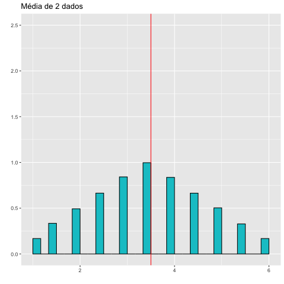
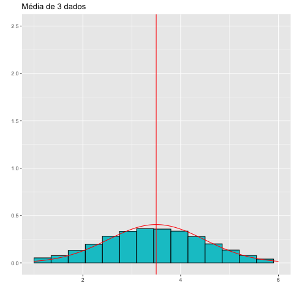
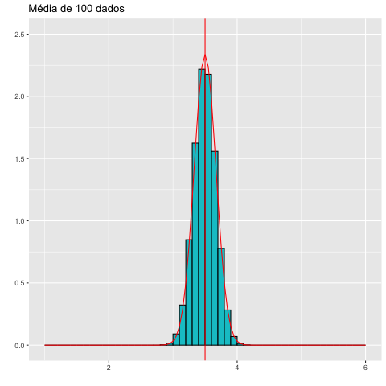
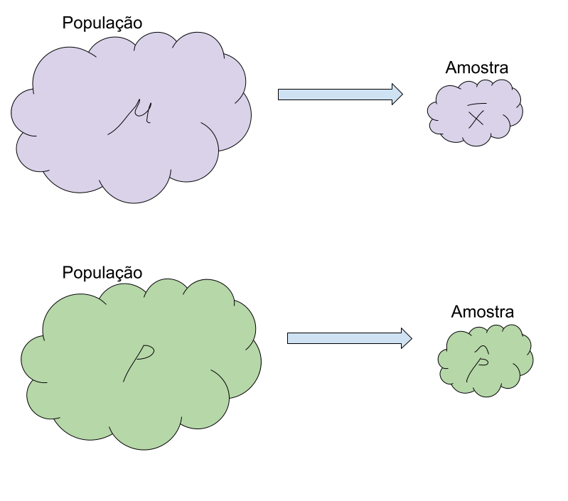

# Distribuição amostral e Teorema Central do Limite

## Estimar uma proporção: Eleições para a prefeitura {.build}


> * Quero saber se o candidato $A$ vai ganhar as eleições para prefeito.

> * Quero saber o parâmetro populacional $p$ = proporção de pessoas que votam em $A$.

> * Posso esperar o resultado das eleições para saber, ou seja, teríamos as respostas de todas as pessoas da cidade.

> * Posso usar uma amostra para estimar a proporção de votos para $A$.

> * Quão boa é a estimativa? É precisa? 

> * Posso pensar no problema de duas formas: Modo 1 e Modo 2.


## Modo 1 {.build}


> * Cidade com $N$ pessoas.

> * $X_i = 1$ se a pessoa $i$ vota em $A$

> * $X_i=0$ se a pessoa $i$ não vota em $A$.

> * $\mathbf{X}=(X_1,X_2,\ldots,X_N)$: respostas de toda a população (temos no dia da eleição).

> * Média populacional: $$p=\frac{1}{N}\sum_{i=1}^N X_i$$

<!-- Repare que aqui, nao estou falando de variáveis aleatórias, temos apenas dados das pessoas da cidade -->
<!-- Estou calculando a média populacional e a variancia, conforme vimos nas estatísticas descritivas -->

## Modo 1 {.smaller}


* Variância populacional:

$$\begin{eqnarray} 
\sigma^2&=&\frac{1}{N}\sum_{i=1}^N(X_i-p)^2\\
&=&\frac{1}{N}\sum_{i=1}^N(X_i^2-2pX_i+p^2)\\
&=&\frac{\sum_{i=1}^N X_i^2-2p\sum_{i=1}^N X_i+\sum_{i=1}^N p^2}{N}\\
&=&\frac{\sum_{i=1}^N X_i-2p\sum_{i=1}^N X_i+\sum_{i=1}^N p^2}{N}\\
&=&\frac{Np-2pNp+Np^2}{N}=p(1-p)
\end{eqnarray}$$


## Modo 1 {.build}

> * $p$ = proporção de pessoas que votam em $A$ na cidade

> * $\sigma^2=p(1-p)$ é a variância da população.

> * Até o dia da eleição, não sabemos $p$.

> * Coletamos uma amostra aleatória de tamanho $n$ para uma pesquisa eleitoral.

> * $\hat{p}$: proporção de pessoas que votam em $A$ na amostra.

> * Quão boa é a estimativa? É precisa? 

> * Se outra pessoa também coleta uma amostra aleatória de tamanho $n$ e calcula $\hat{p}$ teremos o mesmo valor?

## Modo 1 - Exemplo $N=5$ {.build}


$$\mathbf{X}=(X_1,X_2,\ldots,X_5)=(1,0,1,0,1)$$

$$p=\frac{\sum_{i=1}^5X_i}{5}=\frac{3}{5}=0.6$$

$$\begin{eqnarray} 
\sigma^2&=&\frac{1}{5}\sum_{i=1}^N(X_i-p)^2\\
&=&\frac{3\times(1-0.6)^2+2\times(0-0.6)^2}{5}\\
&=&0.24\\
&=&p(1-p)
\end{eqnarray}$$

## Modo 1 - Exemplo $N=5$

Gráfico de barras (proporção) dos dados populacionais:

```{r,echo=FALSE,fig.align='center'}
namess <- c("0","1")
barplot(c(0.4,0.6), names.arg=namess, col="turquoise3", main="", 
            cex.lab=1.0, cex.axis=1.0, cex.names=1.0, cex.main=2, las=2)
```


## Modo 1 - Exemplo $N=5$ e $n=2$ {.smaller}

$N^n=25$ amostras possíveis.
```{r,echo=FALSE,warning=FALSE,message=FALSE}
library(kableExtra)
aa <- expand.grid(1:5,1:5)
xx <- c(1,0,1,0,1)
phat <- unlist(apply(aa,1,function(x) mean(xx[x])))
aa$phat <- phat
#colnames(aa) <- c("Pessoa amostrada 1","Pessoa amostrada 2","$\\hat{p}$")
kable(aa,align = 'ccc',col.names = c("Primeira pessoa","Segunda pessoa","$\\hat{p}$"))
```

## Modo 1 - Exemplo $N=5$ e $n=2$ {.build}

Distribuição **amostral** de $\hat{p}$:

```{r,echo=FALSE,warning=FALSE,message=FALSE}
ff <- as.data.frame(table(aa$phat))
ff$Prop=ff$Freq/(sum(ff$Freq))
kable(ff[,c(1,3)],align = 'cc',col.names = c("$x$","$P(\\hat{p}=x)$"))
```

$$\begin{eqnarray} 
E(\hat{p})&=&0\times 0.16 + 0.5\times 0.48 + 1\times 0.36 = 0.6 = p\\
Var(\hat{p})&=&E[(\hat{p}-p)^2]\\
&=&0.16\times(0-0.6)^2 + 0.48\times(0.5-0.6)^2 + 0.36\times (1-0.6)^2\\
&=&0.12=\frac{0.24}{2}=\frac{p(1-p)}{n}
\end{eqnarray}$$

## Modo 1 - Exemplo $N=5$ e $n=2$

Distribuição amostral de $\hat{p}$:

```{r,echo=FALSE,fig.align='center'}
namess <- as.character(round(as.numeric(as.character(ff$Var1)),2))
barplot(ff$Prop, names.arg=namess, col="turquoise3", main="", 
            cex.lab=1.0, cex.axis=1.0, cex.names=1.0, cex.main=2, las=2)
```


## Modo 1 - Exemplo $N=5$ e $n=3$ {.smaller}

$N^n=125$ amostras possíveis.

```{r,echo=FALSE,warning=FALSE,message=FALSE}
library(kableExtra)
aa <- expand.grid(1:5,1:5,1:5)
xx <- c(1,0,1,0,1)
phat <- unlist(apply(aa,1,function(x) mean(xx[x])))
aa$phat <- round(phat,3)
#colnames(aa) <- c("Pessoa amostrada 1","Pessoa amostrada 2","$\\hat{p}$")
kable(aa[1:25,],align = 'ccc',col.names = c("Pessoa amostrada 1","Pessoa amostrada 2","Pessoa amostrada 3","$\\hat{p}$"))
```

## Modo 1 - Exemplo $N=5$ e $n=3$ {.smaller}

```{r,echo=FALSE,warning=FALSE,message=FALSE}
kable(aa[26:50,],align = 'ccc',col.names = c("Pessoa amostrada 1","Pessoa amostrada 2","Pessoa amostrada 3","$\\hat{p}$"))
```

## Modo 1 - Exemplo $N=5$ e $n=3$ {.smaller}

```{r,echo=FALSE,warning=FALSE,message=FALSE}
kable(aa[51:75,],align = 'ccc',col.names = c("Pessoa amostrada 1","Pessoa amostrada 2","Pessoa amostrada 3","$\\hat{p}$"))
```

## Modo 1 - Exemplo $N=5$ e $n=3$ {.smaller}

```{r,echo=FALSE,warning=FALSE,message=FALSE}
kable(aa[76:100,],align = 'ccc',col.names = c("Pessoa amostrada 1","Pessoa amostrada 2","Pessoa amostrada 3","$\\hat{p}$"))
```


## Modo 1 - Exemplo $N=5$ e $n=3$ {.smaller}

```{r,echo=FALSE,warning=FALSE,message=FALSE}
kable(aa[101:125,],align = 'ccc',col.names = c("Pessoa amostrada 1","Pessoa amostrada 2","Pessoa amostrada 3","$\\hat{p}$"))
```


## Modo 1 - Exemplo $N=5$ e $n=3$ 

Distribuição **amostral** de $\hat{p}$:

```{r,echo=FALSE,warning=FALSE,message=FALSE}
ff <- as.data.frame(table(aa$phat))
ff$Prop=round(ff$Freq/(sum(ff$Freq)),3)
kable(ff[,c(1,3)],align = 'cc',col.names = c("$x$","$P(\\hat{p}=x)$"))
```

$$\begin{eqnarray} 
E(\hat{p})&=&0\times 0.064 + 0.333\times 0.288 + 0.667\times 0.432 + 1\times 0.216\\
&=& 0.6 = p\\
Var(\hat{p})&=&E[(\hat{p}-p)^2]\\
&=&0.08=\frac{0.24}{3}=\frac{p(1-p)}{n}
\end{eqnarray}$$

## Modo 1 - Exemplo $N=5$ e $n=3$

Distribuição amostral de $\hat{p}$:

```{r,echo=FALSE,fig.align='center'}
namess <- as.character(round(as.numeric(as.character(ff$Var1)),2))
barplot(ff$Prop, names.arg=namess, col="turquoise3", main="", 
            cex.lab=1.0, cex.axis=1.0, cex.names=1.0, cex.main=2, las=2)
```


## Modo 1


* $\mathbf{X}=(X_1,\ldots,X_N)$ é fixo

* Amostra aleatória de tamanho $n$

* $\hat{p}$ é v.a. (pelo processo de amostragem)

* $E(\hat{p})=p$

* $Var(\hat{p})=\frac{p(1-p)}{n}$


## Modo 1 - Exemplo $N=1000000$ e $n=100$


```{r,echo=FALSE,warning=FALSE,message=FALSE}
N=1000000
n=100
n1 = ceiling(N*.6)
n2= N-n1
xx <- c(rep(1,n1),rep(0,n2))
B=100000
bb <- matrix(NA,nrow=B,ncol=n)
for (i in 1:B)
{
  bb[i,] <- sample(1:N,n,replace=TRUE)
}
phat <- unlist(apply(bb,1,function(x) mean(xx[x])))
aa <- data.frame(bb)
aa$phat <- round(phat,3)
```


$p=0.6$. Distribuição **amostral** de $\hat{p}$:

```{r,echo=FALSE,warning=FALSE,message=FALSE}
ff <- as.data.frame(table(aa$phat))
ff$Prop=round(ff$Freq/(sum(ff$Freq)),3)
```


```{r,echo=FALSE,fig.align='center',message=FALSE,warning=FALSE}
library(ggplot2)
df <- data.frame(PF = aa$phat)
ggplot(df, aes(x = PF)) + 
    geom_histogram(aes(y =..density..),
                   breaks = seq(min(aa$phat), max(aa$phat), by = .01), 
                   colour = "black", 
                   fill = "turquoise3") +  geom_vline(xintercept=0.6, color="red") + 
stat_function(fun = dnorm, args = list(mean = 0.6, sd = sqrt(0.6*.4/n)),col="red") + xlab(" ") + ylab(" ") + ylim(0,30) + xlim(0.4,0.8)
```


## Modo 1 - Exemplo $N=1000000$ e $n=1000$


```{r,echo=FALSE,warning=FALSE,message=FALSE}
N=1000000
n=1000
n1 = ceiling(N*.6)
n2= N-n1
xx <- c(rep(1,n1),rep(0,n2))
B=100000
bb <- matrix(NA,nrow=B,ncol=n)
for (i in 1:B)
{
  bb[i,] <- sample(1:N,n,replace=TRUE)
}
phat <- unlist(apply(bb,1,function(x) mean(xx[x])))
aa <- data.frame(bb)
aa$phat <- round(phat,3)
```


$p=0.6$. Distribuição **amostral** de $\hat{p}$:

```{r,echo=FALSE,warning=FALSE,message=FALSE}
ff <- as.data.frame(table(aa$phat))
ff$Prop=round(ff$Freq/(sum(ff$Freq)),3)
```


```{r,echo=FALSE,fig.align='center',message=FALSE,warning=FALSE}
df <- data.frame(PF = aa$phat)
ggplot(df, aes(x = PF)) + 
    geom_histogram(aes(y =..density..),
                   breaks = seq(min(aa$phat), max(aa$phat), by = .003), 
                   colour = "black", 
                   fill = "turquoise3") +  geom_vline(xintercept=0.6, color="red") +
stat_function(fun = dnorm, args = list(mean = 0.6, sd = sqrt(0.6*.4/n)),col="red") + xlab(" ") + ylab(" ") + ylim(0,30)+xlim(0.4,0.8)
```


## Modo 2 {.build}

> Suponha que a resposta de uma pessoa da cidade sobre se vota ou não no candidato $A$ possa ser representada por uma **variável aleatória**. $X$ que assume o valor $1$ com probabilidade $p$ ou $0$ com probabilidade $1-p$. 

$\begin{aligned}
X &\sim Bernoulli(p)\\
\mathbb E(X) &= 1 \times P(X=1) + 0 \times P(X=0) \\ 
&= 1\times p + 0\times (1-p) = p\\
Var(X) &= \mathbb E[(X - p)^2] \\
&= (1-p)^2 \times P(X=1) + (0 - p)^2 \times P(X=0) \\
&=p(1-p)^2+(1-p)p^2\\
&= p(1-p)
\end{aligned}$


## Modo 2 - Exemplo $n=2$  {.smaller .build}

> Todas as combinações possíveis de amostras com $n=2$ são:

Possibilidades        | $(X_1 = 1, X_2 = 1)$ | $(X_1 = 1, X_2 = 0)$ | $(X_1 = 0, X_2 = 1)$ | $(X_1=0,X_2=0)$
----------------------|----------------------|----------------------|----------------------|-----------------
$\hat{p}=\frac{1}{n}\sum_{i=1}^nX_i$              | 1                    | 0.5                  | 0.5                  |   0
$P(X_1 = i, X_2 = j)$ | $p^2$                | $p(1-p)$                 | $(1-p)p$                 | $(1-p)^2$

<br />

> $\displaystyle \mathbb E(\hat{p}) = 1 \times p^2 + 0.5 \times p(1-p) + 0.5 \times (1-p)p + 0\times (1-p)^2= p$

> $\begin{aligned}
Var(\hat{p}) &= \mathbb E[(\hat{p} - p)^2 ] \\
&= (1 - p)^2 \times p^2 + (0.5 - p)^2 p(1-p) + (0.5 - p)^2 (1-p)p + (0 - p)^2 (1-p)^2 \\
&= \frac{p(1-p)}{2}
\end{aligned}$

> Note que: $\displaystyle \mathbb E(\hat{p}) = p = \mathbb E(X)$ e $\displaystyle Var(\hat{p}) =  \frac{Var(X)}{n}$.


## Modo 2 - Exemplo $n=2$

Gráficos das distribuições de probabilidade de $X\sim Bernoulli(p=0.6)$ e $\hat{p}$: 


```{r, echo=FALSE, fig.height=3.5, fig.width=6,fig.align='center'}
par(mfrow=c(1, 2), mar = c(4, 3, 2, 1))
barplot(c(0.4, 0.6), las = 1, col = "turquoise3", ylim = c(0, 1), width = 0.25,
        names.arg = c(0, 1), 
        main = "", xlab = "X", ylab = "", xlim = c(0, 1))
barplot(c(0.36, 0.48, 0.16), las = 1, col = "turquoise3", 
        names.arg = c("0", "1/2", "1"), 
        main = " ", 
        xlab = bquote("" * hat(p) * "") , ylab = "", ylim = c(0, 1), )
```


<!-- ## Resultado  {.build .smaller} -->

<!-- Seja $X$ uma v.a. com média $\mu$ e variância $\sigma^{2}$ e $X_{1}, \ldots, X_{n}$ uma amostra aleatória simples de $X$.  -->

<!-- > A média amostral -->
<!-- $$\bar X_n = \frac{1}{n}\sum_{i=1}^n X_i$$  -->
<!-- tem as seguintes propriedades: -->

<!-- > $$\mathbb E (\bar X_n) = \mu \qquad \mbox{e} \qquad Var(\bar X_n) = \frac{\sigma^2}{n}.$$  -->

<!-- (propriedade de linearidade da esperança e da variância, esta última em caso de independência) -->

<!-- > Ou seja, embora $\mu$ seja desconhecido, sabemos que o valor esperado da média amostral é $\mu$.  -->

<!-- > Além disso, conforme o tamanho amostral aumenta, a imprecisão da média amostral para estimar $\mu$ fica cada vez menor, pois $Var(\bar X) = \sigma^2/n$ é inversamente proporcional ao tamanho amostral $n$. -->

## Resultado  {.smaller}

Seja $X$ uma v.a. com distribuição de Bernoulli com parâmetro $p$. Sabe-se que $E(X)=p$ e $Var(X)=p(1-p)$.
Considere uma amostra aleatória $X_1, X_2,\ldots, X_n$ de $X$.

A proporção amostral
$$\hat{p} = \frac{1}{n}\sum_{i=1}^n X_i$$ 
tem as seguintes propriedades:

 $$\mathbb E (\hat{p}) = p \qquad \mbox{e} \qquad Var(\hat{p}) = \frac{p(1-p)}{n}.$$ 

(propriedade de linearidade da esperança e da variância, esta última em caso de independência)

Ou seja, embora $p$ seja desconhecido, sabemos que o valor esperado da proporção amostral é $p$. 

Além disso, conforme o tamanho amostral aumenta, a imprecisão de $\hat{p}$ para estimar $p$ fica cada vez menor, pois $Var(\hat{p}) = p(1-p)/n$ é inversamente proporcional ao tamanho amostral $n$.


## Modo 2


* $X_i\sim Bernoulli (p)$ é v.a. (o voto ou não em $A$ é considerado uma v.a.)

* Amostra aleatória de tamanho $n$

* $\hat{p}$ é v.a. (é combinação linear de v.a.'s)

* $E(\hat{p})=p$

* $Var(\hat{p})=\frac{p(1-p)}{n}$

## Modo 2 - Exemplo $n=3$


Amostra aleatória $n=3$ de $X\sim Bernoulli(p=0.6)$. 

* $\mathbb E(X) = p = 0.6 \qquad \Rightarrow \qquad \mathbb E (\hat{p}) = 0.6$ 

* $Var(X) = p(1 - p) = 0.24 \;\; \Rightarrow \;\; Var(\hat{p}) = \frac{0.24}{3} = 0.08$

```{r, echo=FALSE, fig.height=3, fig.width=7,fig.align='center'}
n = 3
p = 0.6

par(mfrow=c(1, 2), mar = c(4, 3, 2, 1))
barplot(c(1-p, p), las = 1, col = "turquoise3", ylim = c(0, .8), width = 0.25, 
        names.arg = c(0, 1), 
        main = "Bernoulli(p=0.3)", xlab = "X", ylab = "", xlim = c(0, 1))
barplot(dbinom(0:n, n, p), las = 1, col = "turquoise3", 
        names.arg = c("0", "1/3", "2/3", "1"), 
        main = "Distribuição Amostral", 
        xlab = bquote("" * hat(p) * "") , ylab = "", ylim = c(0, .6))
```


<!-- ## Modo 2 - Exemplo $n=30$ -->


<!-- Amostra aleatória $n=30$ de $X\sim Bernoulli(p=0.6)$.  -->

<!-- * $p = \mathbb E(X) = 0.6 \qquad \Rightarrow \qquad \mathbb E (\hat{p}) = 0.6$  -->

<!-- * $p(1-p) = Var(X) = p(1 - p) = 0.24 \;\; \Rightarrow \;\; Var(\hat{p}) = \frac{0.24}{3} = 0.08$ -->

<!-- ```{r, echo=FALSE, fig.height=3.5, fig.width=6,fig.align='center'} -->
<!-- n = 30 -->
<!-- p = 0.6 -->

<!-- par(mfrow=c(1, 2), mar = c(4, 3, 2, 1)) -->
<!-- barplot(c(1-p, p), las = 1, col = "turquoise3", ylim = c(0, .8), width = 0.25,  -->
<!--         names.arg = c(0, 1),  -->
<!--         main = "Bernoulli(p=0.6)", xlab = "X", ylab = "", xlim = c(0, 1)) -->
<!-- barplot(dbinom(0:n, n, p), las = 1, col = "turquoise3",  -->
<!--         names.arg = round(0:n/n, 2),  -->
<!--         main = "Distribuição Amostral",  -->
<!--         xlab = bquote("" * hat(p) * "") , ylab = "") -->
<!-- ``` -->


## Modo 2 - Exemplo $n=30$

$p=0.6$

```{r,echo=FALSE,warning=FALSE,message=FALSE}
n=30
B=100000
bb <- matrix(NA,nrow=B,ncol=n)
for (i in 1:B)
{
  bb[i,] <- rbinom(n,1,0.6)
}
phat <- rowMeans(bb)
aa <- data.frame(bb)
aa$phat <- round(phat,3)
```


```{r,echo=FALSE,fig.align='center',message=FALSE,warning=FALSE}
df <- data.frame(PF = aa$phat)
ggplot(df, aes(x = PF)) + 
    geom_histogram(aes(y =..density..),
                   breaks = seq(min(aa$phat), max(aa$phat), by = .035), 
                   colour = "black", 
                   fill = "turquoise3") +  geom_vline(xintercept=0.6, color="red") +
stat_function(fun = dnorm, args = list(mean = 0.6, sd = sqrt(0.6*.4/n)),col="red") + xlab(" ") + ylab(" ") + ylim(0,30)+xlim(0.4,0.8)
```


## Modo 2 - Exemplo $n=100$

$p=0.6$

```{r,echo=FALSE,warning=FALSE,message=FALSE}
n=100
B=100000
bb <- matrix(NA,nrow=B,ncol=n)
for (i in 1:B)
{
  bb[i,] <- rbinom(n,1,0.6)
}
phat <- rowMeans(bb)
aa <- data.frame(bb)
aa$phat <- round(phat,3)
```


```{r,echo=FALSE,fig.align='center',message=FALSE,warning=FALSE}
df <- data.frame(PF = aa$phat)
ggplot(df, aes(x = PF)) + 
    geom_histogram(aes(y =..density..),
                   breaks = seq(min(aa$phat), max(aa$phat), by = .01), 
                   colour = "black", 
                   fill = "turquoise3") +  geom_vline(xintercept=0.6, color="red") +
stat_function(fun = dnorm, args = list(mean = 0.6, sd = sqrt(0.6*.4/n)),col="red") + xlab(" ") + ylab(" ") + ylim(0,30)+xlim(0.4,0.8)
```

## Modo 2 - Exemplo $n=1000$

$p=0.6$

```{r,echo=FALSE,warning=FALSE,message=FALSE}
n=1000
B=100000
bb <- matrix(NA,nrow=B,ncol=n)
for (i in 1:B)
{
  bb[i,] <- rbinom(n,1,0.6)
}
phat <- rowMeans(bb)
aa <- data.frame(bb)
aa$phat <- round(phat,3)
```


```{r,echo=FALSE,fig.align='center',message=FALSE,warning=FALSE}
df <- data.frame(PF = aa$phat)
ggplot(df, aes(x = PF)) + 
    geom_histogram(aes(y =..density..),
                   breaks = seq(min(aa$phat), max(aa$phat), by = .005), 
                   colour = "black", 
                   fill = "turquoise3") +  geom_vline(xintercept=0.6, color="red") +
stat_function(fun = dnorm, args = list(mean = 0.6, sd = sqrt(0.6*.4/n)),col="red") + xlab(" ") + ylab(" ") + ylim(0,30)+xlim(0.4,0.8)
```


## Resumo dos exemplos {.build}

> * Modo 1: repostas são "fixas", com média populacional $p$ e variância populacional $p(1-p)$.

> * Modo 2: respostas são v.a.'s $X\sim Bernoulli(p)$, $E(X)=p$, $Var(X)=p(1-p)$.

> * Em ambos os casos, a partir do momento que retiro uma amostra aleatória de tamanho $n$, temos as mesmas propriedades e comportamento para a proporção amostral $\hat{p}$: $E(\hat{p})=p$ e $Var(\hat{p})=\frac{p(1-p)}{n}$

> E, conforme $n$ aumenta, vimos nos gráficos que: $\hat{p}\sim \mathcal{N}\left(p,\frac{p(1-p)}{n}\right)$


## Estimar uma média: Salários {.build}


> * Quero saber o salário médio das pessoas de uma certa cidade (parâmetro populacional de interesse).

> * Posso usar uma amostra e estimar usando a média amostral. 

> * Quão boa é a estimativa? É precisa? 

> * Posso pensar no problema de duas formas: Modo 1 e Modo 2.


## Modo 1


* Cidade com $N$ pessoas.

* $X_i$ é o salário da pessoa $i$.

* $\mathbf{X}=(X_1,X_2,\ldots,X_N)$: respostas de toda a população.

* Média populacional: $\mu=\frac{1}{N}\sum_{i=1}^N X_i$

* Variância populacional: $\sigma^2=\frac{1}{N}\sum_{i=1}^N(X_i-\mu)^2$

<!-- Repare que aqui, nao estou falando de variáveis aleatórias, temos apenas dados das pessoas da cidade -->
<!-- Estou calculando a média populacional e a variancia, conforme vimos nas estatísticas descritivas -->


## Modo 1 

* $\mu$ = salário médio da população.

* $\sigma^2$ é a variância da população.

* Coletamos uma amostra aleatória de tamanho $n$.

* $\bar{X}$: média salarial na amostra.

* Quão boa é a estimativa? É precisa? 

* Se outra pessoa também coleta uma amostra aleatória de tamanho $n$ e calcula $\bar{X}$ teremos o mesmo valor?

## Modo 1 - Exemplo $N=5$

$$\mathbf{X}=(X_1,X_2,\ldots,X_5)=(1000,2000,3000,4000,5000)$$

$$\mu=\frac{\sum_{i=1}^5X_i}{5}=3000$$
$$\sigma^2=\frac{1}{5}\sum_{i=1}^N(X_i-\mu)^2=2000000$$

## Modo 1 - Exemplo $N=5$

Gráfico de barras (proporção) dos dados populacionais:

```{r,echo=FALSE,fig.align='center'}
namess <- c("1000","2000","3000","4000","5000")
barplot(c(rep(1/5,5)), names.arg=namess, col="turquoise3", main="", 
            cex.lab=1.0, cex.axis=1.0, cex.names=1.0, cex.main=2, las=2)
```


## Modo 1 - Exemplo $N=5$ e $n=2$ {.smaller}

$N^n=25$ amostras possíveis.
```{r,echo=FALSE,warning=FALSE,message=FALSE}
library(kableExtra)
aa <- expand.grid(1:5,1:5)
xx <- c(1000,2000,3000,4000,5000)
phat <- unlist(apply(aa,1,function(x) mean(xx[x])))
aa$phat <- phat
kable(aa,align = 'ccc',col.names = c("Primeira pessoa","Segunda pessoa","$\\bar{X}$"))
```

## Modo 1 - Exemplo $N=5$ e $n=2$ 

Distribuição **amostral** de $\bar{X}$:

```{r,echo=FALSE,warning=FALSE,message=FALSE}
ff <- as.data.frame(table(aa$phat))
ff$Prop=ff$Freq/(sum(ff$Freq))
kable(ff[,c(1,3)],align = 'cc',col.names = c("$x$","$P(\\bar{X}=x)$"))
esp <- sum(as.numeric(as.character(ff$Var1))*ff$Prop)
vari <- sum( ((as.numeric(as.character(ff$Var1)) - esp )^2)*ff$Prop)
```

## Modo 1 - Exemplo $N=5$ e $n=2$ 


$$\begin{eqnarray} 
E(\bar{X})&=&`r esp`=\mu\\
Var(\bar{X})&=&E[(\bar{X}-\mu)^2]=`r vari`\\
&=&\frac{2000000}{2}=\frac{\sigma^2}{n}
\end{eqnarray}$$

## Modo 1 - Exemplo $N=5$ e $n=2$

Distribuição amostral de $\bar{X}$:

```{r,echo=FALSE,fig.align='center'}
namess <- as.character(round(as.numeric(as.character(ff$Var1)),2))
barplot(ff$Prop, names.arg=namess, col="turquoise3", main="", 
            cex.lab=1.0, cex.axis=1.0, cex.names=1.0, cex.main=2, las=2)
```


## Modo 1 - Exemplo $N=5$ e $n=3$ {.smaller}

$N^n=125$ amostras possíveis.

```{r,echo=FALSE,warning=FALSE,message=FALSE}
library(kableExtra)
aa <- expand.grid(1:5,1:5,1:5)
xx <- c(1000,2000,3000,4000,5000)
phat <- unlist(apply(aa,1,function(x) mean(xx[x])))
aa$phat <- round(phat,3)
#colnames(aa) <- c("Pessoa amostrada 1","Pessoa amostrada 2","$\\hat{p}$")
kable(aa[1:25,],align = 'ccc',col.names = c("Pessoa amostrada 1","Pessoa amostrada 2","Pessoa amostrada 3","$\\bar{X}$"))
```

## Modo 1 - Exemplo $N=5$ e $n=3$ {.smaller}

```{r,echo=FALSE,warning=FALSE,message=FALSE}
kable(aa[26:50,],align = 'ccc',col.names = c("Pessoa amostrada 1","Pessoa amostrada 2","Pessoa amostrada 3","$\\bar{X}$"))
```

## Modo 1 - Exemplo $N=5$ e $n=3$ {.smaller}

```{r,echo=FALSE,warning=FALSE,message=FALSE}
kable(aa[51:75,],align = 'ccc',col.names = c("Pessoa amostrada 1","Pessoa amostrada 2","Pessoa amostrada 3","$\\bar{X}$"))
```

## Modo 1 - Exemplo $N=5$ e $n=3$ {.smaller}

```{r,echo=FALSE,warning=FALSE,message=FALSE}
kable(aa[76:100,],align = 'ccc',col.names = c("Pessoa amostrada 1","Pessoa amostrada 2","Pessoa amostrada 3","$\\bar{X}$"))
```


## Modo 1 - Exemplo $N=5$ e $n=3$ {.smaller}

```{r,echo=FALSE,warning=FALSE,message=FALSE}
kable(aa[101:125,],align = 'ccc',col.names = c("Pessoa amostrada 1","Pessoa amostrada 2","Pessoa amostrada 3","$\\bar{X}$"))
```


## Modo 1 - Exemplo $N=5$ e $n=3$ 

Distribuição **amostral** de $\bar{X}$:

```{r,echo=FALSE,warning=FALSE,message=FALSE}
ff <- as.data.frame(table(aa$phat))
ff$Prop=round(ff$Freq/(sum(ff$Freq)),3)
kable(ff[,c(1,3)],align = 'cc',col.names = c("$x$","$P(\\bar{X}=x)$"))
esp <- sum(as.numeric(as.character(ff$Var1))*ff$Prop)
vari <- sum( ((as.numeric(as.character(ff$Var1)) - esp )^2)*ff$Prop)
```


## Modo 1 - Exemplo $N=5$ e $n=3$ 


$$\begin{eqnarray} 
E(\bar{X})&=&`r esp`=\mu\\
Var(\bar{X})&=&E[(\bar{X}-\mu)^2]=`r vari`\\
&=&\frac{2000000}{3}=\frac{\sigma^2}{n}
\end{eqnarray}$$


## Modo 1 - Exemplo $N=5$ e $n=3$


Distribuição amostral de $\bar{X}$:

```{r,echo=FALSE,fig.align='center'}
namess <- as.character(round(as.numeric(as.character(ff$Var1)),2))
barplot(ff$Prop, names.arg=namess, col="turquoise3", main="", 
            cex.lab=1.0, cex.axis=1.0, cex.names=1.0, cex.main=2, las=2)
```


## Modo 1


* $\mathbf{X} = (X_1,\ldots,X_N)$ é fixo

* Amostra aleatória de tamanho $n$

* $\bar{X}$ é v.a.

* $E(\bar{X})=\mu$

* $Var(\bar{X})=\frac{\sigma^2}{n}$


## Modo 1 - Exemplo $N=1000000$ e $n=100$


```{r,echo=FALSE,warning=FALSE,message=FALSE}
N=1000000
n=100
xx <- c(rep(1000,N/5),rep(2000,N/5),rep(3000,N/5),rep(4000,N/5),rep(5000,N/5))
mu=mean(xx)
vari = var(xx) * (N-1)/N
B=100000
bb <- matrix(NA,nrow=B,ncol=n)
for (i in 1:B)
{
  bb[i,] <- sample(1:N,n,replace=TRUE)
}
phat <- unlist(apply(bb,1,function(x) mean(xx[x])))
aa <- data.frame(bb)
aa$phat <- round(phat,3)
```


$\mu=3000$. Distribuição **amostral** de $\bar{X}$:

```{r,echo=FALSE,warning=FALSE,message=FALSE}
ff <- as.data.frame(table(aa$phat))
ff$Prop=round(ff$Freq/(sum(ff$Freq)),3)
```


```{r,echo=FALSE,fig.align='center',message=FALSE,warning=FALSE}
library(ggplot2)
df <- data.frame(PF = aa$phat)
ggplot(df, aes(x = PF)) + 
    geom_histogram(aes(y =..density..),
                   breaks = seq(min(aa$phat), max(aa$phat), by = 10), 
                   colour = "black", 
                   fill = "turquoise3") +  geom_vline(xintercept=mu, color="red") + 
stat_function(fun = dnorm, args = list(mean = mu, sd = sqrt(vari/n)),col="red") + xlab(" ") + ylab(" ") + ylim(0,0.01) + xlim(2400,3600)
```


## Modo 1 - Exemplo $N=1000000$ e $n=1000$


```{r,echo=FALSE,warning=FALSE,message=FALSE}
N=1000000
n=1000
xx <- c(rep(1000,N/5),rep(2000,N/5),rep(3000,N/5),rep(4000,N/5),rep(5000,N/5))
mu=mean(xx)
vari = var(xx) * (N-1)/N
B=100000
bb <- matrix(NA,nrow=B,ncol=n)
for (i in 1:B)
{
  bb[i,] <- sample(1:N,n,replace=TRUE)
}
phat <- unlist(apply(bb,1,function(x) mean(xx[x])))
aa <- data.frame(bb)
aa$phat <- round(phat,3)
```


$\mu=3000$. Distribuição **amostral** de $\bar{X}$:

```{r,echo=FALSE,warning=FALSE,message=FALSE}
ff <- as.data.frame(table(aa$phat))
ff$Prop=round(ff$Freq/(sum(ff$Freq)),3)
```


```{r,echo=FALSE,fig.align='center',message=FALSE,warning=FALSE}
df <- data.frame(PF = aa$phat)
ggplot(df, aes(x = PF)) + 
    geom_histogram(aes(y =..density..),
                   breaks = seq(min(aa$phat), max(aa$phat), by = 10), 
                   colour = "black", 
                   fill = "turquoise3") +  geom_vline(xintercept=mu, color="red") +
stat_function(fun = dnorm, args = list(mean = mu, sd = sqrt(vari/n)),col="red") + xlab(" ") + ylab(" ") + ylim(0,0.01) + xlim(2400,3600)
```


## Modo 2

Suponha que o salário de uma pessoa possa ser representado por uma **variável aleatória** uniforme discreta assumindo os valores 1000, 2000, 3000, 4000 ou 5000. 

$\begin{aligned}
\mu=\mathbb E(X) &= \frac{1000+2000+3000+4000+5000}{5}=3000 \\ 
\sigma^2=Var(X) &= \frac{1}{5}[(1000-3000)^2+(2000-3000)^2+(3000-3000)^2\\
&+(4000-3000)^2+(5000-3000)^2]\\
&= 2000000
\end{aligned}$

## Modo 2 

Distribuição da variável $X$ (do salário de cada indivíduo da população): 

```{r,echo=FALSE,fig.align='center'}
namess <- c("1000","2000","3000","4000","5000")
barplot(c(rep(1/5,5)), names.arg=namess, col="turquoise3", main="", 
            cex.lab=1.0, cex.axis=1.0, cex.names=1.0, cex.main=2, las=2)
```


## Modo 2 - Exemplo $n=2$  {.smaller}


> $\displaystyle \mathbb E(\bar{X}) = \frac{1}{n}\sum_{i=1}^n \mathbb E (X_i)= E(X)=\mu=3000$

> $\begin{aligned}
Var(\bar{X}) &= \frac{1}{n}\sum_{i=1}^n Var (X_i)= \frac{Var(X)}{n}=\frac{\sigma^2}{n}=1000000\\
\end{aligned}$

(propriedades de linearidade da esperança e variância (a.a.))

## Resultado  {.build .smaller}

Seja $X$ uma v.a. com média $\mu$ e variância $\sigma^{2}$ e $X_{1}, \ldots, X_{n}$ uma amostra aleatória de $X$. 

A média amostral
$$\bar X_n = \frac{1}{n}\sum_{i=1}^n X_i$$ 
tem as seguintes propriedades:

> $$\mathbb E (\bar X_n) = \mu \qquad \mbox{e} \qquad Var(\bar X_n) = \frac{\sigma^2}{n}.$$ 

(propriedade de linearidade da esperança e da variância, esta última em caso de independência)

Ou seja, embora $\mu$ seja desconhecido, sabemos que o valor esperado da média amostral é $\mu$. 

Além disso, conforme o tamanho amostral aumenta, a imprecisão da média amostral para estimar $\mu$ fica cada vez menor, pois $Var(\bar X) = \sigma^2/n$ é inversamente proporcional ao tamanho amostral $n$.


## Modo 2 - Exemplo $n=30$


```{r,echo=FALSE,warning=FALSE,message=FALSE}
n=30
B=100000
bb <- matrix(NA,nrow=B,ncol=n)
for (i in 1:B)
{
  bb[i,] <- sample(x=c(1000,2000,3000,4000,5000),size=n,replace=TRUE)
}
phat <- rowMeans(bb)

aa <- data.frame(bb)
aa$phat <- round(phat,3)
mu=mean(c(1000,2000,3000,4000,5000))
vari = var(c(1000,2000,3000,4000,5000)) * (4/5)
```


```{r,echo=FALSE,fig.align='center',message=FALSE,warning=FALSE}
df <- data.frame(PF = aa$phat)
ggplot(df, aes(x = PF)) + 
    geom_histogram(aes(y =..density..),
                   breaks = seq(min(aa$phat), max(aa$phat), by = 33), 
                   colour = "black", 
                   fill = "turquoise3") +  geom_vline(xintercept=mu, color="red") +
stat_function(fun = dnorm, args = list(mean = mu, sd = sqrt(vari/n)),col="red") + xlab(" ") + ylab(" ") + ylim(0,0.01)+xlim(2000,4000)
```


## Modo 2 - Exemplo $n=100$


```{r,echo=FALSE,warning=FALSE,message=FALSE}
n=100
B=100000
bb <- matrix(NA,nrow=B,ncol=n)
for (i in 1:B)
{
  bb[i,] <- sample(x=c(1000,2000,3000,4000,5000),size=n,replace=TRUE)
}
phat <- rowMeans(bb)

aa <- data.frame(bb)
aa$phat <- round(phat,3)
mu=mean(c(1000,2000,3000,4000,5000))
vari = var(c(1000,2000,3000,4000,5000)) * (4/5)
```


```{r,echo=FALSE,fig.align='center',message=FALSE,warning=FALSE}
df <- data.frame(PF = aa$phat)
ggplot(df, aes(x = PF)) + 
    geom_histogram(aes(y =..density..),
                   breaks = seq(min(aa$phat), max(aa$phat), by = 10), 
                   colour = "black", 
                   fill = "turquoise3") +  geom_vline(xintercept=mu, color="red") +
stat_function(fun = dnorm, args = list(mean = mu, sd = sqrt(vari/n)),col="red") + xlab(" ") + ylab(" ") + ylim(0,0.01)+xlim(2000,4000)
```

## Modo 2 - Exemplo $n=1000$


```{r,echo=FALSE,warning=FALSE,message=FALSE}
n=1000
B=100000
bb <- matrix(NA,nrow=B,ncol=n)
for (i in 1:B)
{
  bb[i,] <- sample(x=c(1000,2000,3000,4000,5000),size=n,replace=TRUE)
}
phat <- rowMeans(bb)

aa <- data.frame(bb)
aa$phat <- round(phat,3)
```


```{r,echo=FALSE,fig.align='center',message=FALSE,warning=FALSE}
df <- data.frame(PF = aa$phat)
ggplot(df, aes(x = PF)) + 
    geom_histogram(aes(y =..density..),
                   breaks = seq(min(aa$phat), max(aa$phat), by = 10), 
                   colour = "black", 
                   fill = "turquoise3") +  geom_vline(xintercept=mu, color="red") +
stat_function(fun = dnorm, args = list(mean = mu, sd = sqrt(vari/n)),col="red") + xlab(" ") + ylab(" ") + ylim(0,0.01)+xlim(2000,4000)
```


## Resultados {.smaller}

Temos uma população com média (proporção) $\mu$ ($p$) e variância $\sigma^2$ desconhecida. 

Retira-se uma amostra aleatória de tamanho $n$ e calcula-se a média (ou proporção) amostral $\bar{X}$ (ou $\hat{p}$) para estimar o parâmetro populacional desconhecido $\mu$ (ou $p$).

Temos as propriedades:


$$E(\bar{X})=\mu \quad \quad Var(\bar{X})=\frac{\sigma^2}{n}$$

$$E(\hat{p})=p\quad \quad Var(\hat{p})=\frac{p(1-p)}{n}$$

##


E, conforme $n$ aumenta, pelos gráficos, *parece* que a distribuição amostral de $\bar{X}$ e $\hat{p}$ se aproxima da normal:

$$\bar{X}\sim \mathcal{N}\left(\mu,\frac{\sigma^2}{n}\right) \quad \quad \hat{p}\sim \mathcal{N}\left(p,\frac{p(1-p)}{n}\right)$$


##  {.smaller .build}

Para uma amostra aleatória de tamanho $n$ a partir de uma população:

* com média $\mu$ e variância $\sigma^2$
    
    $\bar X$: $\mathbb E(\bar X) = \mu$ e $Var(\bar X) = \frac{\sigma^2}{n}$. Erro padrão: $EP(\bar{X})=\sqrt{Var(\bar X)}=\sigma/\sqrt{n}$.

* com proporção populacional $p$

    $\hat{p}$: $\mathbb E(\hat{p}) = p$ e $Var(\hat{p}) = \frac{p(1-p)}{n}$. Erro padrão: $EP(\hat{p})=\sqrt{Var(\hat p)}=\sqrt{\frac{p(1-p)}{n}}$.

> No exemplos, vimos também a distribuição amostral de $\bar X$ ou $\hat{p}$, mas isso só foi possível porque tínhamos informação de todos os valores possíveis na população. 

> Os exemplos anteriores foram casos hipotéticos apenas para ilustrar como $\bar X$ e $\hat{p}$ se comportam quando realizamos a amostragem.

> Na prática, não teremos informações suficientes para de fato descrevermos a distribuição amostral exata de $\bar X$ e $\hat{p}$ (se tivermos, nem é preciso fazer amostragem!)

## Teorema do Limite Central {.build}

**Resultado** 

* Para uma amostra aleatória $X_1, \ldots ,X_n$ coletada de uma população com média $\mu$ e variância $\sigma^{2}$

> * a distribuição amostral de $\bar X$ aproxima-se de uma **distribuição Normal** de média $\mu$ e variância $\frac{\sigma^{2}}{n}$, quando $n$ for suficientemente grande:

$$\bar{X}\sim\mathcal{N}\left(\mu,\frac{\sigma^2}{n}\right)$$


>

$$Z = \frac{\bar X - \mu}{\sigma / \sqrt{n}} \sim \mathcal{N}(0,1)$$ 

Obs: o resultado vale para $\hat{p}$, com $\mu=p$ e $\sigma^2=p(1-p)$.


## Teorema do Limite Central

<center></center>


## Exemplo - Transistor {.build}

Suponha que $X$ denota o tempo de vida de um transistor (em horas) e seu comportamento pode ser representado por uma distribuição Exponencial, tal que $X \sim Exp(2)$, ou seja: 
$$f_{X}(x) = 2e^{-2x}, \qquad \mbox{para } x \geq 0.$$


<br /> 
Sabemos que:

$\mathbb E(X) = \frac{1}{2}$ 

$Var(X) = \frac{1}{4}$

```{r, echo=FALSE, eval=FALSE}
## Código que gerou gráfico salvo como figuras/Exp2.png

x = rexp(1000, rate = 2)
exp2 = function(x) dexp(x, rate = 2)

par(mar = c(4, 4, 2, 1))
hist(x, prob = TRUE, las = 1, col = "lightblue", ylim = c(0, 2), 
     main = "Distribuição Exp(2)")
curve(exp2, col = "red", lwd = 2, add = TRUE)
```


## Exemplo - Transistor {.build}

Os tempos de vida de 100 transistores escolhidos ao acaso são coletados e a média dos tempos é calculada, denotada por $\bar X_{100}$.

> Desejamos estudar a variável aleatória $\bar X_{100}$. 


> Sabemos que:
$$\mathbb E(\bar X_{100}) = \frac{1}{2} \mbox{  e  } Var(\bar X_{100}) = \frac{1/4}{100} = \frac{1}{400}$$

> Então, pelo TLC: 

$$\displaystyle \bar X_{100}\sim N \left(\frac{1}{2},\frac{1}{400}\right).$$

```{r, echo=FALSE, eval=FALSE}
## Código que gerou gráfico salvo como figuras/TransistorExp2.png
xbar = replicate(10000, mean(rexp(100, rate = 2)))
normdens = function(x) dnorm(x, mean = 1/2, sd = 1/20)

par(mar = c(4, 4, 2, 1))
hist(xbar, prob = TRUE, las = 1, col = "turquoise3", ylim = c(0, 8), 
     main = "Distribuição Amostral", ylab = "densidade",  
     xlab = bquote("" * bar(X) * ""))
curve(normdens, col = "red", lwd = 2, add = TRUE)
```


## Exemplo - lançamento de dados {.build}

$X=$ resultado obtido no lançamento de um dado honesto.

$x$ | 1 | 2 | 3 | 4 | 5 | 6
----|---|---|---|---|---|----
$p(x)=P(X=x)$ | $\frac{1}{6}$ | $\frac{1}{6}$ | $\frac{1}{6}$ | $\frac{1}{6}$ | $\frac{1}{6}$ | $\frac{1}{6}$


> $\mathbb E(X) = \frac{1}{6}\times(1+2+3+4+5+6) = \frac{21}{6} = 3.5$

> $Var(X) = \frac{1}{6}[(1-3.5)^2+(2-3.5)^2+\ldots+(6-3.5)^2] = \frac{17.5}{6} = 2.92$

> * $X_i$: resultado do $i$-ésimo lançamento de um dado honesto.

> * $X_i$ tem distribuição uniforme discreta.

> * $\mu = \mathbb E(X_i) = 3.5 \qquad$ e $\qquad \sigma^2 = Var(X_i) = 2.92$


## Exemplo - lançamento de dados {.build .smaller}

> Se temos uma amostra aleatória de tamanho $n$: $X_1,X_2,\ldots, X_n$, pelo TLC sabemos que a distribuição amostral de $\bar X$ é Normal$\left( 3.5, \frac{2.92}{n} \right)$ para $n$ grande.

> O primeiro histograma a seguir mostra o resultado de 100000 repetições do seguinte experimento: observar o resultado do lançamento de 1 dado. Repare que é muito próximo de uma distribuição uniforme discreta (chance 1/6 para cada resultado), que é a distribuição de $X$.

> O segundo histograma mostra o resultado de 100000 repetições do seguinte experimento: observar a média do lançamento de 2 dados. 


> O último histograma mostra o resultado de 100000 repetições do seguinte experimento: observar a média do lançamento de 100 dados. 

> Repare que conforme o número de dados lançados (tamanho amostral) aumenta, a distribuição da média amostral se aproxima da distribuição normal com média 3.5 e variância cada vez menor (2.92/n).


## Exemplo - lançamento de dados


```{r,echo=FALSE,warning=FALSE,message=FALSE}
B=100000
mu=3.5
vari = 17.5/6
```


```{r dados1,echo=FALSE,fig.align='center',message=FALSE,warning=FALSE,eval=FALSE}
png("./figuras/dados1.png")
n=1
bb <- matrix(NA,nrow=B,ncol=n)
for (i in 1:B)
{
  bb[i,] <- sample(1:6,n,replace=TRUE)
}
phat <- rowMeans(bb)
aa <- data.frame(bb)
aa$phat <- round(phat,3)
df <- data.frame(PF = aa$phat)
ggplot(df, aes(x = PF)) + 
    geom_histogram(aes(y =..density..),
                   breaks = seq(1, 6, by = 1/6), 
                   colour = "black", 
                   fill = "turquoise3") +  geom_vline(xintercept=mu, color="red") + ylim(0,2.5)+xlim(1,6)+ xlab(" ") + ylab(" ") +ggtitle("Média de 1 dado")
dev.off()
```

<center>
</center>


## Exemplo - lançamento de dados


```{r dados2,echo=FALSE,fig.align='center',message=FALSE,warning=FALSE,eval=FALSE}
png("./figuras/dados2.png")
n=2
bb <- matrix(NA,nrow=B,ncol=n)
for (i in 1:B)
{
  bb[i,] <- sample(1:6,n,replace=TRUE)
}
phat <- rowMeans(bb)
aa <- data.frame(bb)
aa$phat <- round(phat,3)
df <- data.frame(PF = aa$phat)
ggplot(df, aes(x = PF)) + 
    geom_histogram(aes(y =..density..),
                   breaks = seq(1, 6, by = 1/6), 
                   colour = "black", 
                   fill = "turquoise3") +  geom_vline(xintercept=mu, color="red") +ylim(0,2.5)+xlim(1,6)+ xlab(" ") + ylab(" ")  +ggtitle("Média de 2 dados")
dev.off()
```

<center>
</center>


## Exemplo - lançamento de dados


```{r dados3,echo=FALSE,fig.align='center',message=FALSE,warning=FALSE,eval=FALSE}
png("./figuras/dados3.png")
n=3
bb <- matrix(NA,nrow=B,ncol=n)
for (i in 1:B)
{
  bb[i,] <- sample(1:6,n,replace=TRUE)
}
phat <- rowMeans(bb)
aa <- data.frame(bb)
aa$phat <- round(phat,3)
df <- data.frame(PF = aa$phat)
ggplot(df, aes(x = PF)) + 
    geom_histogram(aes(y =..density..),
                   breaks = seq(1, 6, by = .35), 
                   colour = "black", 
                   fill = "turquoise3") +  geom_vline(xintercept=mu, color="red") +
stat_function(fun = dnorm, args = list(mean = mu, sd = sqrt(vari/n)),col="red") +ylim(0,2.5)+xlim(1,6)+ xlab(" ") + ylab(" ")  +ggtitle("Média de 3 dados")
dev.off()
```

<center>
</center>


## Exemplo - lançamento de dados


```{r dados10,echo=FALSE,fig.align='center',message=FALSE,warning=FALSE,eval=FALSE}
png("./figuras/dados10.png")
n=10
bb <- matrix(NA,nrow=B,ncol=n)
for (i in 1:B)
{
  bb[i,] <- sample(1:6,n,replace=TRUE)
}
phat <- rowMeans(bb)
aa <- data.frame(bb)
aa$phat <- round(phat,3)
df <- data.frame(PF = aa$phat)
ggplot(df, aes(x = PF)) + 
    geom_histogram(aes(y =..density..),
                   breaks = seq(1, 6, by = .1), 
                   colour = "black", 
                   fill = "turquoise3") +  geom_vline(xintercept=mu, color="red") +
stat_function(fun = dnorm, args = list(mean = mu, sd = sqrt(vari/n)),col="red") +ylim(0,2.5)+xlim(1,6)+ xlab(" ") + ylab(" ")  +ggtitle("Média de 10 dados")
dev.off()
```
<center>
</center>


## Exemplo - lançamento de dados


```{r dados50,echo=FALSE,fig.align='center',message=FALSE,warning=FALSE,eval=FALSE}
png("./figuras/dados50.png")
n=50
bb <- matrix(NA,nrow=B,ncol=n)
for (i in 1:B)
{
  bb[i,] <- sample(1:6,n,replace=TRUE)
}
phat <- rowMeans(bb)
aa <- data.frame(bb)
aa$phat <- round(phat,3)
df <- data.frame(PF = aa$phat)
ggplot(df, aes(x = PF)) + 
    geom_histogram(aes(y =..density..),
                   breaks = seq(1, 6, by = 0.1), 
                   colour = "black", 
                   fill = "turquoise3") +  geom_vline(xintercept=mu, color="red") +
stat_function(fun = dnorm, args = list(mean = mu, sd = sqrt(vari/n)),col="red") +ylim(0,2.5)+ xlim(1,6) + xlab(" ") + ylab(" ") +ggtitle("Média de 50 dados")
dev.off()
```

<center>
</center>


## Exemplo - lançamento de dados


```{r dados100,echo=FALSE,fig.align='center',message=FALSE,warning=FALSE,eval=FALSE}
png("./figuras/dados100.png")
n=100
bb <- matrix(NA,nrow=B,ncol=n)
for (i in 1:B)
{
  bb[i,] <- sample(1:6,n,replace=TRUE)
}
phat <- rowMeans(bb)
aa <- data.frame(bb)
aa$phat <- round(phat,3)
df <- data.frame(PF = aa$phat)
ggplot(df, aes(x = PF)) + 
    geom_histogram(aes(y =..density..),
                   breaks = seq(1, 6, by = 0.1), 
                   colour = "black", 
                   fill = "turquoise3") +  geom_vline(xintercept=mu, color="red") +
stat_function(fun = dnorm, args = list(mean = mu, sd = sqrt(vari/n)),col="red")+ylim(0,2.5)+xlim(1,6) + xlab(" ") + ylab(" ") +ggtitle("Média de 100 dados")
dev.off()
```

<center>
</center>


## Teorema do Limite Central (TLC)

Você pode verificar o comportamento de $\bar X$ para várias distribuições de $X$:

[TLC para proporções](https://gallery.shinyapps.io/CLT_prop/)

[TLC para médias](https://gallery.shinyapps.io/CLT_mean/)


## Aproximação da Binomial pela Normal {.build}

> Se $\quad \widehat p = \frac{\sum_{i=1}^n X_i}{n}=\frac{S_n}{n} \quad \Longrightarrow \quad S_n = n\widehat p$. 

> Quando $n$ é grande o suficiente: $\quad \widehat p \sim N \left(p, \frac{p(1-p)}{n}\right)$ 

> Nesse caso, qual a distribuição de $S_n$?

> Vimos que $S_n = X_1 + \ldots + X_n \sim Bin(n, p)$

> Pelas propriedades da distribuição Normal:
$$S_n = n \widehat p \sim N \left(np, np(1-p) \right)$$

> Portanto, quando $n$ é grande, $Bin(n, p) \approx N \left(np, np(1-p) \right)$ 


# Fundamentos de Inferência

## Introdução {.build}


Um dos principais objetivos da Estatística é tirar conclusões a partir dos dados.

> Dados em geral consistem de uma amostra de elementos de uma população de interesse.

> Usar a amostra para tirar conclusões sobre a população.

> Quão confiável será utilizar a informação obtida apenas de uma amostra para concluir algo sobre a população?


## Introdução


<br />

<!-- Fonte da figura: https://online.stat.psu.edu/stat200/book/export/html/21 -->

**População**: todos os elementos ou resultados de um problema que está sendo estudado.

<br />
**Amostra:**  subconjunto da população de interesse. 


## Inferência Estatística {.build}


**Variável**: Característica numérica do resultado de um experimento.

**Parâmetros**: Característica numérica (desconhecida) da distribuição dos elementos da população.

**Estimador/Estatística**: Função da amostra, construída com a finalidade de representar, ou estimar um parâmetro de interesse na população. 

**Estimativa**: Valor numérico que um estimador assume para uma dada amostra.

**Erro amostral:** é a diferença entre um estimador e o parâmetro que se quer estimar.


## Inferência Estatística 

<center></center>


## Estatística {.build}


> Seja $X_{1},...,X_{n}$ uma amostra e $$T = f(X_{1}, \ldots, X_{n})$$ é uma estatística.

**Exemplos:**

> * $\bar X_{n}=\frac{1}{n}\sum_{i=1}^{n}X_{i}=\frac{1}{n}(X_{1}+...+X_{n})$

> * $X_{(1)}=min\{X_{1},...,X_{n}\}$ ou $X_{(n)}=max\{X_{1},...,X_{n}\}$

> * $X_{(i)}$ é o i-ésimo valor da amostra ordenada 

> Note que uma estatística é uma função que em uma determinada amostra assume um valor específico (estimativa).


## Estatística {.build}



Para que serve uma estatística? 

Para "estimar" características de uma população. 

> **População:**

* Média $\mu$
* Proporção $p$

> **Amostra:**

* Média Amostral $\bar X = \frac{1}{n} \sum_{i=1}^{n} X_i$
* Proporção Amostral $\hat{p}=\frac{1}{n} \sum_{i=1}^{n} X_i$


## Exemplo {.build}

Temos interesse em saber a média e a variância da altura dos brasileiros: $\mu$ e $\sigma^2$. 


> **Solução 1:** Medir a altura de todos os brasileiros.

> **Solução 2:** Selecionar de forma aleatória alguns brasileiros (amostra), analisá-la e inferir propriedades para toda a população.


## Parâmetro {.build}

> *  Cada quantidade de interesse (como $\mu$ e $\sigma^2$ no exemplo anterior) é chamada de parâmetro da população. 

> *  Para apresentar uma estimativa de um parâmetro ($\widehat \mu$ e $\hat{\sigma}^2$), devemos escolher uma estatística ($T$). 

> *  Note que da maneira que o plano amostral foi executado (amostra aleatória), a estatística $T$ é uma variável aleatória, visto que cada vez que executarmos o plano amostral poderemos obter resultados diversos.

> *  Portanto, a estatística $T$ possui uma distribuição de probabilidade, chamada de **distribuição amostral** de T.


<!-- ##  -->

<!-- <center> -->
<!--  -->
<!-- </center> -->

<!-- <sub>[Fonte da imagem](https://sphweb.bumc.bu.edu/otlt/MPH-Modules/BS/BS704_BiostatisticsBasics/BS704_BiostatisticsBasics2.html)</sub> -->

## Leituras


* [Ross](http://www.sciencedirect.com/science/article/pii/B9780123743886000077): capítulo 7. 
* [OpenIntro](https://www.openintro.org/stat/textbook.php): seção 4.1.
* Magalhães: capítulo 7.

<br /><br />


Slides produzidos pelos professores:

* Samara Kiihl

* Tatiana Benaglia

* Benilton Carvalho

<font size="2"> [Fonte da imagem](https://f.i.uol.com.br/fotografia/2018/08/29/15355904245b874018219ac_1535590424_3x2_md.jpg)</font>

