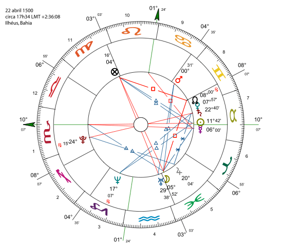

# Teste de Hipóteses: Introdução

## Exemplo: Astrólogos conseguem predizer nossa personalidade com um mapa astral?

<center></center>


## Exemplo: Astrólogos conseguem predizer nossa personalidade com um mapa astral? {.build}

* Se você fornece data, hora e local de nascimento, um astrólogo monta o seu Mapa Astral.  

> * *De acordo com a astrologia, a posição dos astros no momento em que nascemos influencia nossa maneira de ser.* - Wikipedia  

> * *As configurações de um Mapa Astral se repetem apenas a cada 26.000 anos, portanto ele é quase como uma impressão digital - não existe um igual ao outro.* - Wikipedia

> * Há comprovação científica de que seu mapa astral reflete sua personalidade? 


## Exemplo: Mapa Astral {.build}


Um teste foi feito da seguinte maneira:   116 pessoas selecionadas aleatoriamente forneceram data, hora e local de nascimento. 

> Um astrólogo preparou um mapa astral para essas 116 pessoas, usando apenas os dados fornecidos acima.  

> Cada voluntário também preencheu um questionário: "[California Personality Index](https://en.wikipedia.org/wiki/California_Psychological_Inventory)". 


## Exemplo: Mapa Astral {.build}


Para **um outro astrólogo**, foram dados:   

> *  data, hora, local, Mapa Astral de um dos voluntários, por exemplo, voluntário 3.  

> * questionário de personalidade preenchidos pelo voluntário 3.  
 
> *  2 questionários de personalidade, escolhidos ao acaso entre os 115 restantes, preenchidos por outros dois voluntários.  
 
> * Ao astrólogo, pediu-se então para identificar qual questionário havia sido preenchido pelo dono daquele Mapa Astral.


## Exemplo: Mapa Astral {.build}


* Seja $p$ a probabilidade de que o astrólogo identifique o questionário correto.  

> * Se de fato a informação do Mapa Astral não caracteriza a personalidade de uma pessoa e na verdade o astrólogo está apenas escolhendo um dos 3 questionários ao acaso, a probabilidade de acerto é $p=1/3$.  

> * Astrólogos confiam em seus estudos e dizem que a probabilidade de acerto é maior do que $1/3$.  

> * Como testar se eles estão certos?  

> * Escolher ao acaso um astrólogo e fazer o teste com ele uma vez, é suficiente?


## Exemplo: Mapa Astral {.build}


* 28 astrólogos foram selecionados aleatoriamente a partir de uma lista de astrólogos familiarizados com o   "California Personality Index".   

> * A lista foi preparada pelo ["National Council for Geocosmic Research"](https://geocosmic.org/).  

> * Vimos que podemos estudar fenômenos aleatórios definindo variáveis aleatórias e teoria da probabilidade.   

> * Um astrólogo pode associar corretamente o questionário ao mapa astral ou não.  

> * Para cada situação, há uma probabilidade associada.   Portanto temos um evento aleatório.


## Exemplo: Mapa Astral {.build}


Como definir a variável aleatória? 

> * $X_i$: astrólogo associa corretamente um questionário ao mapa astral $i$, ou seja,
$$X_i\sim \mbox{Bernoulli}(p)$$  

> * Podemos pensar em $p$ como a proporção de acerto na população de astrólogos.  

> * Se astrólogos não têm a capacidade de predição, $p = 1/3$.  

> * Astrólogos alegam que são capazes: $p>1/3$.  

* Como usar dados para testar estes dois cenários?  


## Exemplo: Astrólogos conseguem predizer nossa personalidade com um mapa astral? {.build}

<center></center>


## Definindo hipóteses {.build}

> * Objetivo em muitos estudos: checar se os dados apóiam certas afirmações que são feitas para uma população. 

> * Afirmações a serem testadas: **hipóteses**.  

> * Expressamos as hipóteses em termos dos parâmetros da população.  

> * Por exemplo: o parâmetro pode ser uma proporção populacional.


## Exemplo: Mapa Astral {.build}


**Hipótese:** *Usando o mapa astral de uma pessoa, a probabilidade $p$ de um astrólogo predizer corretamente qual dos 3 questionários está associado àquele mapa astral é igual a $1/3$. Ou seja, os astrólogos apenas selecionam ao acaso um dos questionários.*

> Nesse caso, para saber se os astrólogos têm a capacidade de predizer a personalidade usando o mapa astral, usaríamos as seguintes **hipóteses**:

$$
\begin{cases}
	H_0: p = 1/3 &  \mbox{(hipótese nula)} \\
	H_A: p > 1/3 & \mbox{(hipótese alternativa)}
\end{cases}
$$

> No experimento com os 28 astrólogos, observar uma proporção alta de acertos pode ser uma evidência contra a hipótese de que $p=1/3$.   


## Passos de um teste de hipótese {.build}
 
* **Passo 1: Suposições** 

  O teste é válido sob algumas suposições.   A mais importante assume que os dados do experimento foram produzidos através de um processo de aleatorização.  

* **Passo 2: Hipóteses** 

  O teste de hipótese tem sempre duas hipóteses sobre o parâmetro populacional de   interesse.   As hipóteses devem ser definidas **antes** de se realizar o experimento e coletar dados. 

* **Hipótese Nula ($H_0$):** afirma que o parâmetro populacional assume um dado valor. <br />
* **Hipótese Alternativa ($H_A$):** afirma que o parâmetro populacional assume outros valores, diferente do valor descrito na $H_0$.  


## Exemplo: Mapa Astral {.build}


No experimento dos astrólogos, $H_0$: $p=1/3$ representa a hipótese de que **não há efeito**, no sentido de que os astrólogos não têm uma capacidade maior de predizer a personalidade usando o mapa astral.

> A hipótese alternativa,  $H_A$: $p>1/3$, representa a hipótese de que **há efeito**, ou seja, os astrólogos têm uma capacidade de predizer a personalidade usando o mapa astral.  

> **Em teste de hipóteses, mantém-se a favor de $H_0$ a menos que os dados tragam grande evidência contra.**

> A hipótese nula é conservadora: "o réu é inocente até que se prove o contrário".


## Passos de um teste de hipótese {.build}

* **Passo 3: Estatística do teste**  

Vimos que podemos usar uma estatística para estimar um parâmetro populacional.   A **estatística do teste** descreve quão longe do parâmetro populacional usado na $H_0$ a estimativa está.  

> Por exemplo, se $H_0:$ $p=1/3$, e se $\widehat p=40/116=0.345$, queremos uma estatística que quantifique quão longe está $\widehat p=0.345$ de $p=1/3$.  

> * **Passo 4: valor-de-p** 

Para interpretar uma estatística do teste, vamos usar uma probabilidade para resumir a evidência contra $H_0$. Esta probabilidade é chamada de **valor-de-p**.


## Passos de um teste de hipótese {.build}

* **Passo 5: Conclusão**

Baseado no valor-de-p, decidir se rejeita ou não a hipótese nula. Note que a conclusão é sempre em termos da hipótese nula: rejeitar ou não $H_0$. 

Mas quão pequeno deve ser o valor-de-p para ser considerado forte evidência contra $H_0$?

Geralmente, fixamos o **nível de significância** do teste ($\alpha$), e usamos a seguinte regra. É comum usarmos $\alpha=0.05$.

> * Se valor-de-p $\leq \alpha$: rejeitamos $H_0$, ou seja, os dados trazem forte evidência contra a hipóstese nula <br />
> * Se valor-de-p > $\alpha$: não rejeitamos $H_0$, ou seja, não temos evidência nos dados contra a hipótese nula


## Passos de um teste de hipótese {.build}

> Assumimos primeiro que $H_0$ é verdadeira.   

> Consideramos então todos os valores possíveis para a estatística do teste, de acordo com sua distribuição amostral.   

> Calculamos a estatística do teste observada para o experimento realizado e verificamos onde, na distribuição amostral, ela se posiciona.   

> Calculamos a probabilidade de um valor igual ou mais extremo ao da estatística do teste observada (valor-de-p).
    Mais extremo: mais evidência contra $H_0$.  

> Se o valor-de-p obtido é bem pequeno, por exemplo, $0.01$, isto quer dizer que se $H_0$ é verdadeira, então seria incomum obter uma amostra com os resultados como o observado.   Um valor-de-p muito baixo traz fortes evidências contra $H_0$.


## Exemplo: Mapa Astral {.smaller} 

Distribuição amostral da proporção amostral $\widehat p$ sob $H_0$. 

<center>
```{r, echo=FALSE, results='hide', fig.height=3.5, fig.width=8,message=FALSE}
library(openintro)
phat <- 0.345
p0 <- 1/3
n <- 116
xmax <- qnorm(.99,mean=p0,sd=sqrt(p0*(1-p0)/n))

par(mar=c(2, 4, 1, 1) + 0.1)
normTail(m=p0,s=sqrt(p0*(1-p0)/n),U = phat,
         col = COL[1],
         axes  =  FALSE,
         lwd  =  2)
at <- c(1/3,phat)
labels <- expression(frac(1,3),hat(p)[obs])
axis(1, at, labels, cex.axis = 1)
abline(v=1/3,lty=2)

yMax = dnorm(p0,mean=p0,sd=sqrt(p0*(1-p0)/n))

valorp <- round(pnorm(phat,mean=p0,sd=sqrt(p0*(1-p0)/n),lower.tail = FALSE),4)
arrows(xmax, yMax / 2,
       xmax, yMax / 10,
       length = 0.1,
       col = COL[1],
       lwd = 1.5)
text(xmax, yMax / 2, labels= paste0('Valor-de-p ', valorp),
     pos = 3,
     cex = 1.2,
     col = COL[1])
```
</center>

**valor-de-p** (área em azul): probabilidade da proporção amostral assumir um valor igual ao observado, $\widehat p_{obs}$, ou mais extremo, sob $H_0$.


## Exemplo: Mapa Astral {.build}


**Passo 1: Suposições**

> * A variável de interesse é binária.  

> * $X_i$: astrólogo $i$ associa corretamente um questionário ao mapa astral, ou seja,  
$$X_i\sim \mbox{Bernoulli}(p).$$  

> * Os dados foram obtidos usando processo de aleatorização: uma amostra aleatória de voluntários e astrólogos  foi feita.  

> * Temos uma a.a. de tamanho $116$.   Portanto, a distribuição amostral da estimativa para $p$, $\widehat p$, tem distribuição aproximadamente normal, pelo TCL.  


## Exemplo: Mapa Astral {.build}


**Passo 2: Hipóteses**

> * $H_0$: $p = p_0 = 1/3$. 

> * $H_A$: $p > p_0 = 1/3$. 

<br />

Em outras palavras:

> * $H_0$: Astrólogos *chutam* qual o questionário está associado ao mapa astral. 

> * $H_A$: Astrólogos predizem melhor do que um *chute* qual o questionário está associado ao mapa astral. 


## Exemplo: Mapa Astral {.build}


**Passo 3: Estatística do teste**

> * Estatística do teste mede quão longe está a proporção amostral, $\widehat p$, da proporção populacional, $p$, assumindo que $H_0$ seja verdadeira? 

> * Sabemos que:
  $$\widehat p\sim\mbox{N}\left(p,\frac{p(1-p)}{n}\right)$$

> * Se $H_0$ é verdadeira ($p=p_0$), então: $$\widehat p\sim\mbox{N}\left(p_0,\frac{p_0(1-p_0)}{n}\right)$$


## Exemplo: Mapa Astral {.build}


**Passo 3: Estatística do teste**

* A estatística do teste é:
$$Z=\frac{\widehat p-p_0}{EP_0(\widehat p)}$$
onde $EP_0(\widehat p)$ é o erro padrão de $\widehat p$ sob $H_0$. Portanto,  

> $$Z=\frac{\widehat p-p_0}{\sqrt{\frac{p_0(1-p_0)}{n}}} \overset{H_0}{\sim}\mbox{N}(0,1)$$

> * A estatística do teste mede quão distante está $\widehat p$ de $p_0$ em unidades  de "erro-padrão".


## Exemplo: Mapa Astral {.build}


**Passo 3: Estatística do teste**

* No experimento dos astrólogos, dentre 116 mapas, 40 foram corretamente associados ao questionário de personalidade. $$\widehat p = 40/116 = 0.345$$

> * A estatística do teste observada é:
$$z_{obs}=\frac{\widehat p-p_0}{\sqrt{\frac{p_0(1-p_0)}{n}}}=  \frac{0.345-1/3}{\sqrt{\frac{1/3(1-1/3)}{116}}}=0.27$$ 

> * A proporção amostral está a 0.27 erro-padrão de distância da proporção populacional, segundo $H_0$.


## Exemplo: Mapa Astral {.build}


**Passo 4: Valor-de-p**

* Tendo observado $z_{obs}=0.27$, isso traz evidência contra $H_0$ a favor de $H_A$?

> * Quão improvável é $z_{obs}=0.27$ se a proporção de acertos dos astrólogos é de fato $p=p_0=1/3$?  

> * Valor-de-p: probabilidade de que uma estatística do teste assuma um valor igual ou mais extremo do que o observado, assumindo $H_0$ verdadeira.  

> * Mais extremo: neste caso, é um maior valor de $z_{obs}$, pois equivale a um maior $\widehat p$, maior proporção amostral de acertos (astrólogos alegam que $p>1/3$).

> * Valor-de-p: $P(Z>z_{obs})=P(Z>0.27)=0.3936$, onde $Z \sim \mbox{N}(0,1)$.


## Exemplo: Mapa Astral {.build}

Distribuição amostral da estatística do teste $Z$ sob $H_0$.

<center>
```{r, echo=FALSE, results='hide', fig.height=3.5, fig.width=8.5,message=FALSE}
phat <- 0.345
p0 <- 1/3
n <- 116

zobs <- round((phat-p0)/sqrt(p0*(1-p0)/n),2)

xmax <- qnorm(.99,mean=0,sd=1)

par(mar=c(2, 4, 1, 1) + 0.1)
normTail(m=0,s=1,U = zobs,
         col = COL[1],
         axes  =  FALSE,
         lwd  =  2)
at <- c(0,zobs)
labels <- c("0",expression(0.27))
axis(1, at, labels,cex.axis = 1)
abline(v=0,lty=2)

yMax = dnorm(0,mean=0,sd=1)

valorp <- round(pnorm(zobs,mean=0,sd=1,lower.tail = FALSE),4)
arrows(xmax, yMax / 2,
       xmax, yMax / 10,
       length = 0.1,
       col = COL[1],
       lwd = 1.5)
text(xmax, yMax / 2, labels= paste0('Valor-de-p ', valorp),
     pos = 3,
     cex = 1.2,
     col = COL[1])


```
</center>

<br />
**valor-de-p** (área em azul): representa a probabilidade de valores mais extremos que $z_{obs}$ ocorrerem.


## Exemplo: Mapa Astral {.build}


**Passo 5: Conclusão** 

* O valor-de-p obtido no experimento foi 0.3936.  

> *  O valor não é tão pequeno. Portanto, não temos evidências contra $H_0$.  

> * Não podemos concluir que astrólogos têm poderes preditivos especiais usando mapa-astral.

<br />
 <br />
Detalhes da pesquisa podem ser encontrados no artigo da revista Nature: <br />
[A double-blind test of Astrology](http://www.nature.com/nature/journal/v318/n6045/abs/318419a0.html).


# Resumo: Teste de Hipótese para uma proporção

## Resumo: Teste de Hipótese para uma proporção {.build .smaller}

Suponho que temos uma população e uma hipótese sobre a proporção $p$ de indíviduos  com certa característica.

**Hipóteses:**   	
$$ \begin{aligned} H_0:  p = p_0	 \quad \mbox{vs} \quad    	   
H_A: & p \neq p_0 \mbox{ (bilateral)} \\
		& p < p_0 \mbox{ (unilateral à esquerda)} \\
		&  p > p_0 \mbox{ (unilateral à direita)}	
\end{aligned}
$$

**Estatística do teste:** Baseada na distribuição amostral de $\widehat p$
$$Z=\frac{\widehat p-p_0}{\sqrt{\frac{p_0(1-p_0)}{n}}} \overset{H_0}{\sim} N(0,1)$$

**Condição:** $np_0 ≥ 10$ e $n(1−p_0) ≥ 10$ para aproximação normal


## Resumo: Teste de Hipótese para uma proporção {.build}

**valor-de-p** 

* $H_A: p \neq p_0$  (bilateral): valor-de-p=$P(|Z| ≥|z_{obs}|)$ <br />
* $H_A: p < p_0$ (unilateral à esquerda): valor-de-p=$P(Z \leq z_{obs})$ <br />
* $H_A: p > p_0$ (unilateral à direita): valor-de-p=$P(Z \geq z_{obs})$ 

<br />
**Conclusão**

Para um nível de significância $\alpha$:

> * Se valor-de-p $\leq \alpha$: rejeitamos $H_0$ <br />
> * Se valor-de-p > $\alpha$: não rejeitamos $H_0$


## Exemplo: Efeitos Colaterais {.build}

Uma indústria farmacêutica diz que menos de 20% dos pacientes que estão usando um certo medicamento terão efeitos colaterais. 

Realizou-se então um ensaio clínico com 400 pacientes e verificou-se que 68 pacientes apresentaram efeitos colaterais

**Hipóteses:**   $H_0: p = 0.20	\quad 	\mbox{vs} \quad 	   H_A: p < 0.20$
		
**Estatística do teste:** Da amostra temos que $\widehat p = 68/400 = 0.17$
$$z_{obs} = \frac{\widehat p - p_0}{\sqrt{\frac{p_0(1-p_0)}{n}}} = \frac{0.17 - 0.20}{\sqrt{\frac{0.20(1-0.20)}{400}}} = -1.5$$


## Exemplo: Efeitos Colaterais {.build}

$$\mbox{valor-de-p} =P(Z \leq-  1.5) = 0.067$$

<center>
```{r, echo=FALSE, results='hide', fig.height=3, fig.width=7, message=FALSE}
phat <- 0.17
p0 <- 0.2
n <- 400

zobs <- round((phat-p0)/sqrt(p0*(1-p0)/n),2)

xmax <- qnorm(.01,mean=0,sd=1)

par(mar=c(2, 4, 1, 1) + 0.1)
normTail(m=0,s=1, L=zobs,
         col = COL[1],
         axes  =  FALSE,
         lwd  =  2)
axis(1, c(zobs, 0), cex.axis = 1)
abline(v=0, lty=2)

yMax = dnorm(0, mean=0, sd=1)

valorp <- round(pnorm(zobs, mean=0,sd=1,lower.tail = TRUE), 3)
arrows(xmax, yMax / 2,
       xmax, yMax / 10,
       length = 0.1,
       col = COL[1],
       lwd = 1.5)
text(xmax, yMax / 2, labels= paste0("valor-de-p = ", valorp),
     pos = 3,
     cex = 1.2,
     col = COL[1])
```
</center>

**Conclusão**: Para $\alpha=0.05$, como o valor-de-p é maior que 0.05, não temos evidências nos dados para rejeitar a hipótese de que $p=0.20$.

Na verdade, a evidência está na direção que a indústria farmacêutica queria, mas não é o suficiente para rejeitar $H_0$.


## Exemplo: Efeitos Colaterais {.build}

E se estivéssemos testando: $H_0: p = 0.20	\quad 	\mbox{vs} \quad 	   H_A: p \neq 0.20$

$\begin{aligned}
\mbox{valor-de-p} &=P(|Z| \geq 1.5) =  P(Z \leq -1.5) + P(Z \geq 1.5) \\
&= 2P(Z \leq -1.5) = 2 \times 0.067=0.134
\end{aligned}$

<center>
```{r, echo=FALSE, results='hide', fig.height=2.5, fig.width=6, message=FALSE}
phat <- 0.17
p0 <- 0.2
n <- 400

zobs <- round((phat-p0)/sqrt(p0*(1-p0)/n),2)

xmax1 <- qnorm(.01,mean=0,sd=1)
xmax2 <- qnorm(.99,mean=0,sd=1)

par(mar=c(2, 4, 1, 1) + 0.1)
normTail(m=0,s=1, L=zobs, U = abs(zobs),
         col = COL[1],
         axes  =  FALSE,
         lwd  =  2)
axis(1, c(zobs, 0, abs(zobs)), cex.axis = 1)
abline(v=0, lty=2)

yMax = dnorm(0, mean=0, sd=1)

valorp <- round(pnorm(abs(zobs), mean=0,sd=1,lower.tail = FALSE), 3)
arrows(xmax2, yMax / 2,
       xmax2, yMax / 10,
       length = 0.1,
       col = COL[1],
       lwd = 1.5)
text(xmax2, yMax / 2, labels= valorp,
     pos = 3,
     cex = 1.2,
     col = COL[1])
arrows(xmax1, yMax / 2,
       xmax1, yMax / 10,
       length = 0.1,
       col = COL[1],
       lwd = 1.5)
text(xmax1, yMax / 2, labels= valorp,
     pos = 3,
     cex = 1.2,
     col = COL[1])
```
</center>

<br />
**Conclusão**: Para $\alpha=0.05$, como o valor-de-p é maior que 0.05, não temos evidências nos dados para rejeitar a hipótese de que $p=0.20$.


## Coca vs Coca Zero: Você consegue distinguir? {.build}


Algumas pessoas afirmam que conseguem distinguir o sabor da coca-cola normal da coca zero.

> Faremos então um teste para comprovar se a afirmação é verdadeira.

> Experimento:

> * Sorteia-se, sem a pessoa saber, coca ou coca zero, usando um dado (se sair par, recebe uma coca-cola normal, se sair ímpar, uma coca zero.

> * A bebida sorteada é então dada à pessoa, que deve experimentar e dizer que tipo de Coca-Cola está tomando.

> * Repetimos isso 20 vezes e anotamos o total de acertos.


## Experimento da Coca vs Coca Zero {.build}

**Suposições:** 

> * Cada tentativa, $X_i$, é uma Bernoulli$(p)$, em que $p$ é a probabilidade de acerto.  

> * Estamos interessados no total de acertos em 20 tentativas: <br /> $T=\sum_{i=1}^{20}X_i\sim\mbox{Bin}(20, p)$

> * Podemos usar a aproximação pela Normal caso as condições sejam satisfeitas.

> **Hipóteses:**  

> * $H_0: p=1/2$ (a pessoa não consegue diferenciar as duas bebidas) <br />
> * $H_A: p>1/2$. 


## Experimento da Coca vs Coca Zero {.build}


> **Estatística do teste:** $T=\sum_{i=1}^{20}X_i\sim\mbox{Bin}(20, p)$. 

> **Valor-de-p:** evidência contra $H_0$. Calculamos a probabilidade, sob $H_0$, de ocorrer um valor igual ou mais extremo ao valor observado no experimento.  

```{r,echo=FALSE}
n <- 20
alpha <- 0.05
p <- 0.5

T <- 0:n

tmp <- cbind(T,round(dbinom(T,n,p),4))

#plot(T, dbinom(T, n, p), type="h",xlab="total de acertos",ylab="probabilidade")

acertos=19

#abline(v=acertos,col="red")

valorp <- sum(tmp[which(tmp[,1]>(acertos-1)),2])

zobs <- round((acertos/20-0.5)/sqrt(.5*.5/20),2)

valorpn <- pnorm(zobs,lower.tail=FALSE)

dec <- ifelse(valorp < alpha,"rejeitar","não rejeitar")
```

<br />
**Resultado do experimento:**

> Seja $t_{obs}=`r acertos`$ o número de acertos.

> Valor-de-p: $P(T\geq `r acertos`)=`r valorp`$, onde $T\overset{H_0}{\sim}\mbox{Bin}(20, 1/2)$.

> **Conclusão:** Decidimos `r dec` $H_0$.


## Experimento da Coca vs Coca Zero {.build .smaller}

<center>
```{r, echo=FALSE, fig.height=5, fig.width=6}

binomshade <- function(n, p, a, b){
  ## gráfico da função de massa de uma Bin(n, p) e colore os pontos de a até b
  library(RColorBrewer)
  mycol <- brewer.pal(8,"Dark2")

  x <- 0:n
  cores <- rep(mycol[1], n+1)
  cores[a:b + 1] <- "red"
  
  px <- dbinom(x, size=n, prob=p)
  barplot(px, names.arg=x, xlab="número de acertos", ylab="probabilidade", col=cores,
          main=paste("Bin(", n, ", ",  p, ")", sep=""), 
          cex.lab=1.2, cex.axis=1.2, cex.names=1.2, cex.main=1.3, las=1)
  box(bty="l", lwd=2)
  prob <- round(sum(dbinom(a:b, n, p)), 4)
  expr <- bquote(P( {.(a) <= X} <= .(b)) == .(prob))
  title(expr, cex.main=0.95, line=0.5)
}

binomshade(20, 0.5, acertos, 20)
```
</center>


## Experimento da Coca vs Coca Zero {.build}

Seja $T$ é o número de acertos. Utilizando a aproximação pela Normal, temos que $T \sim Bin(20, p)$. 

> A proporção amostral de acertos $\widehat p = \frac{T}{20}= `r acertos`/20=`r acertos/20`$.

> Vamos testar o seguinte: $H_0: p = 0.50	\quad \mbox{vs} \quad H_A: p > 0.50$.

> **Estatística do teste:**

$$z_{obs} = \frac{\widehat p - p_0}{\sqrt{\frac{p_0(1-p_0)}{n}}} = \frac{`r acertos/20` - 0.5}{\sqrt{\frac{(0.50)(0.50)}{20}}} = `r zobs`$$

**valor-de-p** = $P(Z \geq `r zobs`) = `r round(valorpn,4)`$


**Conclusão:** Fixando $\alpha=0.05$, rejeitamos a hipótese de que probabilidade de acertos é 50%. 


## Experimento da Coca vs Coca Zero {.build .smaller}

<center>
```{r, echo=FALSE, results='hide', fig.height=4.5, fig.width=6.5, message=FALSE}
phat <- acertos/20
p0 <- 0.5

xmax <- qnorm(.999999,mean=0,sd=1)

par(mar=c(2, 4, 1, 1) + 0.1)
normTail(m=0,s=1, U=zobs,
         col = COL[1],
         axes  =  FALSE,
         lwd  =  2,xlim=c(-xmax,xmax))
axis(1, c(-zobs, 0,zobs), cex.axis = 1)
abline(v=0, lty=2)

yMax = dnorm(0, mean=0, sd=1)

arrows(3.5, yMax / 2,
       3.5, yMax / 10,
       length = 0.1,
       col = COL[1],
       lwd = 1.5)
text(3.5, yMax / 2, labels= paste0("valor-de-p = ", round(valorpn,5)),
     pos = 3,
     cex = 1.2,
     col = COL[1])
```
</center>


## Leituras

* [Ross](http://www.sciencedirect.com/science/article/pii/B9780123743886000090): capítulo 9. 
* [OpenIntro](https://www.openintro.org/stat/textbook.php): seções 4.3 e 6.1.
* Magalhães: capítulo 8.

<br /><br />

Slides produzidos pelos professores:

* Samara Kiihl

* Tatiana Benaglia

* Benilton Carvalho